# CS231A：Computer Vision, From 3D Reconstruction to Recognition

> https://www.bilibili.com/video/BV1LQ4y1r7ps/

[TOC]

## L2. Camera Models

###  pinhole camera（小孔成像 - 摄像机）

- $f$：定义为相机焦距

以O点（pinhole位置）建立坐标系，真实物体点$P(x,y,z)$投影到成像屏幕上$P'(x',y')$​，有如下关系（**相似三角形**）
$$
x' = \frac{f}{z}x,y' = \frac{f}{z}y
$$
物理课的小知识

- 小孔越小，透光越少，但是画面清晰
- 小孔越大，透光越多，但是画面模糊

因此为了全部都要，引入了Lens（透镜）

### Lenses and Cameras（透镜和相机）

- 除了通过中心的光线，其他光线都会被折射
- 在一定距离，所有入射光线会被折射到图像的一点上
- 少于或多于这段距离，光无法聚焦在一个点上（Out of focus）

> 景深（Depth of Field）则是指在摄影或者摄像中，一张图像中能够保持清晰度的距离范围。

定义参数等效焦距$z'=f + z_0$，$z_0$​为像距

则有：
$$
x' = \frac{z'}{z}x,y' = \frac{z'}{z}y
$$
但由于工艺问题，透镜成像的边缘经常发生distortion（畸变）

> 虚线为理想情况
>
> - 图1：聚焦偏外，越角落越边缘的图像越偏外
> - 图2：聚焦偏内，越角落越边缘的图像越偏内

### The Geometry of Pinhole Cameras（几何）

>  只要距离足够，透镜和小孔成像都是同一个数学模型

$$
p=\begin{bmatrix}x\\y\\z\end{bmatrix} \to p'=\begin{bmatrix}x'\\y'\end{bmatrix}
$$

我们完成了三维世界到二维平面的投影

#### Coordinate systems（坐标系）

- Off Set：$(x,y,z)\to(\frac{f}{z}x+c_x,\frac{f}{z}y+c_y)$​
  - $(c_x,c_y)$的存在：相机由于工艺问题，无法保证焦点中心一定在图像中心，因此通过引入参数来进行矫正调整
- From Metric to Pixels：$(x,y,z)\to(k\frac{f}{z}x+c_x,l\frac{f}{z}y+c_y)$​
  - 我们更偏向乘上系数，使得长度单位变成像素（不同的系数解决了像素是长方形的情况）
  - 所以$(c_x,c_y)$也是像素单位

当$z$​发生变化时，投影坐标并不是线性变化（倒数），不利于使用线代处理

同时乘上$z$，会丢失$z$的信息

因此引入Homogeneous Coordinates（齐次坐标）

#### Homogeneous Coordinates（齐次坐标）

$$
(x,y)\to \begin{bmatrix}x\\y\\1\end{bmatrix}
$$

我们对点坐标，额外增加一个新的维度（二维变三维，三维变四维）

所以我们需要知道如何从齐次坐标转化回真实坐标
$$
\begin{bmatrix}x\\y\\w\end{bmatrix}\to (\frac{x}{w},\frac{y}{w})
$$
在后续计算中，补充的1可能会变化，我们需要让它变回1，代表了真实值
$$
(x,y,z)\to(k\frac{f}{z}x+c_x,l\frac{f}{z}y+c_y)\\
(x,y,z)\to(\alpha\frac{x}{z}+c_x,\beta\frac{y}{z}+c_y)
$$
我们整理式子，先让变化只跟$(x,y,z)$有关，$\alpha,\beta$事实上就是相机确定后的两个定值系数
$$
\begin{bmatrix}
\alpha & 0 & c_x & 0\\
0 & \beta & c_y & 0 \\
0 & 0 & 1 & 0
\end{bmatrix}
\begin{bmatrix}x\\y\\z\\1\end{bmatrix}=\begin{bmatrix}
\alpha x+c_xz\\\beta y+c_y \\ z
\end{bmatrix}
$$
我们通过变换矩阵$M$，把相机坐标系下的齐次坐标点$P_h$转化为了图像坐标系下的齐次坐标点$P'_h$，即：
$$
P_h'=MP_h
$$
$z$的信息就能得到很好的保存

#### Camera Matrix K（相机内参）

$M$内的参数被相机内部确定，只由相机的内部参数组成，内部参数一般称为$K$
$$
M = \begin{bmatrix}
\alpha & 0 & c_x & 0\\
0 & \beta & c_y & 0 \\
0 & 0 & 1 & 0
\end{bmatrix} = K\begin{bmatrix}I & 0\end{bmatrix}
$$
 但由于工艺问题，有时像素平面可能不是一个矩形，而是一个平行四边形，产生了旋转

此时我们就需要考虑偏度（skewness）$\theta$的影响
$$
K=\begin{bmatrix}
\alpha & -\alpha\cot\theta & c_x \\
0 & \frac{\beta}{\sin\theta} & c_y  \\
0 & 0 & 1 
\end{bmatrix}
$$

> 懒得推导了

- $\alpha,\beta,\theta,c_x,c_y$共五个自由度
- 上三角矩阵

#### World Reference System（世界坐标系）

我们希望世界坐标系转化为相机坐标系，这里我们依旧使用齐次坐标

 我们先处理二维平面的情况

- 平移Translation

  - $$
    P'\to\begin{bmatrix}x + t_x\\y + t_y\\1\end{bmatrix} = 
    \begin{bmatrix}
    1 & 0 & t_x\\
    0 & 1 & t_y \\
    0 & 0 & 1\\
    \end{bmatrix} 
    \begin{bmatrix}x \\y \\1\end{bmatrix}
    $$

- 缩放Scaling

  - 注意是围绕原点进行缩放

  - 当$s_x=s_y$时，称为**相似变换**

  - $$
    P'\to\begin{bmatrix}s_xx\\s_yy\\1\end{bmatrix} = 
    \begin{bmatrix}
    s_x & 0 & 0\\
    0 & s_y & 0 \\
    0 & 0 & 1\\
    \end{bmatrix} 
    \begin{bmatrix}x \\y \\1\end{bmatrix}
    $$

- 旋转Rotation

  - $$
    P'\to\begin{bmatrix}x'\\y'\\1\end{bmatrix} = 
    \begin{bmatrix}
    \cos\theta & -\sin\theta & 0\\
    \sin\theta & \cos\theta & 0 \\
    0 & 0 & 1\\
    \end{bmatrix} 
    \begin{bmatrix}x \\y \\1\end{bmatrix}
    $$

  - 同样是围绕原点进行旋转

我们可以组合上述的矩阵：同时进行平移缩放旋转

即对$P$先后进行变换矩阵的左乘即可

对于三维情况：

- 平移Translation

  - $$
    P'\to\begin{bmatrix}
    I & T\\
    0 & 1
    \end{bmatrix} 
    \begin{bmatrix}x \\y \\z \\1\end{bmatrix}
    $$

- 缩放Scaling

  - $$
    P'\to
    \begin{bmatrix}
    S & 0\\
    0 & 1
    \end{bmatrix} 
    \begin{bmatrix}x \\y \\z\\1\end{bmatrix}
    $$
  
- 旋转Rotation

  - 绕x轴旋转$\alpha$，绕y轴旋转$\beta$，绕z轴旋转$\gamma$
  
  - $$
    R_x(\alpha)=\begin{bmatrix}
        1 &0&0\\
       0 & \cos\alpha & -\sin\alpha \\
       0 & \sin\alpha & \cos\alpha  \\
    
        \end{bmatrix} 
      \\
      R_y(\beta)=\begin{bmatrix}
    
       \cos\beta & 0 & -\sin\beta\\
           0 &1&0\\
       \sin\beta  & 0& \cos\beta  \\
    
        \end{bmatrix} 
       \\
       R_z(\gamma)=\begin{bmatrix}
    
       \cos\gamma& -\sin\gamma & 0 \\
       \sin\gamma & \cos\gamma  & 0\\
       0 &0&1\\
    
        \end{bmatrix}
    $$
    
  - 任意绕轴旋转都可以进行分解成绕三轴先后旋转
  
  - $R = R_x(\alpha)R_y(\beta)R_z(\gamma)$，合成三个矩阵
  
  - $$
    P'\to
    \begin{bmatrix}
    R & 0\\
    0 & 1
    \end{bmatrix} 
    \begin{bmatrix}x \\y \\z\\1\end{bmatrix}
    $$
  
- 

在这里，我们一般不考虑缩放（刚体是不会缩放的）

组合旋转和平移
$$
P' \to \begin{bmatrix}R & T \\ 0 & 1\end{bmatrix}
$$
即可完成旋转后，再平移

- 从世界坐标系，通过$R,T$转化到相机坐标系
- 从相机坐标系通过投影，转化为图像坐标系

推导从世界坐标系直接导入图像的公式：
$$
P'=K\begin{bmatrix}I & 0\end{bmatrix}P=K\begin{bmatrix}I & 0\end{bmatrix}\begin{bmatrix}R & T \\ 0 & 1\end{bmatrix}P_w\\
P'=K\begin{bmatrix}R & T\end{bmatrix}P_w
$$
其中$\begin{bmatrix}R & T\end{bmatrix}$被称为外参数

## L8: Fitting and Matching

### Fitting

>   -   Choose a parametric model to fit a certain quantity from data
>
>   -   Estimate model parameters

#### Critical issues

-   noisy data
    -   数据中存在的随机误差或不确定性，测量、记录或传输过程中的各种因素引起
    -   对整体趋势影响较小
    -   处理噪声数据的方法包括平滑技术（如移动平均）、滤波方法、数据清洗等
-   outliers
    -   数据集中与其他观测值**明显不同**的值，测量错误、录入错误、实际现象的稀有事件
    -   具有明显的偏离，可能对分析结果产生较大的影响
-   missing data

#### Techniques

目标：拟合点集$(x_i,y_i)$

##### Least Square methods（最小二乘法）

-   直线模型：$y-mx-b = 0$
-   找到$(m,b)$使得最小化误差$E = \sum(y_i-mx_i-b)^2$
$$
E &= \sum(y_i-\begin{bmatrix}
x_i  & 1
\end{bmatrix}\begin{bmatrix}
  m\\b
\end{bmatrix})^2 \\
&= \left \| \begin{bmatrix}
y_1  \\ ... \\ y_n
\end{bmatrix}- \begin{bmatrix}
x_1 & 1 \\ ... & 1\\ x_n & 1
\end{bmatrix} \begin{bmatrix}
m \\ b
\end{bmatrix}\right \| ^2 \\

&= \left \| Y - Xh \right \| ^2 \\
&= (Y-Xh)^T(Y-Xh) \\
&= Y^TY-2(Xh)^TY+(Xh)^TXh
$$
对$h$求导
$$
\frac{dE}{dh} = -2X^TY+2X^TXh=0
$$
解得：
$$
h = (X^TX)^{-1}X^TY
$$
但是这样是**代数意义**上的最优解

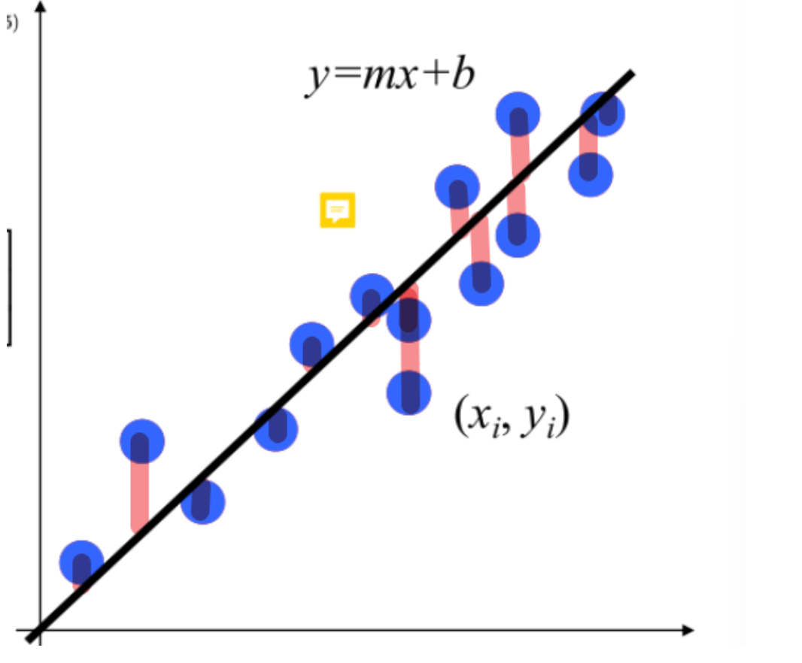

考虑几何意义上的最优解：

对于直线$ax+by+d=0$，点$(x,y)$到直线的距离定义为：
$$
dis=\frac{|ax+by+d|}{\sqrt{a^2+b^2}}
$$
我们可以$a,b$的存在表示了斜率，因此我们可以通过类似归一化的操作，使得$\sqrt{a^2+b^2}$为1，或者为一个定值

因此我们事实上只需要关心$|ax+by+d|$，代表了相对大小，不需要具体的真实值

故定义：$E = \sum |ax+by+d|^2$

我们需要寻找最优的$(a,b,d)$

令矩阵$A = \begin{bmatrix}
 x_1 & y_1 & 1 \\ x_2 & y_2 & 1 \\ ...&...&...\\x_n&y_n&1\end{bmatrix}$，$h = \begin{bmatrix}
a\\b\\d\end{bmatrix}$

则问题转化为：最小化 $||Ah||$，并且限制$||h|| = 1$

使用**SVD分解**即可完成优化问题（留坑待填）

最后：

-   噪声：鲁棒的
-   外点：影响巨大

>   **conclusion: Least Square is not robust w.r.t. outliers.**
>
>   "w.r.t." 是英文表达中的缩写，意思是 "with respect to"，翻译成中文是 "关于"、"针对"、"就...而言" 等等。

##### Least Squares: Robust Estimators （鲁棒估计器）

令残差$\mu = ax+by-d$

定义鲁棒函数：
$$
\rho(u;\sigma) = \frac{\mu^2}{\sigma^2+\mu^2}
$$

-   $\mu$越大，函数值接近1
-   $\mu$越小，函数是一个关于$\mu^2$的函数

较大的残差，原本会极大影响损失函数的值

通过此方法，我们限制了大残差的贡献，从而降低了对损失函数的影响，故能拟合的鲁棒性提升

##### RANdom SAmple Consensus(RANSAC)

-   假设1：嘈杂的数据不会为任何单一模型投一致的票
-   假设2：有足够的数据点来商定一个好的模型

我们定义好阈值$\delta$，与给定直线的距离在阈值范围内的点，被称为内点；否则是外点

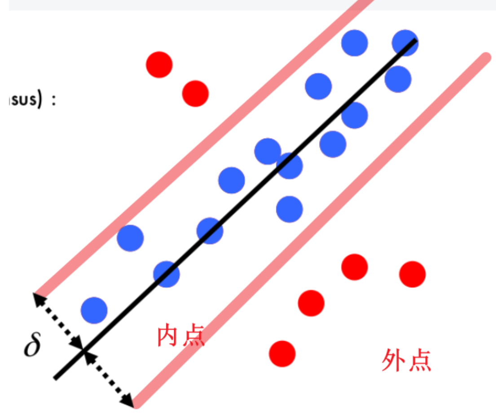

算法流程

-   随机选择出需要确定模型的最小数量的点（例如：确定直线需要两个点，因此随机两个点）
-   对于随机选出的点，计算出模型
-   计算出内点和外点

重复多次，外点数量最小的模型即为我们需要的

因此我们比较好奇重复多少次可以基本保证能找到最优解

设重复次数为$N$，算法成功概率为$p$（一般取0.99），$e$表示内点数量与点数之比，$s$表示采样点的数量

则不成功的概率为：
$$
1-p = (1-e^s)^N
$$
则有：
$$
N = \frac{\log (1-p)}{\log (1-e^s)}
$$

不管是需要采样的点变多，还是内点比例下降，都会使得次数增加

>   **conclusion: Cannot be used if ratio inliers is too small**

但对于大部分场景，外点是占较大部分的，因此很难使用

##### Hough transform(霍夫变换)

设一条直线：$y=mx+n$，其中$(x_i,y_i)$是该直线上一点

我们考虑将$m,n$看作自变量与因变量：$n = -x_im-y_i$

因此我们得到了

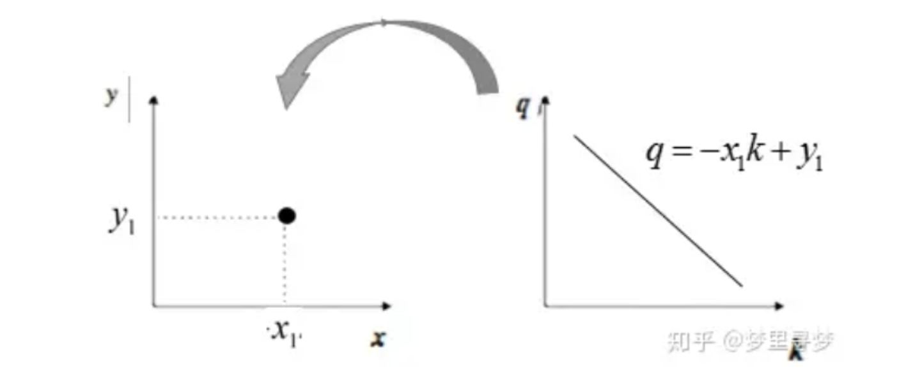

经过霍夫变换后得到的被称为是霍夫空间

**笛卡尔坐标系中的一个点，对应霍夫空间中的一条直线**

同理，**笛卡尔坐标系中的一条直线，对应霍夫空间中的一个点**

因此在笛卡尔坐标系中，同一直线上的点，其在霍夫空间中将交于同一点

理论上我们只需要知道哪些点被投票得最多，这条直线就是我们需要的

但问题还很多：**我们无法表示垂直的线**

考虑切换为**极坐标系**

直线方程：
$$
x\cos\theta +y\sin\theta = \rho
$$

我们将霍夫空间看作一个网格

其中高度为原图像对角线长度（$\rho$的最大值），宽度为$\theta$的最大值$2\pi$

枚举网格点，估计一下其中的交点数量

>   对于高维数据非常难以处理

## L9. Detectors and descriptors

### Detectors

#### Edge detectors

##### Edge产生的要素

-   **深度**不连续性
-   **表面方向**不连续性（物体表面不同部分的朝向或法线方向发生突然变化）
-   反射率不连续性（即，表面材料性质的变化、颜色）
-   **光照**不连续性（例如，高光; 阴影）

边缘检测的例子

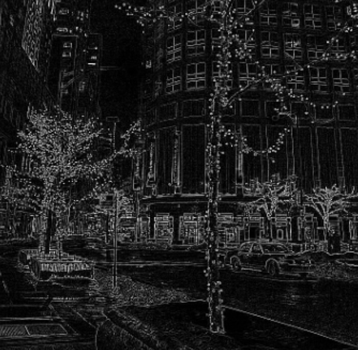

##### 检测标准

-   Good detection accuracy：不误检测噪声，漏检测真实边缘
-   Good localization：检测边缘应该尽可能接近真实边缘
-   Single response constraint：单一的回应

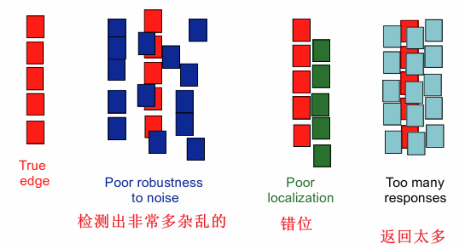

##### Detectors的设计

-   使用导数，定义了梯度较高（也就是变化较为激烈）的地方
-   对图像进行了平滑处理，提取导数之前减少噪音

在图像中，我们定义导数：
$$
\frac{df}{dx} = f_x - f_{x-1}
$$
因为是离散的，所以单位长度是一个像素，我们对一个像素作一个差值就是变化率，即导数

考虑如上的一个图像，我们若直接求出导数图像，你会发现并没有特别显著的大导数

原因是本身图像的波动大概就是5左右，而上升部分的差值也差不多是5

所以你会发现导数基本都一样

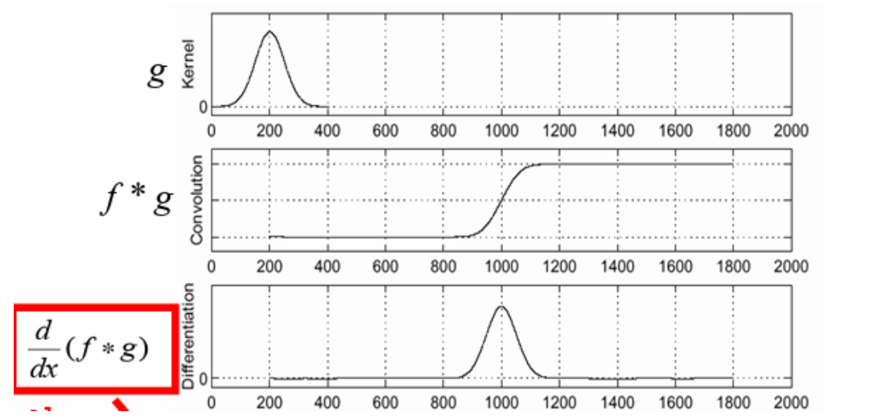

因此我们使用高斯模糊的卷积核进行平滑处理

消除了大量的波动，因此边缘部分得到了突出
$$
S &= \bigtriangledown(g\ast I) = (\bigtriangledown g)\ast I \\ &=  \begin{bmatrix}
 \frac{\partial  g}{\partial  x} \\
 \frac{\partial  g}{\partial  y}
\end{bmatrix}\ast I = \begin{bmatrix}
g_x\ast I \\
 g_y\ast I
\end{bmatrix} \\
&= \begin{bmatrix}
S_x & S_y
\end{bmatrix}
$$

#### Corner/blob detectors

-   **可重复性**：尽管存在几何和光度变换，但同一特征可以在多幅图像中被找到。
-   **显著性**：每个特征都位于图像的“有趣”区域。（反正基本不是空白区域）
-   **局部性**：一个特征占据图像的“相对较小”区域。

##### Harris corner detector

在窗口位置变化时探索窗口内的**强度变化**

-   flat：在所有方向上都没有变化
-   edge：沿着边缘方向没有变化
-   corner：在**所有方向**上都有显著变化

**我们无法知道corner的尺度变化**

##### Blob detection

回到边缘探测，我们可以把卷积后的结果的导数

修改为二阶导

因此我们的高斯算子可以换成拉普拉斯算子（高斯的导数）

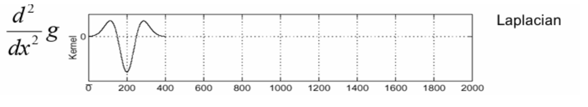

对原图像使用拉普拉斯算子进行处理即可

因此对于一个比较宽的图形，两侧边缘会分别导出两个波动

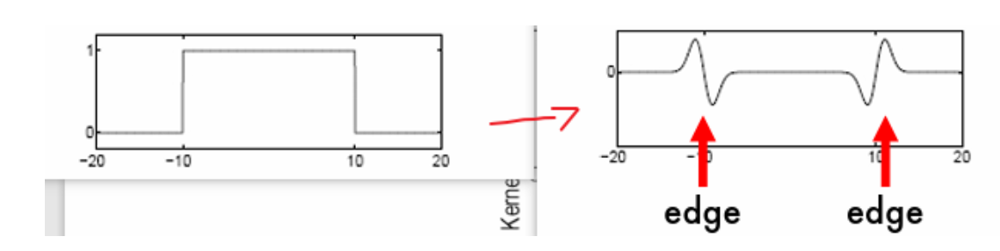

我们先尝试固定拉普拉斯算子，当图形宽度变化时

某种情况下，两个波动会融合在一起，并且幅度最大值取在了图形中央

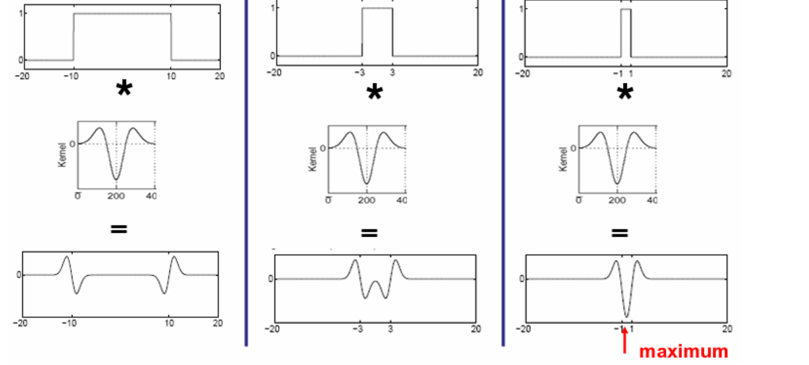

所以我们调一下参数，就可以找到幅度最大的点，从而估计出**尺度大小**

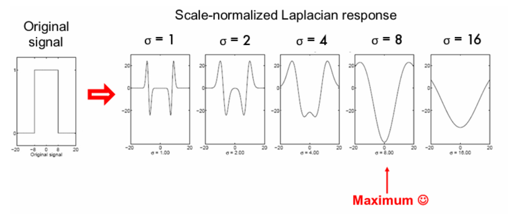

并且对于半径为$r$的圆，取到最大值的参数是可以计算的

##### DoG

高斯差分，你只需知道这个算子会更常用一点

### Descriptors

描述信息一般需要：

特征保证

-   **光照不变性（Invariant w.r.t Illumination）**：特征应该不受光照变化的影响。
-   **姿势不变性（Invariant w.r.t Pose）**：特征应该不受物体姿势变化的影响。
-   **尺度不变性（Invariant w.r.t Scale）**：特征应该不受尺度变化的影响。
-   **类内变异不变性（Invariant w.r.t Intraclass variability）**：特征应该能够在相同类别的不同实例之间保持稳定性。

特征要有

-   **高度独特性（Highly distinctive）**：特征应该具有足够的独特性，以便在大型特征数据库中能够以高概率找到其正确匹配的特征。

#### Simplest Descriptor - Patch

>   图像中的一个小区域或局部区域，通常由一组相邻像素组成

将特征周围的像素$n\times m$的小图片展开为$[1,nm]$大小的一维向量$w$

对$w$的强度进行归一化
$$
w = \frac{w-\bar{w}}{||w-\bar{w}||}
$$
减去均值除以模长

无论图像的光照条件如何变化，这种归一化保证了描述符的生成不会受到影响，从而增强了描述符的稳定性和可靠性

缺点

-   对于位置、姿势、尺度和类内变异的小变化敏感
-   特征区分度较差

#### Filter

提供卷积核做点事情，然后提取特征

只能说鲁棒性有所提升

#### SIFT

>   大致理解即可，并不准确

-   使用DoG确定位置和特征尺度

对于一个$N\times N$的窗口，我们对每个像素计算梯度

我们把$[0,2\pi]$分成若干份，对所有方向进行计数

数量最多的即为主方向

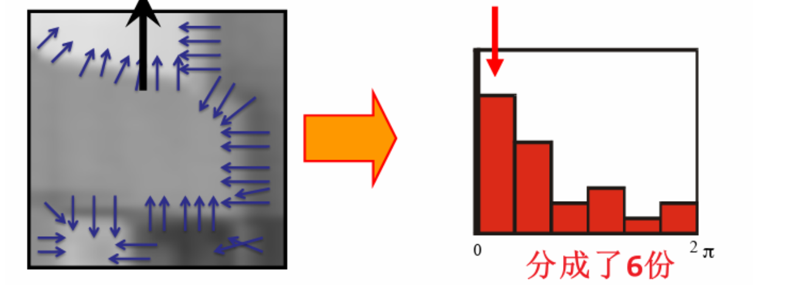

那么只需要按照主方向的角度进行旋转即可

打包后得到的向量即为描述符

显然

-   强度：DoG的归一化、梯度足够处理
-   姿势：按照主方向把所有箭头旋转成一样的角度，无视了姿势变化
-   尺度：DoG处理完毕
-   类内变异：直方图有一定的粗略计算，有一定鲁棒性

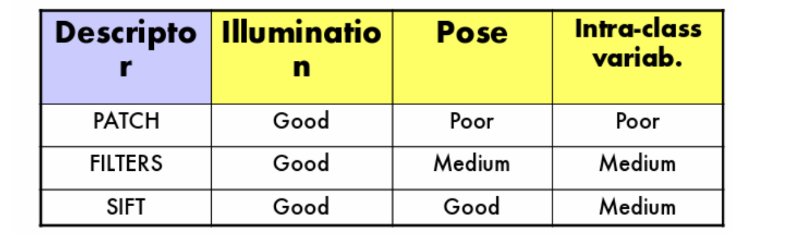

## L11. Visual recognition

## 数学补坑

### SVD分解（未完成）

### 卷积

[【官方双语】那么……什么是卷积？](https://www.bilibili.com/video/BV1Vd4y1e7pj)

在这里我们主要理解一下离散的情况即可

因此我们可以表示两个非均匀骰子点数之和为$n$的概率$P(n)$
$$
P(n) = \sum_{i+j=n}a_ib_j
$$

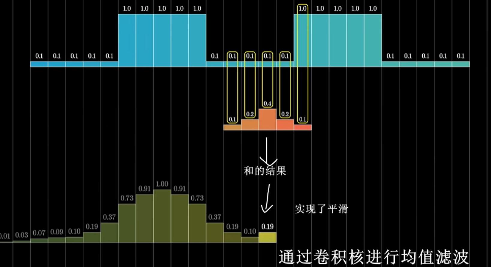

>   高斯模糊：
>
>   在二维图像上，使用一个$n\times n$的卷积核，卷积核的值从中心开始符合二维高斯分布，对整个图像的颜色进行加权平均

