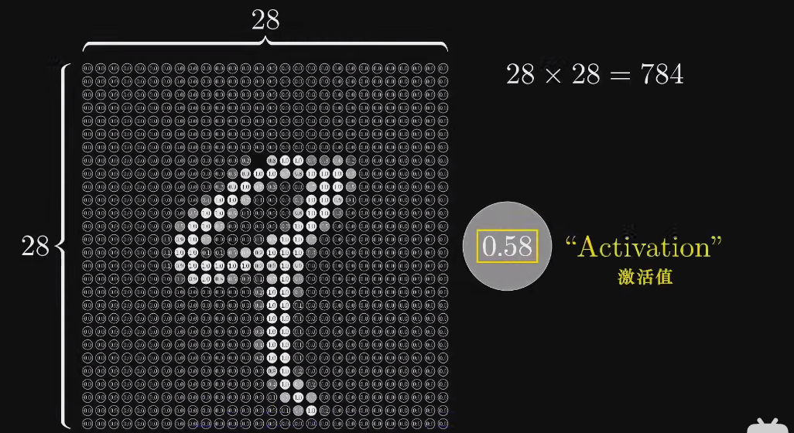
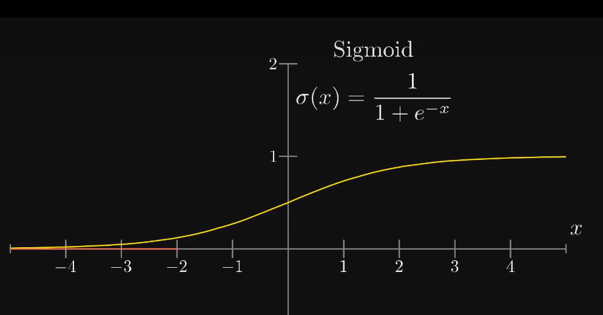
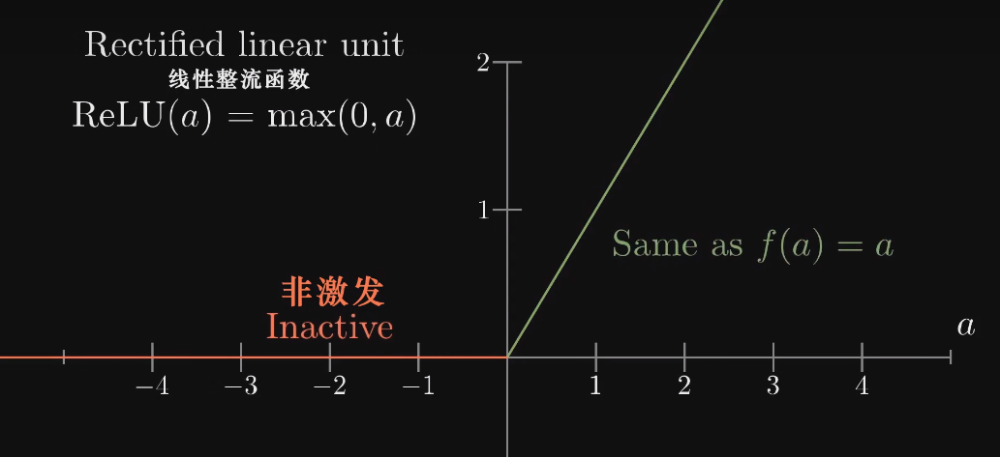
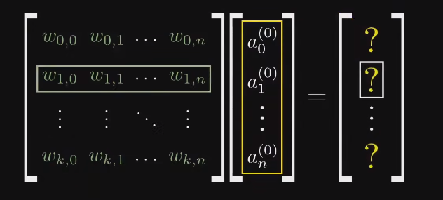
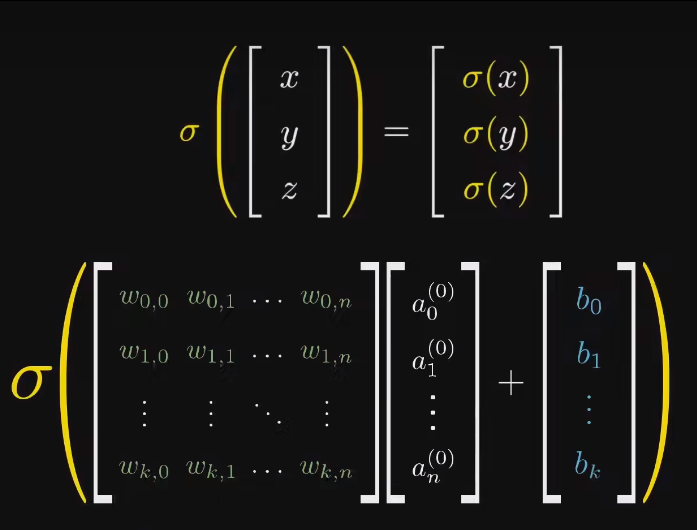

# Cuda手写神经网络

[TOC]

## 神经网络

推荐资料

- [Bilibili: 3d1b神经网络 Part1](https://www.bilibili.com/video/BV1bx411M7Zx)
- [Bilibili: 3d1b神经网络 Part2](https://www.bilibili.com/video/BV1Ux411j7ri)

### 神经元Neuron

> 一个装数字0-1的容器

对于MNIST数据集，每个像素就是一个神经元

其灰度值就是**激活值Activation**

所有像素的神经元组成了网络的第一层

### 结构

对于MNIST数据集的神经网络

- 输入层：每个像素对应一个神经元
- 输出层：一共10个神经元，分别对应0-9的数字。激活值表示概率
- 隐含层：网络的中间部分，进行处理数据的具体工作

### 正向传播

#### 激活函数

常用的激活函数有

- Sigmoid函数：$\sigma(x) = \frac{1}{1+e^{-x}}$

- ReLU函数：$ReLU(a) = \max(a, 0)$

故对于每一层的激活值，由上一层向其连边的神经元得到

可以理解为：对于每个神经元，其对前驱神经元的权重，表示了重要性或者偏好；$\sum w_i a_i$得到的总和，表示了一个强度，但是我们可能需要这个强度大于一个值，才认为是有意义的。因此引入了**偏置（Bias）**。因此此时：$\sum w_i x_i-b$ 为正值时，我们把它喂入激活函数$\sigma(\sum w_i x_i-b)$，就会得到了一个大于0.5的新激活值，认为成功激活

> 你会发现这些是线性组合，用矩阵处理非常方便

我们定义符合表示
$$
a_0^{(1)}=\sigma(w_{0,0}a_0^{(0)}+w_{0,1}a_1^{(0)}+...+b_0)
$$
我们把每一层的所有神经元的激活值看做一个列向量
$$
\begin{bmatrix}
 a_0^{(0)} \\
  a_1^{(0)} \\
.\\
a_n^{(0)}
\end{bmatrix}
$$
这就表示第$0$层（输入层）的列向量

所以我们实际上用了一个$k\times n$的权值矩阵，乘上了一个$n\times 1$的列向量，得到了新的列向量$k\times 1$

最后加上偏置

所以可以简写：
$$
a^{(i)} = \sigma(Wa^{(i-1)}+b)
$$
