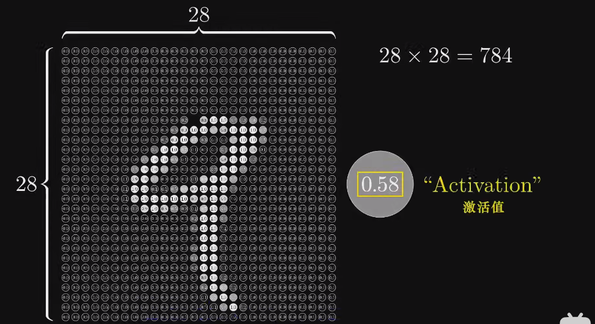
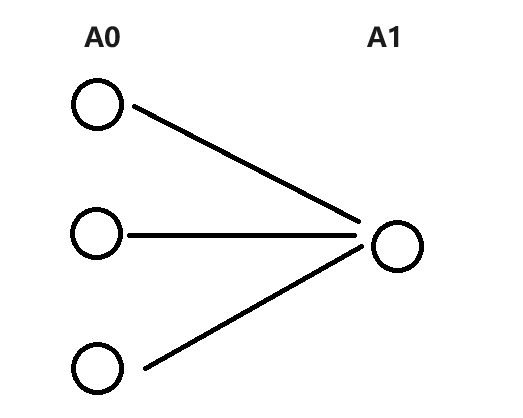

# Cuda手写神经网络

[TOC]

## 神经网络

推荐资料

- [Bilibili: 3d1b神经网络 Part1](https://www.bilibili.com/video/BV1bx411M7Zx)
- [Bilibili: 3d1b神经网络 Part2](https://www.bilibili.com/video/BV1Ux411j7ri)

### 神经元Neuron

> 一个装数字0-1的容器

对于MNIST数据集，每个像素就是一个神经元

其灰度值就是**激活值Activation**

所有像素的神经元组成了网络的第一层

### 结构

对于MNIST数据集的神经网络

- 输入层：每个像素对应一个神经元
- 输出层：一共10个神经元，分别对应0-9的数字。激活值表示概率
- 隐含层：网络的中间部分，进行处理数据的具体工作

这也是我们最终要实现的目标

## 前向传播与反向传播的向量化推导

见`./DeepLearning/Andrew_Ng _DL.md`

## 手写 - 线性模型

有如下线性模型：
$$
y = wx + b
$$
那么显然我们只需要一个输入层，一个输出层即可

我们令$x$是一个$3\times 1$的列向量$\begin{bmatrix}x_1\\x_2\\x_3\end{bmatrix}$

-   输入层：三个神经元
-   输出层：一个神经元

激活函数选择的是Relu函数

### 初始化训练集与真实数据

