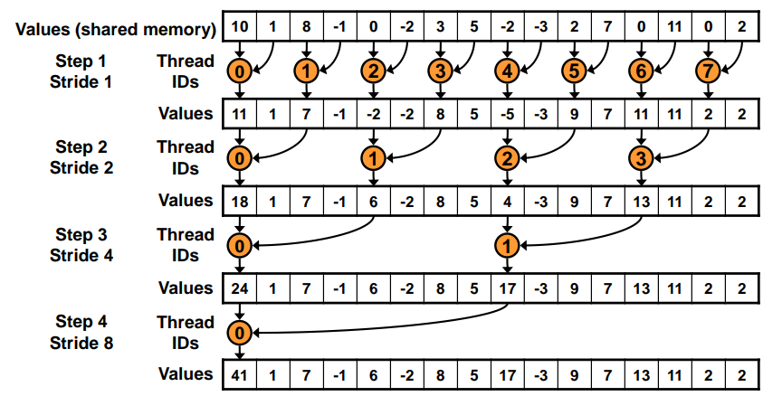
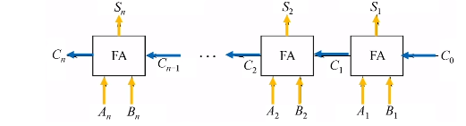
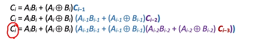

# cuda编程 · 零

> [蒙特卡洛的树 - Cuda编程Bilibili](https://www.bilibili.com/video/BV17K411K76C/)
>
> [Github: Cuda_Learning](https://github.com/keefeWu/cuda_learning)

[TOC]

## 基本步骤

在进行运行之前，我们可以先查询一下设备中有多少块GPU

```cpp
    int gpuCount = -1;
    cudaGetDeviceCount(&gpuCount);
    printf("%d ", gpuCount);
```

然后可以设置成最后一块显卡的ID

`cudaGetDevice`可以得到当前正在使用的gpu

```cpp
    int gpuCount = -1;
    cudaGetDeviceCount(&gpuCount);
    printf("gpuCount = %d\n", gpuCount);

    // 1. 指定GPU设别
    // 单GPU设备其实可以省略此步骤
    cudaSetDevice(gpuCount - 1);

    int devideId = -1;
    cudaGetDevice(&devideId);
    printf("gpu = %d\n", devideId);
```

当设置不存在的设备编号时，默认启动0号gpu


基本步骤如下：

```cpp
#include <stdio.h>
#include <stdlib.h>
#include <cuda_runtime_api.h>

__global__ void kernel(float *a) {
    a[threadIdx.x] = 1;
}

int main(int argc, char ** argv) {

    int gpuCount = -1;
    cudaGetDeviceCount(&gpuCount);
    printf("gpuCount = %d\n", gpuCount);

    // 1. 指定GPU设别
    // 单GPU设备其实可以省略此步骤
    cudaSetDevice(gpuCount - 1);

    int devideId = -1;
    cudaGetDevice(&devideId);
    printf("gpu = %d\n", devideId);

    // 2. 分配显存空间
    float *aGPU;
    // cudaError_t cudaMalloc(void **devPtr, size_t size);
    // void **devPtr 指向待分配内存空间指针的指针 
    // 		指针是通用的设备指针，可以指向任何类型的内存
    // size_t size 分配的内存大小
    cudaMalloc((void**)&aGPU, 16 * sizeof(float));

    // 3. 分配内存空间
    float a[16] = {0};

    // 4. 内存->显存
    // cudaError_t cudaMemcpy(void* dst, const void* src, size_t count, cudaMemcpyKind kind)
    // 目的地址, 源地址，需要复制的字节数量， 复制类型
        //  cudaMemcpyHostToHost：从主机到主机的内存复制。
        //  cudaMemcpyHostToDevice：从主机到设备的内存复制。
        //  cudaMemcpyDeviceToHost：从设备到主机的内存复制。
        //  cudaMemcpyDeviceToDevice：从设备到设备的内存复制。

    cudaMemcpy(aGPU, a, 16 * sizeof(float), cudaMemcpyHostToDevice);

    // 5. 设备代码
    kernel<<<1, 16>>>(aGPU);
    
    // 6. 显存->内存
    cudaMemcpy(a, aGPU, 16 * sizeof(float), cudaMemcpyDeviceToHost);

    for (int i=0;i<16;++i)
        printf("%.2lf ", a[i]);

    // 7. 释放
    cudaFree(aGPU); // 释放申请的显存
    cudaDeviceReset(); // 重置设备
    // 如果主机内存也有申请 也需要释放
}
```

#### GPU详细信息

`cudaDeviceProp`是cuda封装的一个显卡信息结构体

我们可以通过这个结构体查看显卡信息

```cpp
    cudaDeviceProp prop;
    // 指定0号显卡
    cudaGetDeviceProperties(&prop, 0);

    printf("maxThreadsPerBLOCK: %d\n", prop.maxThreadsPerBlock);
    printf("maxThreadsDim: %d\n", prop.maxThreadsDim[0]);
    printf("maxGridSize: %d\n", prop.maxGridSize[0]);
    printf("totalConstMem: %d\n", prop.totalConstMem);
    printf("clockRate: %d\n", prop.clockRate);
    printf("integrated: %d\n", prop.integrated);    

```

还有一些别的东西

```cpp
// 程序可以在多个 CUDA 设备上运行时，可以使用这个函数来选择一个最合适的设备 device会变成被选中的设备编号 
// prop需要填写需求 自动匹配符合要求的设备
cudaError_t cudaChooseDevice(int* device, const cudaDeviceProp* prop)

// 传入一个编号数组和数组长度
// 只有编号在其中的设备会是有效设备
cudaError_t cudaSetValidDevices(int *device_arr, int len);
```

## Cuda项目建立

建立项目文件夹，新建`CMakeLists.txt`

```cmake
cmake_minimum_required(VERSION 3.22)
project(app LANGUAGES CUDA CXX)
find_package(CUDA REQUIRED)
CUDA_ADD_EXECUTABLE(app main.cu)
TARGET_LINK_LIBRARIES(app)
```

在同文件夹下建立一个`main.cu`

```cpp
#include <stdio.h>
#include <stdlib.h>
#include <cuda_runtime_api.h>

__global__ void add(int *a, int *b, int *c, int num) {
	if ( threadIdx.x < num ) 
		c[threadIdx.x] = a[threadIdx.x] + b[threadIdx.x];
}

int main(int argc, char ** argv) {
	
	int num = 10;
	int a[num], b[num], c[num];
	
	for (int i=0;i<num;++i) a[i] = i;
	for (int i=0;i<num;++i) b[i] = i * i;

	int *agpu, *bgpu, *cgpu;
	
	cudaMalloc((void**)&agpu, num * sizeof(int));
	cudaMalloc((void**)&bgpu, num * sizeof(int));
	cudaMalloc((void**)&cgpu, num * sizeof(int));

	cudaMemcpy(agpu, a, num * sizeof(int), cudaMemcpyHostToDevice);
	cudaMemcpy(bgpu, b, num * sizeof(int), cudaMemcpyHostToDevice);

	// 加法
	add<<<1, 10>>>(agpu, bgpu, cgpu, num);
	cudaMemcpy(c, cgpu, num * sizeof(int), cudaMemcpyDeviceToHost);
	
	printf("add:\n");
	for (int i=0;i<num;++i) printf("%d + %d = %d\n", a[i], b[i], c[i]);

	cudaFree(agpu); 
	cudaFree(bgpu); 
	cudaFree(cgpu); 
    cudaDeviceReset(); 
}
```

新建`build`文件夹

```bash
mkdir buid && cd build
cmake ..
make -j3
./app
```

## 手写卷积

什么是卷积？[【官方双语】那么……什么是卷积？](https://www.bilibili.com/video/BV1Vd4y1e7pj)

 首先需要添加一个新的东西：`CUDA_CHECK`

```cpp
#define CUDA_CHECK(call) \
do { \
    cudaError_t err = call; \
    if (err != cudaSuccess) { \
        fprintf(stderr, "CUDA error at %s:%d code=%d(%s) \"%s\"\n", \
                __FILE__, __LINE__, err, cudaGetErrorString(err), #call); \
        exit(EXIT_FAILURE); \
    } \
} while (0)

// 后续我们使用Cuda函数时 用宏进行包装
// 即可及时报错
CUDA_CHECK(cudaMalloc(&devPtr, size));

```

code见`code/src/code_2.cu`


## 并行归约Parallel Reduction

> 我们需要对一个数组进行并行算法的求和

### 交错寻址



两两求和，逐渐合并

但是这样寻址速度较慢

### 连续地址


code见`code/src/code_3.cu`

## 程序计时

推荐使用

```cpp
#include <sys/time.h>

	struct timeval startTime, endTime;
	
	// 获取开始时间
    gettimeofday(&startTime, NULL);

    // 执行一些操作

    // 获取结束时间
    gettimeofday(&endTime, NULL);

    // 计算时间差
    long long elapsedTime = (endTime.tv_sec - startTime.tv_sec) * 1000000LL + (endTime.tv_usec - startTime.tv_usec);

    printf("Elapsed time: %lld microseconds\n", elapsedTime);
```

其中，`sys/time.h` 是一个 C 标准库头文件，通常用于在 POSIX 操作系统中进行时间操作，因此在 POSIX 兼容的操作系统上使用时通常是可用的，比如 Linux 和 macOS 等。

这里我们对手写卷积进行了测速

code见`code/src/code_4.cu`

并且我们发现，我们一个block一次计算，和一个thread一次计算

效率基本一致

并且放在thread可以共享内存，所以推荐放在thread里

## 原子操作

原子操作是一种**不可分割**的操作，它要么完全执行，要么完全不执行，没有中间状态。

在并发编程中，原子操作是一种**确保多个线程或进程安全访问共享资源**的机制。

原子操作能够保证在多线程环境下不会出现数据竞争的情况，从而确保数据的一致性和正确性。

原子操作的特性包括：

1. **不可分割性**：原子操作是一个不可分割的操作，它要么完全执行，要么完全不执行，不会被中断或分割成更小的部分。
2. **独占性**：在原子操作执行期间，其他线程或进程无法访问被操作的资源，直到原子操作执行完成。
3. **并发安全性**：多个线程或进程可以同时执行原子操作，而不会导致数据竞争或数据不一致的情况。

> 银行转账，当钱被转出时若发生中断，则此时钱就少了
>
> 因此转出和转入必须完整执行完毕

### 实例

> 统计每种数字出现多少次

如果在核函数中

```cpp
	hist[ a[id] ] ++;
```

由于会有多个核函数并行操作，每次hist的值都不一致

会造成值操作的覆盖

因此引入了`atomicAdd()`，自动为数据上锁，在完成一次加法之间，不允许被其他thread使用

code见`code/src/code_5.cu`


## 共享内存

使用`__shared__`进行声明

同属于一个block的thread共享一个共享内存

### 静态申请

如果我们一开始就确定要开多少共享内存数组

```cpp
__shared__ int s[64];
__shared__ int s[N]; // N is constexpr
```

### 动态申请

在核函数指定第三个执行配置参数，数值为需要申请的**每个块**动态共享内存大小

```cpp
dynamicReverse<<<1, n, n*sizeof(int)>>>();
```

在核函数内

```cpp
extern __shared__ int s[]; // 此时s即为大小为指定值的数组
```

如果需要申请多个共享内存数组

```cpp
Kernel<<<g, b, nI*sizeof(int)+nF*sizeof(float)+nC*sizeof(char)>>>();
```

申请的数值即为所有数组大小之和

```cpp
extern __shared__ int s[];
int *integerData = s;                        // nI ints
float *floatData = (float*)&integerData[nI]; // nF floats
char *charData = (char*)&floatData[nF];      // nC chars
```

手动切割数组即可


## 框架thrust

> cuda版本的STL

官方地址：https://github.com/NVIDIA/thrust

记录几个比较简单的例子

```cpp
#include <thrust/host_vector.h>
#include <thrust/device_vector.h>

	// 在主机内存中申请 大小为10的vector
	thrust::host_vector<int > a(10);

	for (auto & e : a) std::cin >> e;
	for (auto & e : a) std::cout << e <<" ";

	// 基本和std::vector没什么差别
```

## 实例：估算圆周率

code见`code/src/code_6.cu`

## 多个block的归约

例如我们要进行一个数组求和，但是数组元素个数远远多于线程

一个block的线程数量有限，一般是1024（看具体设备）

因此我们需要让多个block进行归约

（估算圆周率的实例中，我们使用了1个block进行归约）

- 把数据切分为若干段，每段数量为总线程数
- 第一次先把所有数据读到前总线程数个数字内
- 再细分成block num段，每段thread_num个
- 分别归约，得到blockNum个数字
- 数量不会很多的情况下直接CPU计算，节省硬件传输

code见`code/src/code_7.cu`


## 多维矩阵

```cpp

	size_t width = 120, height = 10;
    float * a_gpu; size_t pitch;

    cudaMallocPitch((void**)&a_gpu, &pitch, width*sizeof(float), height );

    printf("real = %zu\npitch = %zu", width*sizeof(float), pitch);
    cudaFree(a_gpu);

// 当width*sizeof(float)<=512时 pitch=512
// 超过512 pitch取最小的512的倍数
```

内存对齐，使得访问效率更高

但是我们一行该放多少放多少，剩下的空间直接忽略

暂时先不研究这个，感觉用处不大


## 实例：手写全加器

对于串行加法器



高位计算需要等待低位的进位

令$A_i+B_i$的进位结果为$C_i$，计算结果为$S_i$

则$C_i = 1 $的情况有：

- $A_i = 1, B_i = 1$同时为1
- $A_i \otimes B_i = 1, C_{i-1} = 1$只有一个1，存在进位1

因此$C_i = A_iB_i + (A_i\otimes B_i)C_{i - 1}$

>$+$表示或，$\cdot$表示并



因此我们可以进行多次展开，每次的进位都可以由$C_0$直接确定

一般来说我们每四位进行并行，然后总体串行即可

code见`code/src/code_8.cu`

