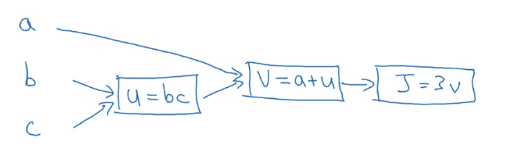
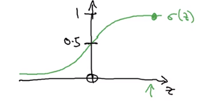
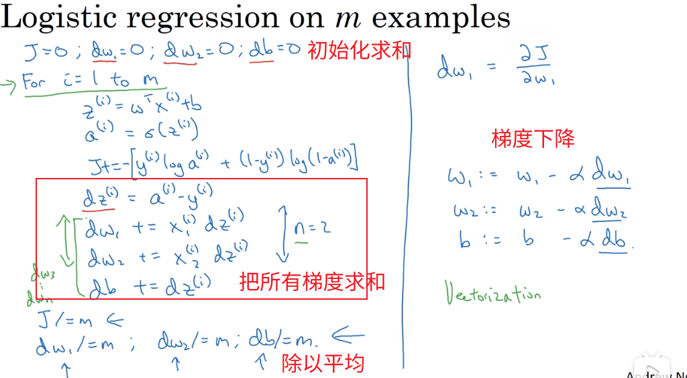

# 深度学习 - 吴恩达

> [Bilibili](https://www.bilibili.com/video/BV1FT4y1E74V)
>
> [配套资源](https://blog.csdn.net/weixin_36815313/article/details/105728919)

[TOC]

## 神经网络与深度学习

### 神经网络基础

对于结构化的训练数据，我们记列向量$x^{(i)}$所构成的矩阵为$X$

所有label值构成一个行向量$Y = \begin{bmatrix}  y^{(1)} & y^{(2)} & ... & y^{(m)}  \end{bmatrix}$

#### 梯度下降

懂的都懂
$$
w:= w - \alpha \frac{\partial J(w, b)  }{\partial w} \\
b:= b - \alpha \frac{\partial J(w, b)  }{\partial b}
$$

#### 计算图

令$J(a,b,c) = 3(a + bc)$

我们将此成本函数进行分解，引入中间变量
$$
u = bc\\
v = a+u\\
J = 3v
$$

- $\frac{\partial J}{\partial v} = 3$
- $\frac{\partial J}{\partial a} = \frac{\partial J}{\partial v}\times \frac{\partial v}{\partial a} = 3 \times 1 = 3$
- $\frac{\partial J}{\partial u} = \frac{\partial J}{\partial v}\times\frac{\partial v}{\partial u} = 3\times 1 = 3$
- $\frac{\partial J}{\partial b} = \frac{\partial J}{\partial u}\times\frac{\partial u}{\partial b}  = 3c $
- $\frac{\partial J}{\partial c} = \frac{\partial J}{\partial u}\times\frac{\partial u}{\partial c}  = 3b $

通过构建计算图，我们从右往左，可以非常容易计算出导数

每个矩形框使用的运算类型，其所代表的求导公式可以提前保存

#### Logistic Regression

> 给定$X$，需要计算出$\hat y = P(y=1|x)$
>
> 即符合某种分类的概率

- 输入：$X$
- 参数：$w\in R^{n}, b \in R$
- 输出：$\hat y = \sigma(w^Tx + b)$

> sigmoid函数：
> $$
> \sigma(z) = \frac{1}{1 + e^{-z}}
> $$
> 求导$y = \sigma(z)$：
> $$
> y = \frac{1}{1 + e^{-z}} \\
> y' = \frac{e^{-z}}{(1+e^{-z})^2} = \frac{1+e^{-x}- 1}{1+e^{-x}} \times \frac{1}{1+e^{-x}}=(1-y)y
> $$
> 

##### Loss Function损失函数

$$
L(\hat y, y) = -(y\log \hat y + (1-y)\log (1-\hat y))
$$

Loss Function是对单个样本的计算

>**为什么选择上述函数作为损失函数？**
>
>我们希望我们的模型输出$\hat y$：标签$y=1$的概率
>
>因此，标签$y=0$的概率即为：$1-\hat y$
>
>即为：
>$$
>P(y=1|x) = \hat y\\
>P(y=0|x) = 1-\hat y
>$$
>当y=1时，我们期待$\hat y$尽可能大，接近1
>
>当y=0时，我们期待$1-\hat y$尽可能大，接近1
>
>
>
>我们希望统一这两个式子：
>$$
>P(y|x) = \hat y^y\times (1-\hat y)^{1-y}
>$$
>不符合的地方自动会变成1，不影响到结果
>
>**因此目标为：最大化这个函数**
>
>但这个函数比较抽象，不方便研究
>
>我们知道对数函数是一个**单调递增**的函数，因此我们对原式同时进行对数操作
>$$
>\log P(y|x)= \log( \hat y^y\times (1-\hat y)^{1-y})= y\log \hat y+(1-y)\log (1-\hat y)
>$$
>我们希望最大化$P(y|x)$，那么根据单调函数的性质，最大化$\log P(y|x)$即可
>
>我们需要最大化左边的值，就需要最大化右边
>
>我们加个负号
>$$
>L(\hat y, y) = -(y\log \hat y + (1-y)\log (1-\hat y))
>$$
>右边的表达式就是损失函数的负值
>
>我们最小化损失函数，与最大化概率值的目的一致
>
>因此作为损失函数非常不错

##### Cost Function成本函数 

$$
J(w, b) = \frac{1}{m}\sum L(\hat y^{(i)},y^{(i)})
$$

针对总体成本的函数

神经网络训练目标即为：找到最佳的参数，使得成本函数最小

>   **为什么选择这个作为成本函数？**
>
>   ~~直觉上是这样~~
>
>   我们考虑从**最大似然估计**的角度出发
>
>   在参数$w,b$下，所有单个样本等于某个随机值$y_i$的概率就是：$\prod  P(y_i|x)$
>
>   构造似然函数：$L(w,b|y,x) = \prod  P(y_i|x)$
>
>   是一个关于$w,b$的函数，$y,x$均为定值
>
>   同样，我们希望两边求对数
>   $$
>   \log L =- \sum  L(\hat y, y)
>   $$
>   我们令成本函数：
>   $$
>   J(w, b) = -\frac{1}{m} \sum  L(\hat y, y)
>   $$
>   乘上一个$\frac{1}{m}$常数因子没什么影响，更加方便
>
>   最小化成本函数，即为最大化似然函数，则就是找到了最佳参数组合，使得样本和标签值已知的情况下，概率最大

##### Logistics Regression的梯度下降

首先考虑**单个样本**
$$
z^{(i)} = w^Tx^{(i)} + b \\
\hat y^{(i)} = \sigma(z^{(i)}) \\
L = -( y^{(i)}\log \hat y^{(i)} +(1- y^{(i)})\log  (1-\hat y^{(i)}) )
$$
我们求出梯度，通常在编程中，我们喜欢使用$d_a$表示目标函数关于$a$的梯度
$$
d\hat y^{(i)} = \frac{\partial L}{\partial \hat y^{(i)}} = - \frac{y^{(i)}}{\hat y^{(i)}} +\frac{1 - y^{(i)}}{1 - \hat y^{(i)}} \\
dz^{(i)} = d\hat y^{(i)} \times \frac{\partial \hat y^{(i)}}{\partial z^{(i)}} = d\hat y^{(i)} \times (1-\hat y^{(i)})\hat y^{(i)} = \hat y^{(i)} - y^{(i)}
$$

$w$我们**暂时先不看作是一个矩阵向量**

我们分别对$w_1,w_2, ...$即$w_j$进行求导
$$
dw_j^{(i)} = dz^{(i)}\times \frac{\partial z^{(i)}}{\partial w_j} = x^{(i)}_jdz^{(i)} =  x^{(i)}_j(\hat y^{(i)} - y^{(i)}) \\
db^{(i)} = dz^{(i)}\times \frac{\partial z^{(i)}}{\partial b} = dz^{(i)} = \hat y^{(i)} - y^{(i)}
$$
现在我们考虑**多个样本**，即需要考虑的是成本函数$J$​

事实上：$J = \frac{1}{m}L(\hat y^{(i)}, y^{(i)})$

每个样本之间都是不相干的，我们一个枚举，把所有单个样本的结果：$d_w,d_b$全部计算出来求和，最后除以$m$求平均即可

但是对于深度学习问题，我们枚举计算非常低效

解决方法有：

- 向量化
- 小批量随机梯度下降

 

##### Logistics Regression的梯度下降（向量化版本）

>   避免显示的for循环
>
>   不管是CPU还是GPU，我们都更加推荐使用支持SIMD的函数
>
>   充分并行化操作，加快执行效率

-   $v = [v_1, ..., v_n]^T$
-   $e^v = [e^{v_1},...,e^{v_n}]^T$

大部分函数操作，如`abs,log`等，都是会自动扩展成矩阵向量形式的

---

我们首先计算$z^{(i)}$，非向量版本就需要一个个枚举
$$
z^{(i)} = w^Tx^{(i)} + b
$$
我们可以放在一个矩阵中
$$
z =\begin{bmatrix}
z^{(1)} & z^{(2)} & ... & z^{(m)} 
\end{bmatrix}
= 
\begin{bmatrix}
 w^Tx^{(1)} + b & w^Tx^{(2)} + b & ... &  w^Tx^{(m)} + b
\end{bmatrix}
=
w^TX+b
$$
则有：
$$
\hat y =\begin{bmatrix}
\hat y^{(1)} & \hat y^{(2)} & ... & \hat y^{(m)} 
\end{bmatrix}
=
\begin{bmatrix}
\sigma(z^{(1)}) & \sigma(z^{(2)}) & ... & \sigma(z^{(m)} )
\end{bmatrix}
=
\sigma\begin{bmatrix}
z^{(1)} & z^{(2)} & ... & z^{(m)} 
\end{bmatrix}
= \sigma(z)
$$
接下来我们计算梯度
$$
dz = \begin{bmatrix}
dz^{(1)} & dz^{(2)} & ... & dz^{(m)} 
\end{bmatrix}
=
\begin{bmatrix}
\hat y^{(1)}- y^{(1)} & \hat y^{(2)}-y^{(2)} & ... & \hat y^{(m)}-y^{(m)} 
\end{bmatrix}
= \hat y - Y
$$
**这也就解释了为什么Y是行向量**

>   列向量表示同一个样本的不同属性
>
>   行向量表示多个不同样本

$$
dw = \begin{bmatrix}
dw_1\\
dw_2\\
...\\
dw_n
\end{bmatrix}
=
\frac{1}{m} \begin{bmatrix}
\sum x_1^{(i)}dz^{(i)}  \\
\sum x_2^{(i)}dz^{(i)}\\
...\\
\sum x_n^{(i)}dz^{(i)}
\end{bmatrix}
=
\frac{1}{m} \begin{bmatrix}
x_1dz^T  \\
x_2dz^T \\
...\\
x_ndz^T 
\end{bmatrix}
=\frac{1}{m}Xdz^T
$$
得到的是一个$(n\times m)*(m\times 1) = (n\times 1)$的矩阵
$$
db = \frac{1}{m}\sum dz^{(i)}
$$
是一个标量

最后，梯度下降即可以表示为：
$$
w:=w -\alpha dw\\
b:=b -\alpha db
$$
