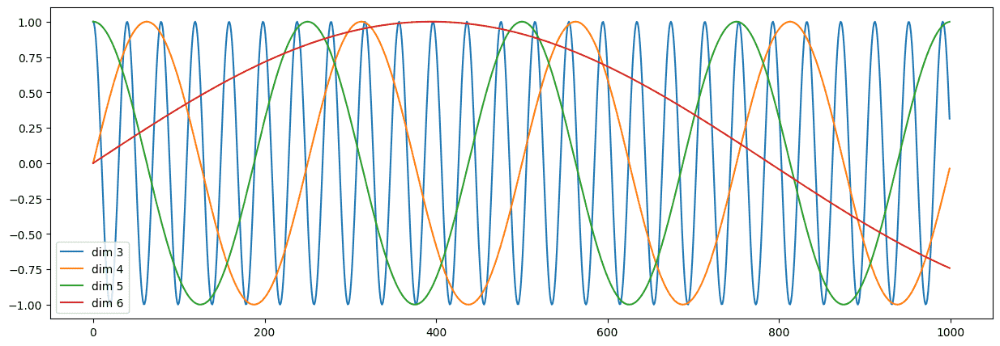

# Transformer

>   理论：[李宏毅机器学习L5 · Sequence to Sequence · BiribiriBird's Gallery (aoijays.top)](https://aoijays.top/2024/08/12/Lee-ML-L5/)
>
>   参考代码：[一文看懂Transformer内部原理（含PyTorch实现） - 郭耀华 - 博客园 (cnblogs.com)](https://www.cnblogs.com/guoyaohua/p/transformer.html)
>
>   论文：[Transformer论文逐段精读【论文精读】_哔哩哔哩_bilibili](https://www.bilibili.com/video/BV1pu411o7BE/)

动手学深度学习那的代码看不动了

我发现不如直接翻论文看源代码（

笔记中只有如何构建Transfomer架构的代码

关于训练什么的懒得写了（有用到再补吧（

[TOC]

## 注意力

### 注意力机制

-   查询query
-   键值对key+value
    -   所有的键值对被称为source

注意力机制对不同信息的关注程度用权值体现

>   本质上Attention机制是Source中元素的Value值进行加权求和，而Query和Key用来计算对应Value的权重系数

$$
\text{Attention}(\text{query},\text{Source}) = \sum_{}^{\text{Source}} \text{similarity}(\text{query},\text{key}_i)\times \text{value}_i
$$

我们可以使用`heatmap`展示权值

```python
def show_heatmaps(matrix):
    matrix = matrix.squeeze()
    plt.figure(figsize=(8, 6)) # 移除数组中所有长度为1的维度
    sns.heatmap(matrix,cmap="viridis")
    plt.title("Attention")
    plt.xlabel("Key")
    plt.ylabel("Query")
    plt.show()
    
show_heatmaps(torch.eye(10).reshape((1, 1, 10, 10)))
```


### 注意力汇聚

我们构造一个符合以下函数的数据集：
$$
y=2\sin(x)+x^{0.8} 
$$

```python
n_train = 50

x_train,_ = torch.sort(torch.rand(n_train) * 5) # rand是0-1
y_train = torch.sin(x_train) * 2 + x_train**0.8
y_train += torch.normal(0,0.5,(n_train,)) # 训练样本添加噪声

n_test = 50
x_test = torch.arange(0, 5, 5/n_test)
y_test = torch.sin(x_test) * 2 + x_test**0.8
```


绘图代码

```python
def show_line(y_pred=None):
    plt.figure(figsize=(8, 6))
    plt.scatter(x_train, y_train, color='blue', label='Train Data')
    plt.plot(x_test, y_test, color='red', label='Test Data')
    
    if y_pred is None:
        pass
    else:
        plt.plot(x_test, y_pred, color='green', label='Pred Data')
    plt.title('Train and Test Data')
    plt.xlabel('X')
    plt.ylabel('Y')
    plt.legend()
    plt.grid(True)
    plt.show()
show_line()
```


#### 平均汇聚

比较简单的考虑，对于所有键值对$key,value$，不管查询内容是什么，我们直接分配平均、一致的权重
$$
\text{Attention}(\text{query}) = \frac{1}{n}\sum y_i
$$

```python
def avg_attention(query, x_train, y_train):
    return torch.full( (len(query), len(x_train)), 1/len(x_train))

# 形状(n_test,n_train)
attention_weights = avg_attention(x_test, x_train, y_train)
show_heatmaps(attention_weights)
```


显然，所有权重都一样：

```python
# 权重乘上value
y_pred = torch.matmul(attention_weights, y_train)
show_line(y_pred)
```


显然是不太好，我们并没有考虑key的存在


#### 非参数注意力汇聚

我们希望引入key。query和key越近，权重当然是越大的
$$
\text{Attention}(\text{query}) = \sum \frac{K(x-x_i)}{\sum K(x-x_j)} \times y_i
$$
其中$K$是核函数，我们可以采用高斯核：
$$
K(\mu) = \frac{1}{\sqrt{2\pi}}\exp(-\frac{\mu^2}{2})
$$
代入得：
$$
\text{Attention}(\text{query}) = \sum\text{softmax}(-\frac{1}{2}(x-x_i)^2)\times y_i
$$

```python
def non_param_attention(query, x_train, y_train):
    x_repeat = x_train.repeat(len(query)).reshape(len(query),-1)
    x_repeat = -1/2 * ((x_repeat - query.reshape(-1,1)) ** 2)
    return nn.functional.softmax(x_repeat, dim=1)

attention_weights = non_param_attention(x_test, x_train, y_train)
show_heatmaps(attention_weights)

y_pred = torch.matmul(attention_weights, y_train)
show_line(y_pred)
```


好了不少


#### 带参数注意力汇聚

可以引入可学习参数，模型自适应地进行调整
$$
\text{Attention}(\text{query}) = \sum \frac{K((x-x_i)\times w)}{\sum K((x-x_j)\times w)} \times y_i
$$
同样使用高斯核：
$$
\text{Attention}(\text{query}) = \sum\text{softmax}(-\frac{1}{2}((x-x_i)\times w)^2)\times y_i
$$

```python
class Mynn(nn.Module):
    def __init__(self, *args, **kwargs) -> None:
        super().__init__(*args, **kwargs)
        self.w = nn.Parameter(torch.rand((1,), requires_grad=True))
        self.attention_weights = torch.rand(1,)
        
    def forward(self, query, x_train, y_train):
        x_repeat = (x_train.repeat(len(query)).reshape(len(query),-1) - query.reshape(-1,1)) * self.w
        x_repeat = -1/2 * ( x_repeat** 2)
        self.attention_weights = nn.functional.softmax(x_repeat, dim=1)
        return torch.matmul(self.attention_weights, y_train)

    def getAttention(self):
        show_heatmaps(self.attention_weights)
    
net = Mynn()
loss = nn.MSELoss(reduction='none')
trainer = torch.optim.SGD(net.parameters(), lr=0.5)

for epoch in range(5):
    trainer.zero_grad()
    l = loss(net(x_train, x_train, y_train), y_train)
    l.sum().backward()
    trainer.step()
    print(f'epoch {epoch + 1}, loss {float(l.sum()):.6f}')
    
'''
epoch 1, loss 57.662407
epoch 2, loss 6.773480
epoch 3, loss 6.629529
epoch 4, loss 6.524448
epoch 5, loss 6.442084
'''

with torch.no_grad():
    y_pred = net(x_test, x_train, y_train)
    show_line(y_pred)
    
net.getAttention()
```


效果好很多

可以发现权重更加集中，因此受训练数据影响非常大

出现不平滑的曲线


### 注意力评分函数

我们的权重最后是依靠softmax进行输出

我们把喂入softmax的函数称为注意力评分函数


对于前文来说，评分函数为：
$$
-\frac{1}{2}((x-x_i)\times w)^2
$$

#### 掩蔽softmax

我们把评分函数这个概念独立出来是有意义的

有时候我们会需要对序列填充词元，但是最后在进行计算时，他们不应该带来权重，即我们需要屏蔽他们

```python
def masked_softmax(X, valid_lens):

    if valid_lens is None:
        return nn.functional.softmax(X, dim=-1)
    else:
        shape = X.shape
        # 全部变成1d
        if valid_lens.dim() == 1:
            valid_lens = torch.repeat_interleave(valid_lens, shape[1]) 
            #[2,3,..]->[2,2,2,...,3,3,3...]
        else:
            valid_lens = valid_lens.reshape(-1)
        # 最后一轴上被掩蔽的元素使用一个非常大的负值替换，从而其softmax输出为0
        X = sequence_mask(X.reshape(-1, shape[-1]), valid_lens, value=-1e6)
        return nn.functional.softmax(X.reshape(shape), dim=-1)
```

测试：

```python
masked_softmax(torch.rand(2, 2, 4), torch.tensor([2, 3]))
'''
tensor([[[0.5980, 0.4020, 0.0000, 0.0000],# 2
         [0.5548, 0.4452, 0.0000, 0.0000]], # 2

        [[0.3716, 0.3926, 0.2358, 0.0000], # 3
         [0.3455, 0.3337, 0.3208, 0.0000]]]) # 3
'''

masked_softmax(torch.rand(2, 2, 4), torch.tensor([[1, 3], [2, 4]]))
'''
tensor([[[1.0000, 0.0000, 0.0000, 0.0000], # 1
         [0.4125, 0.3273, 0.2602, 0.0000]], # 3

        [[0.5254, 0.4746, 0.0000, 0.0000], # 2
         [0.3117, 0.2130, 0.1801, 0.2952]]]) # 4
'''
```


#### 加性注意力

有时候查询和键是尺寸不一致的向量

我们可以分别对$q,k$​（查询和键）通过一个全连接层，使其对齐

定义加性注意力的评分函数：
$$
a(q,k) = W_v^T\tanh(W_qq+W_kk)
$$

```python
#@save
class AdditiveAttention(nn.Module):
    """加性注意力"""
    def __init__(self, key_size, query_size, num_hiddens, dropout, **kwargs):
        super(AdditiveAttention, self).__init__(**kwargs)
        self.W_k = nn.Linear(key_size, num_hiddens, bias=False) # 注意禁用偏置
        self.W_q = nn.Linear(query_size, num_hiddens, bias=False)
        self.w_v = nn.Linear(num_hiddens, 1, bias=False)
        self.dropout = nn.Dropout(dropout)

    def forward(self, queries, keys, values, valid_lens):
        queries, keys = self.W_q(queries), self.W_k(keys)
        # queries(batch_size，查询的个数，1，num_hidden)
        # key(batch_size，1，“键－值”对的个数，num_hiddens)
        # 使用广播方式进行求和
        features = queries.unsqueeze(2) + keys.unsqueeze(1)
        features = torch.tanh(features)
        # self.w_v仅有一个输出，因此从形状中移除最后那个维度。
        # scores的形状：(batch_size，查询的个数，“键-值”对的个数)
        scores = self.w_v(features).squeeze(-1)
        self.attention_weights = masked_softmax(scores, valid_lens)
        # values的形状：(batch_size，“键－值”对的个数，值的维度)
        return torch.bmm(self.dropout(self.attention_weights), values)
```


### 缩放点积注意力

我们想计算得更简单一点

那么我们定义评分函数：
$$
a(q,k) = \frac{q\cdot k}{\sqrt{d}}
$$
其中$d$是查询和键的长度为d

>考虑每一个token都是一个服从标准正态分布的随机变量
>
>那么方差都是1，长度为d序列的方差就是d个1相加得到1
>
>所以最后结果除以标准差，缩放一下


## 自注意力机制

[李宏毅机器学习L4 · Sequence as input · BiribiriBird's Gallery (aoijays.top)](https://aoijays.top/2024/08/11/Lee-ML-L4/)

相比循环神经网络，可以做并行化


## 手搓Transformer


顺序和论文顺序不太一样，因为直接按顺序的话代码看不懂（


### Word Embedding

我们需要对词元序列转化为张量

考虑使用`nn.Embedding`，作为一个**可学习**的词嵌入方式


我们可以将词嵌入的结果看作服从标准正态分布的随机变量，我们考虑进行一定的缩放

即乘上一个$\sqrt{d_{model}}$，确保嵌入向量的幅度与 `d_model` 的大小成比例

>   为什么 ？后面需要Position Encoding，两个结果需要相加，但是如果embedding结果比较小，就会被掩盖，因此需要缩放一下

```python
class Embeddings(nn.Module):
    def __init__(self, d_model, vocab):
        super().__init__()
        # vocab 表示词汇表的大小，d_model 表示嵌入向量的维度
        self.lut = nn.Embedding(vocab, d_model)
        self.d_model = d_model
    def forward(self, x):
        return self.lut(x) * math.sqrt(self.d_model)
```


### Position Encoding

Transformer中采用的是**Sinusoidal Position Encoding**

对于序列中位置位于$pos$的token，我们定义其位置编码为一个$d_{model}$维的向量：

$2i$表示偶数维度，$2i+1$表示奇数维度：
$$
PE(pos,2i) = \sin (\frac{pos}{10000^{2i/d_{model}}})\\
PE(pos,2i+1) = \cos (\frac{pos}{10000^{2i/d_{model}}})
$$
使用正余弦函数交错

对于**同一个维度**，都只是关于$pos$的三角函数：其频率由：$1$降低到$\frac{1}{10000}$，波长由$2\pi$增加到$10000\times 2\pi$

这样的好处是我们可以轻松表示序列中的相对位置

对于$pos$和$pos+k$，$pos+k$可以表示为：
$$
PE(pos+k,2i) = \sin (\frac{pos+k}{10000^{2i/d_{model}}})
$$
令分母为$\frac{1}{w_{2i}}$：
$$
PE(pos+k,2i) = \sin (w_{2i}(pos+k)) \\
= \sin(w_{2i}pos)\cos(w_{2i}k)+\cos(w_{2i}pos)\sin(w_{2i}k)\\
= PE(pos,2i)\cos(w_{2i}k)+PE(pos,2i)\sin(w_{2i}k)
$$
对于$2i+1$也是同理

你会发现$pos+k$可以被表示为$pos$的线性表示

进一步的，当我们将两个位置的位置编码进行点积，将会得到一个只关于维度$i$和位置差$k$的常数

则有：
$$
PE(pos+k,)PE(pos) = PE(pos-k)PE(pos)
$$
两对距离一致的位置编码点积结果一致

**坏处是无法区分方向**


开始实现代码：

对于第$i$组三角函数的自变量的分母只与维度有关，可以表示为$\text{divterm}_i$​


$$
\text{divterm}_i = \frac{1}{10000^{2i/d_{model}}} = \exp( -(2i/d_{model})\ln 10^4 )
$$
则第$pos$个token第$2i$、$2i+1$维的三角函数为：$\sin(pos\times \text{divterm}_i),\cos(pos\times \text{divterm}_i)$

```python
class PositionalEncoding(nn.Module):
    
    # 词嵌入维度 dropout概率 最大序列长度
    def __init__(self, d_model, dropout, max_len = 5000):
        super(PositionalEncoding, self).__init__()
        
        # 对于序列的每个位置 初始化每一维
        position_encoding = torch.zeros( max_len, d_model )
        
        # div_term : pos * exp( - (2i/d_model)ln1e4 ) 
            # 0~2i,2i+1~d_model-1
            # -torch.arange(0, d_model, 2) / d_model   -> -2i/d_model
        div_term = torch.exp( -torch.arange(0, d_model, 2) / d_model * math.log(10000.0) ) 
        position = torch.arange( max_len ).unsqueeze(1) # ->  [ [0], [1], [2], ... ]
        
        # position*div_term 广播机制 
        # position : (max_len, 1) div_term : (1, d_model/2)
        # -> (max_len, d_model/2)
        half_pe = position*div_term
        position_encoding[:, 0::2] = torch.sin(half_pe) # 每个token的偶数维度
        position_encoding[:, 1::2] = torch.cos(half_pe) # 每个token的奇数维度
        
        # -> (1, max_len, d_model) 方便批量操作
        position_encoding = position_encoding.unsqueeze(0)
        
        # 定义一组参数self.position_encoding 
        # 模型训练时不会更新 即调用 optimizer.step() 后该组参数不会变化，只可人为地改变它们的值
        # 但是保存模型时，该组参数又作为模型参数不可或缺的一部分被保存
        self.register_buffer('position_encoding', position_encoding)
        self.dropout = nn.Dropout(dropout)
        
    def forward(self, x):
        # x: (batch_size, position , dim)
        # 返回所有x.size(1)表示x的序列长度（可能含有pad）
        # 广播机制：每个batch都进行同样操作
        return self.dropout( x + self.position_encoding[:, : x.size(1) ] )
```

测试效果：

```python
plt.figure(figsize=(15, 5))

pe = PositionalEncoding(10, 0, 1000)
y = pe((torch.zeros(2, 1000, 10)))
print(y.shape)

plt.plot(np.arange(1000), y[0, :, 3:7].data.numpy())
plt.legend(["dim %d"%p for p in [3,4,5,6]])
```




### Attention


Transformer采用**缩放点积注意力机制**

前文讲过了

我们将多组$q,k,v$表示为矩阵形式：$Q,K,V$

则有：
$$
\text{Attention}(Q,K,V) = \text{softmax}(\frac{QK^T}{\sqrt{d_K}})V
$$
Transformer中设定了$d_{model} =512$，因此$Q,K,V$中每个向量的维度都是一致的$dim = 512$

假设$Q$是一个$(n,dim)$的矩阵，$K$和$V$是键值对，因此形状均为$(m,dim)$


-   因为是**自注意力机制**，所以$n=m$，$q,k$都是一回事
-   图漏了一个scale

-   点积速度更快、矩阵乘法方便并行
-   点积之后做一次sacle，避免在维度较大时，点积结果较大，softmax得到一个较大的值，梯度会更小，更难迭代
    -   因此除以标准差，消除维数的影响

-   Mask：有时候需要计算注意力时，可以得到整个序列；而有时做预测时，是只能看到之前的序列，因此需要mask去屏蔽后面的数值（我们并不会动态改变矩阵大小，而只是修改值），保证计算只有有效的数值参与

```python
def attention(query, key, value, mask=None, dropout=None):
    # value,query,size : (batch_size, num_heads, seq_len, d_k) 
    # num_heads会用到多头注意力机制中
    
    d_k = query.size(-1) # 最后一维 表示向量维度大小
    
    # 计算相似分数
    # key交换最后两个维度 实质上是进行转置
    scores = torch.matmul(query, key.transpose(-2, -1)) / math.sqrt(d_k)
    
    if mask is not None:
        # pytorch自带函数 满足第一个条件mask == 0时 赋值为：-1e9
        scores = scores.masked_fill(mask == 0, -1e9)
    
    # 按最后一个维度去softmax
    # score:(batch_size, num_heads, seq_len, seq_len) 
    # 每个token对其他所有token的分数
    attention_weights = F.softmax(scores, dim=-1) 
    
    if dropout is not None:
        # 引入一点噪声
        attention_weights = dropout(attention_weights)
        
    return torch.matmul(attention_weights, value), attention_weights
```

测试：

```python
# 创建一些测试数据
# 这里假设每个输入的维度是 d_k = 4，序列长度为 3
batch_size = 2
num_heads = 1
seq_len = 3
d_k = 4

# 生成随机的 query, key, value 张量
query = torch.rand(batch_size, num_heads, seq_len, d_k)
key = torch.rand(batch_size, num_heads, seq_len, d_k)
value = torch.rand(batch_size, num_heads, seq_len, d_k)

# 生成可选的 mask 张量
mask = torch.ones(batch_size, num_heads, seq_len, seq_len)

# 测试 attention 函数
output, attention_weights = attention(query, key, value, mask)

# 输出测试结果
print(attention_weights.shape)
print(output.shape)

show_heatmaps(attention_weights)
```


### Multi-Head Attention

我们需要引入多头注意力机制，丰富模型对相似度的表达

对于第$i$个头，我们通过全连接层或矩阵乘法等方式，对$Q,K,V$进行一定的投影变换

求解变化后的注意力，达到丰富相似度的功能
$$
head_i = \text{Attention}(QW^Q_i,KW^K_i,VW_i^V)
$$
最后我们需要合并所有的$head_i$
$$
\text{MultiHead}(Q,K,V) = \text{Concat}(head_1, ...,head_h)W^O
$$
我们将所有的矩阵连接起来，做一次输出的全连接层或矩阵乘法，重新投影成$(n,d_{model})$的矩阵

为了保证维度正确，每个$head_i$的形状取决于我们采用的头数$h$，则$d_k = \frac{d_{model}}{h}$

Transformer中使用了$h=8$，则$d_k=512/8=64$​


```python
def clones(module, n):
    # 深拷贝
    return nn.ModuleList([copy.deepcopy(module) for _ in range(n)])

class MultiHeadedAttention(nn.Module):
    def __init__(self, h, d_model, dropout=0.1):
        super(MultiHeadedAttention, self).__init__()
        assert d_model % h == 0
        self.h, self.d_k = h, d_model//h
        self.dropout = nn.Dropout(dropout)
        self.attn = None
        self.linears = clones(nn.Linear(d_model, d_model), 4)
    
    def forward(self, query, key, value, mask=None):
        if mask is not None:
            mask = mask.unsqueeze(1)
            
        batch_size = query.size(0)

        # 切分成多头
        ## value,query,size : (batch_size, seq_len, d_model) 
        ## linear(x): (batch_size, seq_len, d_model) 
        ## .view(batche_size, -1, self.h, self.d_k) -> (batch_size, seq_len, num_heads, d_k)
        ## .transpose(1, 2) -> (batch_size, num_heads, seq_len, d_k) 转置操作
        
        # zip -> (linear0, query) (linear1, key) (linear2, value)
        # 最后一个linear没有被绑定
        
        query, key, value = [
            linear(x).view(batch_size, -1, self.h, self.d_k).transpose(1, 2)
            for linear, x in zip(self.linears, (query, key, value))
        ]
        
        # 此时x:(batch_size, num_heads, seq_len, d_model)
        # 转置回来 重新变成(batch_size, seq_len, num_heads, d_k)
        # 修正存储 保证数值一定是连续存储的 .contiguous()
        # 否则无法使用.view() -> (batch_size, seq_len , d_model)
        x, self.attn = attention(query, key, value, mask=mask, dropout=self.dropout)
        x = x.transpose(1, 2).contiguous().view(batch_size, -1, self.d_k*self.h)
        return self.linears[-1](x)
```

测试：

```python
    # 定义一些参数
    batch_size = 2
    seq_len = 5
    d_model = 16
    h = 4
    
    # 随机生成一些输入张量
    query = torch.rand(batch_size, seq_len, d_model)
    key = torch.rand(batch_size, seq_len, d_model)
    value = torch.rand(batch_size, seq_len, d_model)
    
    # 创建一个 mask，假设要忽略序列中的最后一个时间步
    mask = torch.ones(batch_size, num_heads, seq_len)
    mask[:, -1] = 0  

    # 创建 MultiHeadedAttention 实例
    mha = MultiHeadedAttention(h, d_model)
    
    # 前向传播
    output = mha(query, key, value, mask=mask)
    
    # 打印输出的形状
    print("Output shape:", output.shape)
    
    # 检查输出的维度是否符合预期
    assert output.shape == (batch_size, seq_len, d_model), "Output shape mismatch!"
    
    print("Test passed with mask!")
    '''
    checking
torch.Size([2, 4, 5, 5])
torch.Size([2, 1, 1, 5])
Output shape: torch.Size([2, 5, 16])
Test passed with mask!
    '''
```


回到Transformer，我们一共使用了三次多头注意力机制：


我们需要搞清楚三次分别读取了什么，实现了什么，输出了什么

#### Encoder层的MHA


-   Key、Value和Query都来同一个地方，这里都是来自Encoder中前一层的输出

#### Decoder层的masked-MHA


-   一样是复制三份
-   只不过输入的来源不只是源文本，而是添加了之前的预测文本

#### Encoder-Decoder的MHA


-   Decoder先前的解码器的输出作为Q
-   Encoder的输出复制两遍，作为K和V

相当于Decoder每次根据当前的输出文本，从给定的源文本的上下文中，挑选更加感兴趣的内容进行加权


### Position-wise Feed-Forward Networks

encoder和decoder每个块的最后部分的输出，都有一个FFN（前馈神经网络）

-   多头注意力机制是线性的，因此我们需要引入一点非线性，能够捕捉更复杂的模式和特征

$$
FFN(x) = \text{ReLU}(xW_1+b)W_2+b
$$

统一设计为单隐藏层的神经网络，输入输出维度均为$d_{model} = 512$

隐藏层维度$d_{ff}=2048$

```python
class PositionwiseFeedForward(nn.Module):
    def __init__(self, d_model, d_ff, dropout=0.1):
        super(PositionwiseFeedForward, self).__init__()
        self.ffn = nn.Sequential(
            nn.Linear(d_model, d_ff),
            nn.ReLU(),
            nn.Dropout(dropout),
            nn.Linear(d_ff, d_model) 
        )
    def forward(self, x):
        return self.ffn(x)

# 测试
temp = PositionwiseFeedForward(512, 2048)
x = torch.rand(5,1000, 512)
x = temp(x)
print(x.shape)
```


### Residual Connection&LayerNorm

现在就剩最后一层`Add&Norm`了

#### LayerNorm

非常常见的操作，为了保证数值稳定性，加速训练收敛速度

-   Batch Norm：对于每个Batch中的数据的每一维进行操作
-   Layer Norm：对于每个样本的所有维度操作

>   为什么选择Layer而不是Batch？
>
>   
>
>   -   对于一个Batch来说，数据中会存在seq长度参差不齐的情况，我们想对每一个维度计算均值与方差非常麻烦（我们不能拿填充token参与计算，因此每一维的实际token都不一致）
>   -   对于一个数据来说，我们却可以保证维度的数量都是$d_{model}$，因此是一个非常规整的数据，方便计算

对于单个数据$x$，其第$i$个维度上的值$x_i$，我们定义

$$
\text{LayerNorm}(x) = \frac{a(x-\mu)}{\sigma + \epsilon} + b
$$

```python
class LayerNorm(nn.Module):
    def __init__(self, dim, eps=1e-6):
        super(LayerNorm, self).__init__()
        self.a = nn.Parameter(torch.ones(dim))
        self.b = nn.Parameter(torch.zeros(dim))
        self.eps = eps
    def forward(self, x):
        mean = x.mean(dim=-1, keepdim=True) # 求出最后一维的均值
        std = x.std(dim=-1, keepdim=True) # 求出最后一维的方差
        
        # keepdim 把最后一个维度的所有数据替换成一个数字：计算结果
        # 其他维度不变，方便后续的广播
        
        # 防止除以0
        return self.a * (x - mean) / (std + self.eps) + self.b
```

测试：

```python
d_model = 512
layer_norm = LayerNorm(d_model)
batch_size = 2
seq_len = 10
output = layer_norm( torch.randn(batch_size, seq_len, d_model) )
print("Input shape:", x.shape)
print("Output shape:", output.shape)
'''
Input shape: torch.Size([2, 10, 512])
Output shape: torch.Size([2, 10, 512])
'''
```


#### Residual Connection

在ResNet中曾经学习过残差连接的概念

我们假设当前的子层为`sublayer()`

那么为了累加残差，该层的结果则为：`x+sublayer(x)`

通常还会引入`dropout`

---

整合一下，我们可以得到一个残差归一化连接代码：

```python
class SublayerConnection(nn.Module):
    def __init__(self, dim, dropout):
        super(SublayerConnection, self).__init__()
        self.norm = LayerNorm(dim) # 定义本层的归一化维度
        self.dropout = nn.Dropout(dropout)
    def forward(self, x, sublayer):
        # 归一化后进行残差连接
        return x + self.dropout(sublayer( self.norm(x) ))
    
```


### Encoder

开始搭建Encoder层

```python
class EncoderLayer(nn.Module):
    def __init__(self, d_model, self_attention, feed_forward, dropout):
        super(EncoderLayer, self).__init__()
        self.self_attention = self_attention # encoder使用的自注意力机制
        self.feed_forward = feed_forward
        self.sublayer = clones( SublayerConnection(d_model, dropout), 2) # encoder两次残差归一化层
        self.d_model = d_model
        
    def forward(self, x, mask):
        # 通过自注意力机制
        # sublayer.forward传入(x,func)两个参数 第二个参数要求是函数
        # 使用lambda封装 
        # x同时作为query key value
        x = self.sublayer[0](x, lambda x: self.self_attention(x,x,x,mask) )
        
        # 通过Feed-Forward
        return self.sublayer[-1](x, self.feed_forward)
```


Transformer中，EncoderLayer重复总共N=6次

我们封装一个Encoder类：

```python
class Encoder(nn.Module):

    def __init__(self, layer, N):
        super(Encoder, self).__init__()
        self.layers = clones(layer, N) # layer层重复N次
        self.norm = LayerNorm(layer.d_model)
        
    def forward(self, x, mask):
        # 滚动N遍encoder
        for layer in self.layers:
            x = layer(x, mask)
        return self.norm(x)
```


测试一下能不能跑通：

```python
def test_encoder_layer():
    
    d_model, h, d_ff, dropout = 512, 8, 2048, 0.1

    self_attention = MultiHeadedAttention(h, d_model, dropout)
    feed_forward = PositionwiseFeedForward(d_model, d_ff, dropout)
    encoder_layer = EncoderLayer(d_model, self_attention, feed_forward, dropout)
    encoder = Encoder(encoder_layer, 6)

    batch_size, seq_len = 2, 10
    x = torch.randn(batch_size, seq_len, d_model)
    mask = torch.ones(batch_size, seq_len, seq_len)
    
    output = encoder(x, mask)

    print("Output shape:", output.shape)
    assert output.shape == (batch_size, seq_len, d_model), "Output shape mismatch!"
    print("Test passed!")

# 运行测试
test_encoder_layer()

'''
Output shape: torch.Size([2, 10, 512])
Test passed!
'''
```

### Decoder

没什么太大差别

```python
class DecoderLayer(nn.Module):
    def __init__(self, d_model, self_attn, src_attn, feed_forward, dropout):
        super(DecoderLayer, self).__init__()
        self.d_model = d_model 
        self.self_attn = self_attn
        self.src_attn = src_attn
        self.feed_forward = feed_forward
        self.sublayer = clones(SublayerConnection(d_model, dropout), 3)
 
    def forward(self, x, memory, src_mask, tgt_mask):
        m = memory # encoder的输出
        x = self.sublayer[0](x, lambda x: self.self_attn(x, x, x, tgt_mask))
        x = self.sublayer[1](x, lambda x: self.src_attn(x, m, m, src_mask)) # 结合encoder
        return self.sublayer[2](x, self.feed_forward)
```


```python
class Decoder(nn.Module):
    def __init__(self, layer, N):
        super(Decoder, self).__init__()
        self.layers = clones(layer, N)
        self.norm = LayerNorm(layer.d_model)
        
    def forward(self, x, memory, src_mask, tgt_mask):
        for layer in self.layers:
            x = layer(x, memory, src_mask, tgt_mask)
        return self.norm(x)
```


### Generator

每次得到decoder的输出

我们需要过一遍全连接层，通过softmax进行token的预测

进行输出

```python
class Generator(nn.Module):
    def __init__(self, d_model, vocab):
        super(Generator, self).__init__()
        self.proj = nn.Linear(d_model, vocab)

    def forward(self, x):
        # 对数 softmax 以防止数值不稳定性
        # 返回概率分布
        return F.log_softmax(self.proj(x), dim=-1)
```


### Encoder-Decoder

我们需要合并一下

```python

class EncoderDecoder(nn.Module):

    def __init__(self, encoder, decoder, src_embed, tgt_embed, generator):
        super(EncoderDecoder, self).__init__()
        self.encoder = encoder
        self.decoder = decoder
        self.src_embed = src_embed 
        self.tgt_embed = tgt_embed
        self.generator = generator
   
    def encode(self, src, src_mask):
        return self.encoder(self.src_embed(src), src_mask)
    
    def decode(self, memory, src_mask, tgt, tgt_mask):
        return self.decoder(self.tgt_embed(tgt), memory, src_mask, tgt_mask)
         
    def forward(self, src, tgt, src_mask, tgt_mask):
        return self.decode(self.encode(src, src_mask), src_mask, tgt, tgt_mask)
```


然后按顺序把每个模块的深拷贝弄进去就行了

后面代码基本直接copy了（没什么太大难度了

```python
def make_model(src_vocab, tgt_vocab, N=6, d_model=512, d_ff=2048, h=8, dropout=0.1):
    c = copy.deepcopy
    attn = MultiHeadedAttention(h, d_model)
    ff = PositionwiseFeedForward(d_model, d_ff, dropout)
    position = PositionalEncoding(d_model, dropout)
    
    model = EncoderDecoder(
        Encoder(EncoderLayer(d_model, c(attn), c(ff), dropout), N),
        Decoder(DecoderLayer(d_model, c(attn), c(attn), 
                             c(ff), dropout), N),
        nn.Sequential(Embeddings(d_model, src_vocab), c(position)),
        nn.Sequential(Embeddings(d_model, tgt_vocab), c(position)),
        Generator(d_model, tgt_vocab))
    for p in model.parameters():
        if p.dim() > 1:
            nn.init.xavier_uniform(p)
    return model
```

