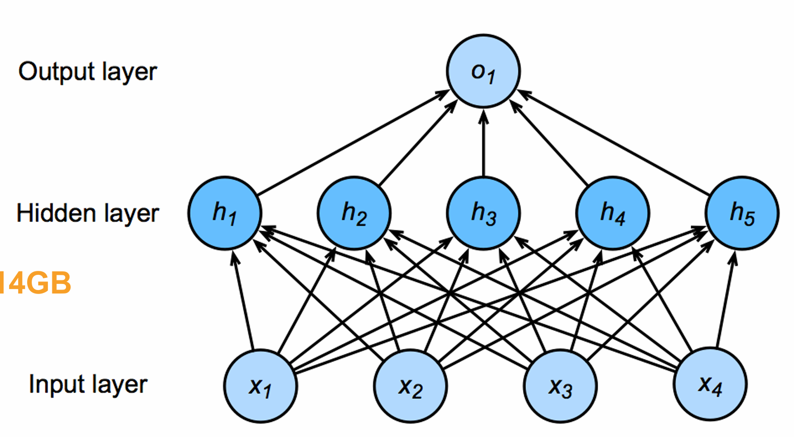
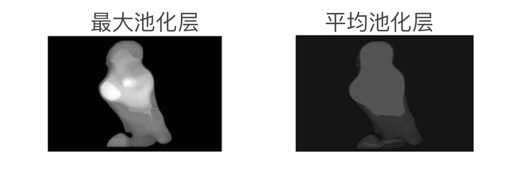
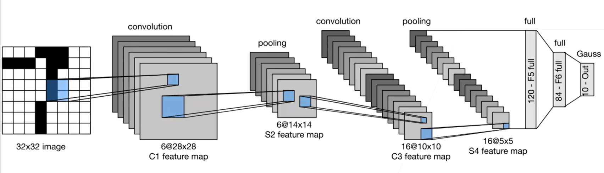
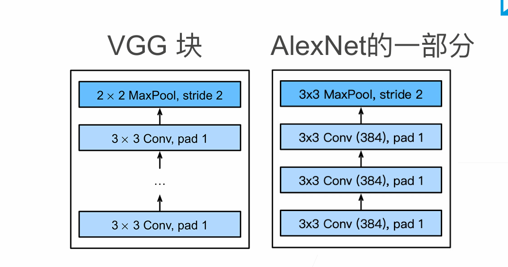
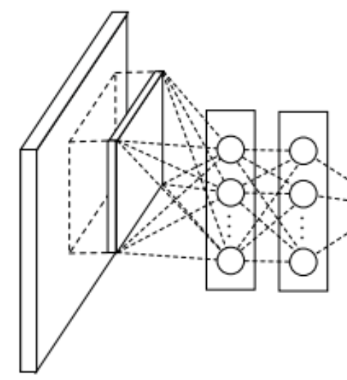
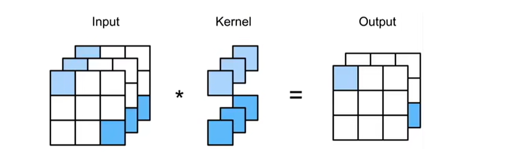
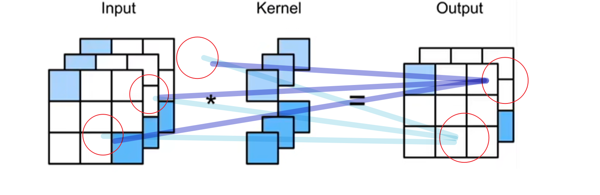
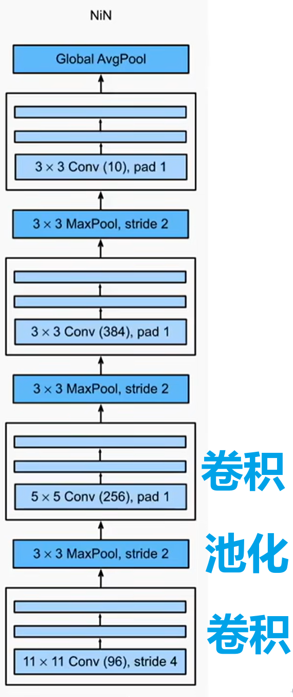
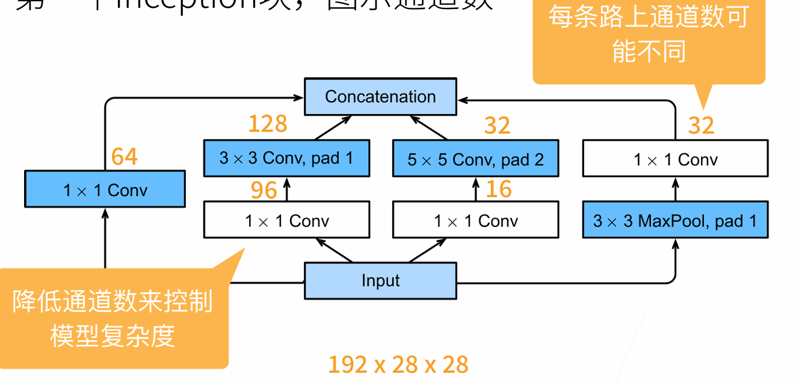
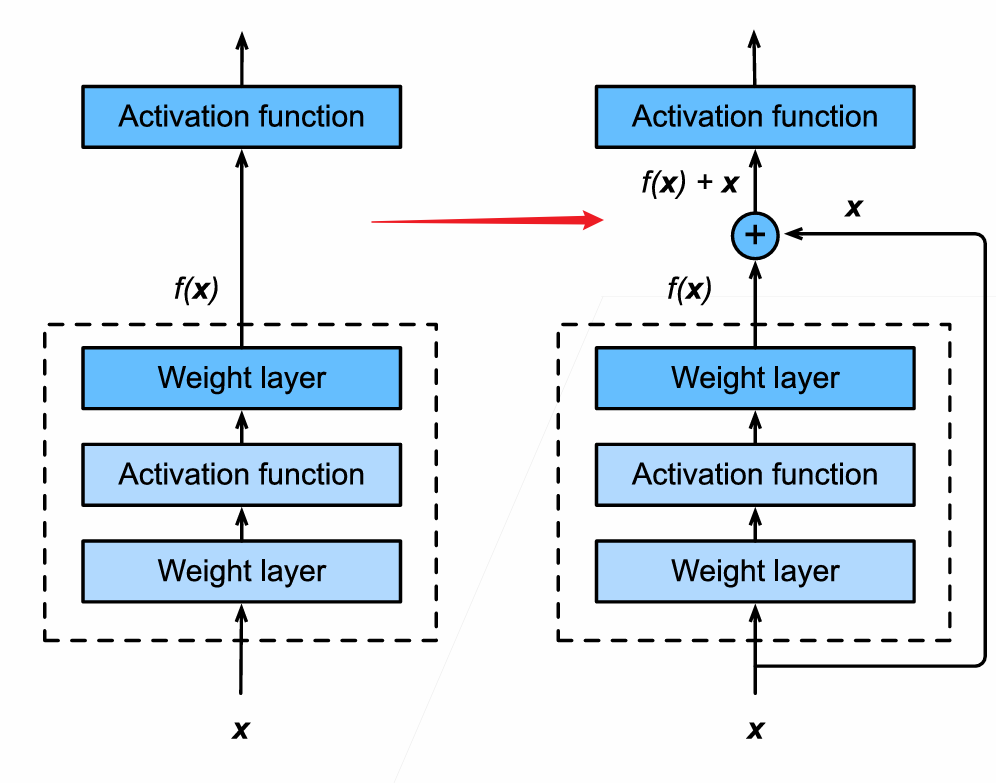

# 卷积神经网络

>   **动手学深度学习v2** - https://www.bilibili.com/video/BV18p4y1h7Dr
>
>   [课程安排 - 动手学深度学习课程 (d2l.ai)](https://courses.d2l.ai/zh-v2/)
>
>   代码：[cs_note/DeepLearning/D2L/code at main · aoiJays/cs_note (github.com)](https://github.com/aoiJays/cs_note/tree/main/DeepLearning/D2L/code)

[TOC]

## Pytorch补充

有如下代码：

```python
import torch
from torch import nn

class Mynn(nn.Module):

    def __init__(self):
        super().__init__()
        self.sequential1 = nn.Sequential(
            nn.Conv2d(in_channels=3, out_channels=32, kernel_size=5, padding=2),
            nn.MaxPool2d(2),
            nn.Conv2d(in_channels=32, out_channels=32, kernel_size=5, padding=2),
            nn.MaxPool2d(2),
            nn.Conv2d(in_channels=32, out_channels=64, kernel_size=5, padding=2),
            nn.MaxPool2d(2),
            nn.Flatten(), # 将tensor张成一维张量
            nn.Linear(1024, 64),
            nn.Linear(64, 10)
        )
        self.sequential2 = nn.Linear(10,10)
        self.classfication = nn.Sequential(
            nn.Linear(10,10),
            nn.Linear(10,10),
            nn.Linear(10,10)
        )


mynn = Mynn()
print(mynn)

'''
Mynn(
  (sequential1): Sequential(
    (0): Conv2d(3, 32, kernel_size=(5, 5), stride=(1, 1), padding=(2, 2))
    (1): MaxPool2d(kernel_size=2, stride=2, padding=0, dilation=1, ceil_mode=False)
    (2): Conv2d(32, 32, kernel_size=(5, 5), stride=(1, 1), padding=(2, 2))
    (3): MaxPool2d(kernel_size=2, stride=2, padding=0, dilation=1, ceil_mode=False)
    (4): Conv2d(32, 64, kernel_size=(5, 5), stride=(1, 1), padding=(2, 2))
    (5): MaxPool2d(kernel_size=2, stride=2, padding=0, dilation=1, ceil_mode=False)
    (6): Flatten(start_dim=1, end_dim=-1)
    (7): Linear(in_features=1024, out_features=64, bias=True)
    (8): Linear(in_features=64, out_features=10, bias=True)
  )
  (sequential2): Linear(in_features=10, out_features=10, bias=True)
  (classfication): Sequential(
    (0): Linear(in_features=10, out_features=10, bias=True)
    (1): Linear(in_features=10, out_features=10, bias=True)
    (2): Linear(in_features=10, out_features=10, bias=True)
  )
)
'''
```


### 参数管理

-   参数访问：

    -   ```python
        mynn.classfication[0].bias
        mynn.classfication[0].weight
        mynn.classfication[0].state_dict() # 返回指定层权重字典
        
        mynn.classfication[0].weight.grad = None # 也能访问修改梯度
        print(mynn.classfication[0].weight.grad)
        
        # 访问所有参数
        for name, param in mynn.named_parameters(): 
            print(name)
            
        # 访问指定层所有参数
        for name, param in mynn.classfication.named_parameters(): 
            print(name)
        ```

-   权重初始化

    -   ```python
        def xavier(m):
            if type(m) == nn.Linear:
                nn.init.xavier_uniform_(m.weight)
        
        def init_42(m):
            if type(m) == nn.Linear:
                nn.init.constant_(m.weight, 42)
        
        mynn.classfication[0].apply(xavier)
        mynn.classfication[1].apply(init_42)
        
        print(mynn.classfication[0].weight.data)
        print(mynn.classfication[1].weight.data)
        ```

### 读写文件

-   张量的保存

    -   ```python
        x = torch.arange(12.)
        torch.save(x, 'x.temp')
        x2 = torch.load('x.temp')
        print(x2)
        
        # 列表形式
        x,y,z = torch.arange(12.),torch.arange(12.),torch.arange(12.)
        torch.save([x,y,z], 'xyz.temp')
        x2,y2,z2 = torch.load('xyz.temp')
        print(x2,y2,z2,sep='\n')
        
        # 字典形式
        x,y,z = torch.arange(12.),torch.arange(12.),torch.arange(12.)
        
        dict = {
            'x':x, 'y':y, 'z':z
        }
        torch.save(dict, 'xyz.temp')
        
        res =  torch.load('xyz.temp')
        print(res)
        '''
        {'x': tensor([ 0.,  1.,  2.,  3.,  4.,  5.,  6.,  7.,  8.,  9., 10., 11.]),
         'y': tensor([ 0.,  1.,  2.,  3.,  4.,  5.,  6.,  7.,  8.,  9., 10., 11.]),
         'z': tensor([ 0.,  1.,  2.,  3.,  4.,  5.,  6.,  7.,  8.,  9., 10., 11.])}
         '''
        ```

-   模型参数保存

    -   事实上已经知道如何保存字典了，模型参数能以字典存储

    -   ```python
        torch.save(mynn.state_dict(), 'mynn.pth') # 保存
        new_model = Mynn()
        new_model.load_state_dict(torch.load('mynn.pth')) # 加载
        ```


### GPU管理

```python
print(torch.cuda.device_count()) # 查询gpu数量

x = torch.arange(12., device=torch.device('cpu'))
print(x.device) # cpu

y = torch.arange(12., device=torch.device(f'cuda:{0}'))
print(y.device) # cuda:0

x = x.cuda()
print(x.device) # cuda:0
```


## 卷积神经网络

### MLP

以猫狗分类为例，一张RGB图片假设有36M像素

我们使用一个单隐藏层（100个节点）的全连接MLP进行预测

参数量：
$$
36\times 2^{20}\times 100 \approx 3.6\times 10^8
$$
事实上世界上所有的猫和狗的数量加起来也不到一个亿（不如全部记住）

### MLP->卷积层

我们从最开始的MLP开始推导



对于一般的MLP，我们会把图片像素全部展成一维张量$x$​

此时则有：
$$
h_i = \sum_j w_{i,j}x_j
$$
但是这样显然会丢失二维图像中的上下左右位置的信息

我们考虑将图像、隐藏层变成二维的形式
$$
h_{i,j} = \sum_{k,l}w_{i,j,k,l}x_{k,l}
$$
为了方便，我们用相对坐标$a,b$表示对应的像素
$$
h_{i,j} = \sum_{k,l}w_{i,j,k,l}x_{k,l} = \sum_{a,b}w_{i,j,i+a,j+b}x_{i+a,j+b}
$$
令$v_{i,j,a,b} = w_{i,j,i+a,j+b}$
$$
h_{i,j} =  \sum_{a,b}v_{i,j,a,b}x_{i+a,j+b}
$$
图像的特征有两个原则：

-   平移不变性
-   局部性


首先是平移不变性，我们假设这套权重$v$​用于提取某一种特征

那么不管$i,j$是多少，其只跟计算范围内的相对位置有关

即：$v_{i,j,a,b} = v_{a,b}$​


根据局部性，我们没必要遍历整个图像， 而是一个非常小的区域（感受野）

我们只遍历相对位置$\Delta$范围内的图像像素（等价于超出范围设置权重为0）


则有：
$$
h_{i,j} = \sum_{a=-\Delta}^{\Delta}\sum_{b=-\Delta}^{\Delta} v_{a,b}x_{i+a,j+b}
$$
这就是二维卷积，相当于使用$2\Delta \times 2\Delta$大小的卷积核，扫一遍图像

### 多通道

-   一个三维卷积核对每个通道都有自己的一个二维卷积核，卷积结果的和作为一个输出

-   几个三维卷积核就会有几个输出通道
-   可以认为
    -   每个输出通道代表了一种特定的模式（每个卷积核）
    -   每个输入通道会被卷积核组合进行识别

### 池化层

池化层压缩图片分辨率

-   最大池化：某种程度上有放大信号的功能
-   平均池化：更加平滑




## 经典卷积神经网络

### LeNet



-   卷积层：学习图片空间信息
-   MLP：分类

```python
class LeNet(nn.Module):
    def __init__(self) -> None:
        super().__init__()
        self.Lenet = nn.Sequential(
            nn.Conv2d(in_channels=1, out_channels=6, kernel_size=5, padding=2),
            nn.Sigmoid(),
            nn.AvgPool2d(kernel_size=2, stride=2),
            nn.Conv2d(in_channels=6, out_channels=16, kernel_size=5),
            nn.AvgPool2d(kernel_size=2, stride=2),
            nn.Conv2d(in_channels=16, out_channels=120, kernel_size=5),
            nn.Flatten(),
            nn.Linear(120, 84),
            nn.Linear(84, 10)
        )

    def forward(self, x):
        return self.Lenet(x)

```

### AlexNet

相比于LeNet，引入了新的激活函数：ReLU

从而使得网络可以变得更深

除此之外引入了Dropout和Max Pooling（LeNet是平均池化）

```python

class AlexNet(nn.Module):
    def __init__(self) -> None:

        super().__init__()
        self.Conv1 = nn.Sequential(
            nn.Conv2d(1, 96, kernel_size=11, stride=4, padding=1), 
            nn.ReLU(),
            nn.MaxPool2d(kernel_size=3, stride=2),
        )

        self.Conv2 = nn.Sequential(
            nn.Conv2d(96, 256, kernel_size=5, padding=2), 
            nn.ReLU(),
            nn.MaxPool2d(kernel_size=3, stride=2),
        )

        self.Conv3 = nn.Sequential(
            nn.Conv2d(256, 384, kernel_size=3, padding=1), 
            nn.ReLU(),
            nn.Conv2d(384, 384, kernel_size=3, padding=1), 
            nn.ReLU(),
            nn.Conv2d(384, 256, kernel_size=3, padding=1), 
            nn.ReLU(),
            nn.MaxPool2d(kernel_size=3, stride=2), 
        )

        self.mlp = nn.Sequential(
            nn.Flatten(),
            nn.Linear(6400, 4096), nn.ReLU(), nn.Dropout(p=0.5),
            nn.Linear(4096, 4096), nn.ReLU(), nn.Dropout(p=0.5),
            nn.Linear(4096, 10)
        )

    def forward(self, x):
        x = self.Conv1(x)
        x = self.Conv2(x)
        x = self.Conv3(x)
        x = self.mlp(x)
        return x

# 训练效果：FashionMNIST
# epoch 10/10: loss = 0.3135168254375458 acc = 0.8833666666666666
# Validation: loss = 0.30078911781311035 acc = 0.8894
```


### VGG

Alex过于抽象，没有规律

-   堆叠更多窄的卷积核，加深深度效果貌似会更好
-   以VGG块为单位，更方便进行拓展



对于一个VGG块，其结构可以用三个参数描述：

-   `in_channels`
-   `out_channels`
-   `num_convs`：卷积层数量

最后加一层池化层即可

```python
def vgg_block(num_convs, in_channels, out_channels):
    layer = []

    # 卷积层重复
    for i in range(num_convs):
        layer.append( nn.Conv2d(in_channels, out_channels, kernel_size=3, padding=1 ))
        layer.append( nn.ReLU() )
        in_channels = out_channels

    # 添加池化层
    layer.append( nn.MaxPool2d(kernel_size=2, stride=2) )

    return nn.Sequential( * layer )

mynn = vgg_block(3, 4, 8)
print(mynn)

'''
Sequential(
  (0): Conv2d(4, 8, kernel_size=(3, 3), stride=(1, 1), padding=(1, 1))
  (1): ReLU()
  (2): Conv2d(8, 8, kernel_size=(3, 3), stride=(1, 1), padding=(1, 1))
  (3): ReLU()
  (4): Conv2d(8, 8, kernel_size=(3, 3), stride=(1, 1), padding=(1, 1))
  (5): ReLU()
  (6): MaxPool2d(kernel_size=2, stride=2, padding=0, dilation=1, ceil_mode=False)
)
'''
```


接下来我们需要去组合VGG块，使用一个列表即可进行定义

```python

def vgg_net( conv_arch ):
    
    block_list = []

    in_channels = 1
    for num_convs, out_channels in conv_arch:

        # 依次添加VGG块
        block_list.append( vgg_block(num_convs, in_channels, out_channels) )
        in_channels = out_channels

    # MLP 部分
    block_list.append(
        nn.Sequential(
            nn.Flatten(),
            nn.Linear(out_channels * 7 * 7, 4096), nn.ReLU(), nn.Dropout(0.5), 
            nn.Linear(4096, 4096), nn.ReLU(), nn.Dropout(0.5),\
            nn.Linear(4096, 10))
    )

    return nn.Sequential( * block_list )


# (num_conv, out_channels), (num_conv, out_channels),(num_conv, out_channels) 
conv_arch = ((1, 16), (1, 32), (2, 64), (2, 128), (2, 128))
mynn = vgg_net(conv_arch)
print(mynn)
   
# epoch 20/20: loss = 0.23978157341480255 acc = 0.9131833333333333
# Validation: loss = 0.26048412919044495 acc = 0.9064
```


### NetWork In NetWork(NiN)

上述网络中都使用了MLP，能够得到更高的抽象，泛化能力更强

在卷积层后的一个全连接层，参数数量非常大

我们希望在不丢弃MLP带来的非线性的情况下，能用较小的参数量进行训练

对于NiN，每个NiN块就是一个小的网络



如图，NiN设计为：先过一次卷积层，然后连续过两个全连接层

我们考虑转化全连接层，替换成两次$1\times 1$​的卷积层


为什么$1\times 1$的卷积层可以带来MLP的效果



这个时候我们应该这样理解：**一个通道是一个神经元**



Output层的两组参数，刚好对应上了两个卷积核的参数

因此我们实际上对于通道之间进行了MLP，并且可以自由控制神经元的增加与减少（卷积神经网络的升维和降维）




-   交替NiN块和池化层

那么我们最后如何输出类别的概率呢？不使用MLP的情况下

我们都知道一个通道是一个神经元了，所以要求最后的通道数 = 类别数

然后我们用全局平均池化，用一个通道的所有值的平均值，作为这个通道（神经元）的输出

```python
class NiN(nn.Module):
    def NiN_block(self, in_channels, out_channels, kernel_size, strides, padding):
        return nn.Sequential(
            # 放入正常设计的卷积层
            nn.Conv2d(in_channels, out_channels, kernel_size, strides, padding), nn.ReLU(),
            # 两次1*1卷积
            nn.Conv2d(out_channels, out_channels, kernel_size=1), nn.ReLU(), 
            nn.Conv2d(out_channels, out_channels, kernel_size=1), nn.ReLU()            
        )


    def __init__(self) -> None:

        super().__init__()
        self.net = nn.Sequential(
            self.NiN_block(1, 96, kernel_size=11, strides=4, padding=0),
            nn.MaxPool2d(3, stride=2),
            
            self.NiN_block(96, 256, kernel_size=5, strides=1, padding=2),
            nn.MaxPool2d(3, stride=2),
           
            self.NiN_block(256, 384, kernel_size=3, strides=1, padding=1),
            nn.MaxPool2d(3, stride=2), nn.Dropout(0.5),
     
            self.NiN_block(384, 10, kernel_size=3, strides=1, padding=1),
            nn.AdaptiveAvgPool2d((1, 1)),
            nn.Flatten()
        )

    def forward(self, x):
        x = self.net(x)
        return x
    
# epoch 10/10: loss = 0.31839463114738464 acc = 0.8851333333333333
# Validation: loss = 0.3436856269836426 acc = 0.8775
```

NiN其实很少使用

但是其使用$1\times 1$的卷积降低通道数，从而减少参数量的做法非常通用


### GoogLeNet

引入Inception块的概念



-   不比较哪种卷积效果好，直接组合多个路线所生成的通道（越来越像MLP）
-   大量使用$1\times 1$卷积控制了通道数量
-   用较小的参数数量，实现了更深、更快的网络

有100+层，代码就不写了


## 批量归一化batch normalization

-   越底层的梯度越小，更新越慢
-   底层一但更新，高层也需要重新训练
-   重复训练，收敛速度慢
-   可以看作一个层（BN层）


对于当前层，如果我们在这层之前插入了一个BN层，就需要对其输入$x_i$进行处理

我们考虑像数值稳定性一样，固定每层的输出、梯度的数值分布

对于一个Batch：
$$
\mu_B = \frac{1}{|B|}\sum_{i\in B}x_i\\
\sigma^2_B = \frac{1}{|B|}\sum_{i\in B}(x_i-\mu_B)^2 + \epsilon\\
$$
$\epsilon$是一个很小的数，避免方差为0

接下来修改所有$x_i$
$$
x'_i = \gamma\frac{x_i-\mu_B}{\sigma_B}+\beta
$$
其中有两个参数$\gamma,\beta$是这层中的可学习的参数

若分布不合适，会通过学习调整分布


理论上BN层应该放在激活函数之前

>   BN是一个线性变化，而激活函数是一个非线性变化
>
>   我们最好是线性变化完再进行非线性

但是似乎放在激活函数之后更有效[Batch-normalized 应该放在非线性激活层的前面还是后面？ - 知乎 (zhihu.com)](https://www.zhihu.com/question/283715823)


-   全连接层：作用在每个神经元的输出
-   卷积层：作用在每个通道

某种程度上引入了一定的噪声，因此不需要和Dropout一起使用

BN可以加速收敛，但是不会优化模型精度

```python

class LeNet(nn.Module):
    def __init__(self) -> None:
        super().__init__()
        self.Lenet = nn.Sequential(
            nn.Conv2d(in_channels=1, out_channels=6, kernel_size=5, padding=2),
            nn.BatchNorm2d(6),
            nn.Sigmoid(),
            nn.AvgPool2d(kernel_size=2, stride=2),
            nn.Conv2d(in_channels=6, out_channels=16, kernel_size=5),
            nn.BatchNorm2d(16),
            nn.AvgPool2d(kernel_size=2, stride=2),
            nn.Conv2d(in_channels=16, out_channels=120, kernel_size=5),
            nn.BatchNorm2d(120),
            nn.Flatten(),
            nn.Linear(120, 84),
            nn.BatchNorm1d(84), # 1d
            nn.Linear(84, 10)
        )

    def forward(self, x):
        return self.Lenet(x)
```

-   数值稳定性：在初始化阶段稳定
-   批量归一化：始终

>   李宏毅：经过归一化，Error Surface会变得平坦，所以可以用大一点的学习率


## ResNet



-   相当于接了一条短路线，绕过这一块新加入的网络
    -   后续训练时，如果新加入的网络效果很差（没有什么影响），则其梯度会很小，无法更新
    -   相当于直接使用$x$作为主要贡献
    -   因此新加入的网络块，有效最好，无效也不会使得网络变坏
-   残差？
    -   理论上是先训练一个非常简单的模型（通过短路）
    -   再根据残差，得到梯度，去更新可以拓展的网络块

-   为什么ResNet可以训练1000层？

    -   主要原因是避免了梯度弥散

    -   $$
        y = f(x) + g(f(x))\\
        \frac{\partial y}{\partial w} = \frac{\partial f(x)}{\partial w} + \frac{\partial g(f(x))}{\partial w}
        $$

    -   原本会因为累乘导致梯度变小，但是此处是加法（有保底）

    -   另一种理解：高层的大梯度会通过短路，送到底层进行优化
