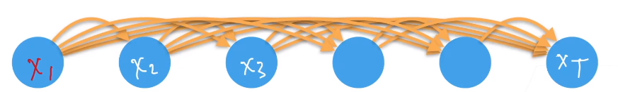
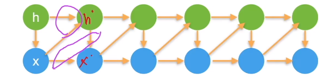

# 序列模型

>   **动手学深度学习v2** - https://www.bilibili.com/video/BV18p4y1h7Dr
>
>   个人评价是需要有一点基础
>
>   -   [Pytorch 小土堆](https://www.bilibili.com/video/BV1hE411t7RN) 先把Pytorch基础看一下
>   -   [李宏毅2022春机器学习](https://www.bilibili.com/video/BV1Wv411h7kN)
>       -   理论部分更推荐李宏毅或者吴恩达，会更好理解
>       -   我的策略是理论在李宏毅这里补，作业不做，在李沐这里实操一下代码
>
>   本文不会放太多理论的东西
>
>   记录一下代码实操即可
>
>   理论请移步李宏毅课程的相关笔记

[TOC]

## 数据

- 序列数据
    - 音频
    - 文本
    - 视频

## 序列模型

$$
p(x) = p(x_1)p(x_2|x_1)...p(x_T|x_1,x_2, ...,x_{T-1})
$$

- 在之前所有事件发生的前提下，下一件事发生

- 对条件概率建模：

$$
p(x_t|x_1,...,x_{t-1}) = p(x_t|f(x_1,...,x_{t-1}))
$$

这样就得到了自回归模型

使用自身数据预测未来

### 马尔科夫假设

- 假设当前数据只会与过去$\tau$个数据有关

$$
p(x_t|x_1,...,x_{t-1}) = p(x_t|x_{t-\tau},...,x_{t-1})= p(x_t|f(x_{t-\tau},...,x_{t-1}))
$$

### 潜变量模型

- 不希望考虑太多参数，故引入潜变量$h_t=f(x_1,...,x_{t-1})$

    - 模型1：根据$x,h$得到下一步的潜变量$h'$

    - 模型2：根据$h',x$得到下一步的变量$x'$​

- 使用潜变量概括了历史信息

### 误差

- 事实上不断的自回归会不断积累误差，导致对未来的预测逐渐偏离
- 后续旨在研究如何让序列模型尽可能预测得更远

