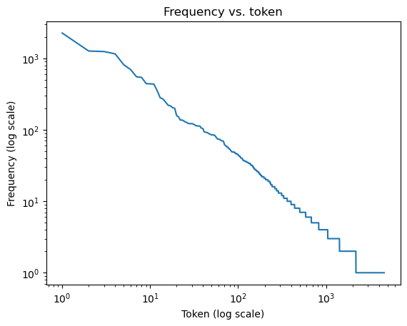
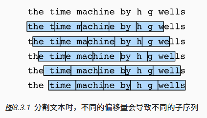

# 序列模型

>   **动手学深度学习v2** - https://zh-v2.d2l.ai/
>
>   
>
>   个人评价是需要有一点基础
>
>   -   [Pytorch 小土堆](https://www.bilibili.com/video/BV1hE411t7RN) 先把Pytorch基础看一下
>   -   [李宏毅2022春机器学习](https://www.bilibili.com/video/BV1Wv411h7kN)
>       -   理论部分更推荐李宏毅或者吴恩达，会更好理解
>       -   我的策略是理论在李宏毅这里补，作业不做，在李沐这里实操一下代码
>
>   本文不会放太多理论的东西
>
>   记录一下代码实操即可
>
>   理论请移步李宏毅课程的相关笔记

[TOC]

## 数据

- 序列数据
    - 音频
    - 文本
    - 视频


### 文本预处理

>   [文本：H.G.Well的时光机器](https://d2l-data.s3-accelerate.amazonaws.com/timemachine.txt)


#### 词元

```python
import re
def read_txt():
    with open('data/timemachine.txt', 'r') as f:
        lines = f.readlines()

    # 替换所有非字母字符为空格 去除每行前后空白字符 转换为小写
    return [re.sub('[^A-Za-z]+', ' ', line).strip().lower() for line in lines]

lines = read_txt()
print(f'Lines = {len(lines)}')
print(lines[0], lines[10],sep='\n')
'''
Lines = 3221
the time machine by h g wells
twinkled and his usually pale face was flushed and animated the
'''
```


-   词元：词元（token）是文本的基本单位
    -   单词
    -   汉字
    -   英文字符

```python
def tokenize(lines, token='word'):
    
    # 按词或英文字符划分词元
    # 以___字符串列表___形式返回
    if token == 'word':
        # 按空格分割
        return [line.split() for line in lines]
    else:
        # 字符串转为字符列表
        return [list(line) for line in lines]
    
tokens = tokenize(lines, 'word')
tokens[0]
'''
['the', 'time', 'machine', 'by', 'h', 'g', 'wells']
'''
```


#### 词表

-   词表
    -   我们需要把字符串的词元转化成模型可以接受的数值
    -   构建一个字典，从词元映射到数值，这就是词表
    -   构建：
        -   合并所有文档进行去重，得到**语料（corpus）**
        -   统计词元在语料库中出现的频率，出现次数很少的词元移除（降低复杂性）
        -   被删除、不认识的词：`<unk>`
        -   begin of seq：`<bos>`、end of seq：`<eos>`、填充词元`<pad>`

```python
import collections

class Vocab:  #@save
    """文本词表"""
    def __init__(self, tokens=None, min_freq=0, reserved_tokens=None):
        # 如果没有提供词元列表，则使用空列表
        if tokens is None:
            tokens = []
        # 如果没有提供保留词元列表，则使用空列表
        if reserved_tokens is None:
            reserved_tokens = []
        # 统计词元的频率并按频率降序排序
        counter = count_corpus(tokens)
        self._token_freqs = sorted(counter.items(), key=lambda x: x[1],
                                   reverse=True)
        # 初始化词表，未知词元的索引为0
        self.idx_to_token = ['<unk>'] + reserved_tokens
        # 创建从词元到索引的映射字典
        self.token_to_idx = {token: idx
                             for idx, token in enumerate(self.idx_to_token)}
        # 遍历按频率排序后的词元和对应频率
        for token, freq in self._token_freqs:
            # 如果词元的频率小于最小频率，则停止添加
            if freq < min_freq:
                break
            # 如果词元不在词表中，则将其添加到词表并更新映射字典
            if token not in self.token_to_idx:
                self.idx_to_token.append(token)
                self.token_to_idx[token] = len(self.idx_to_token) - 1

    def __len__(self):
        # 返回词表的长度
        return len(self.idx_to_token)

    def __getitem__(self, tokens):
        # 如果输入的是单个词元，返回其对应的索引
        if not isinstance(tokens, (list, tuple)): #不是列表或元组
            return self.token_to_idx.get(tokens, self.unk) # 字典中不存则自动返回unk
        # 如果输入的是一个词元列表，递归获取每个词元的索引
        return [self.__getitem__(token) for token in tokens]

    def to_tokens(self, indices):
        # 如果输入的是单个索引，返回其对应的词元
        if not isinstance(indices, (list, tuple)):
            return self.idx_to_token[indices]
        # 如果输入的是一个索引列表，递归获取每个索引对应的词元
        return [self.idx_to_token[index] for index in indices]

    @property
    def unk(self):  # 未知词元的索引为0
        # 返回未知词元的索引
        return 0

    @property
    def token_freqs(self):
        # 返回词元及其对应频率的列表
        return self._token_freqs

def count_corpus(tokens):  #@save
    """统计词元的频率"""
    # 这里的tokens是1D列表或2D列表
    if len(tokens) == 0 or isinstance(tokens[0], list):
        # 将2D词元列表展平成一个1D列表
        tokens = [token for line in tokens for token in line]
    # 使用collections.Counter统计词元的频率
    return collections.Counter(tokens)

vocab = Vocab(tokens)
print(list(vocab.token_to_idx.items())[:10])

'''
[('<unk>', 0), ('the', 1), ('i', 2), ('and', 3), ('of', 4), ('a', 5), ('to', 6), ('was', 7), ('in', 8), ('that', 9)]
'''

for i in [0, 10]:
    print('文本:', tokens[i])
    print('索引:', vocab[tokens[i]])
    
'''
文本: ['the', 'time', 'machine', 'by', 'h', 'g', 'wells']
索引: [1, 19, 50, 40, 2183, 2184, 400]
文本: ['twinkled', 'and', 'his', 'usually', 'pale', 'face', 'was', 'flushed', 'and', 'animated', 'the']
索引: [2186, 3, 25, 1044, 362, 113, 7, 1421, 3, 1045, 1]
'''
```


-   整合一下

```python
def load_corpus(max_tokens=-1):  

    lines = read_txt()
    tokens = tokenize(lines, 'word')
    vocab = Vocab(tokens)

    # for line in tokens 枚举tokens中的每一行
    # for token in line 枚举line中的每个词元
    # 按顺序合并成一个列表 词元 -> 此表索引
    corpus = [vocab[token] for line in tokens for token in line]
    
    if max_tokens > 0: # 最多保留数量
        corpus = corpus[:max_tokens] 
        
    return corpus, vocab

corpus, vocab = load_corpus()
len(corpus), len(vocab)

```


#### 停用词

```python
vocab.token_freqs[:10]
'''
[('the', 2261),
 ('i', 1267),
 ('and', 1245),
 ('of', 1155),
 ('a', 816),
 ('to', 695),
 ('was', 552),
 ('in', 541),
 ('that', 443),
 ('my', 440)]
'''
```

出现频率较多的往往都是一些`the`、`and`……，被称为**停用词**

但本身是有意义的，需要在模型中进行使用


#### 词频

-   词频的衰减是非常快的

```python
freq = [freq for token, freq in vocab.token_freqs]
indices = np.arange(1, len(freq) + 1)
plt.figure()
plt.plot(indices, freq)
plt.xscale('log')
plt.title('Frequency vs. token')
plt.xlabel('Token (log scale)')
plt.ylabel('Frequency')
```



我们绘制了词频与索引在log下的图像

发现中间一部分基本是对数坐标系上的**一条直线**

>   齐普夫定律：
>   $$
>   \log n_i = -\alpha \log i + c
>   $$
>   其中$n_i$表示第$i$个最常用词的频率


### 长序列处理

-   当序列太长时，无法被模型一次性处理，需要进行拆分
-   假设我们设定的子序列长度$n=5$，使用不同的偏移量可以切出不一样的子序列
    -   多种方案都是一样好的切分，但是我们不希望子序列的切分只有同一种偏移方式，否则会造成的覆盖的子序列有限
    -   需要引入随机偏移量，兼具随机性、覆盖率



#### 随机采样

```python
import random

# subseq_len 序列长度（序列的时间步数num_steps）
def seq_data_iter_random(corpus, batch_size, subseq_len):  

	# 随机偏移 一个subseq长度以内的量
    corpus = corpus[random.randint(0, subseq_len - 1):]

	# 实际能够生成的subseq数量
    num_subseqs = (len(corpus) - 1) // subseq_len
    
	
	# 长度为subseq_len的子序列的起始索引
    # [0, len, len*2, len*3, ...]
    initial_indices = list(range(0, num_subseqs * subseq_len, subseq_len))
    # 打乱位置 保证随机性
    random.shuffle(initial_indices)

    # 分配到各个batch中
    num_batches = num_subseqs // batch_size

    for i in range(0, batch_size * num_batches, batch_size):
        
        # [i, i + batch_size - 1]的索引为这个batch所有序列的起始坐标
        # 剪出来
        initial_indices_per_batch = initial_indices[i: i + batch_size]
        
        # 剪切出这一部分的序列
        X = [corpus[j: j + subseq_len] for j in initial_indices_per_batch]
        # 偏移一位 作为标签序列
        Y = [corpus[j + 1: j + 1 + subseq_len] for j in initial_indices_per_batch]

        # 提供迭代对象 
        yield torch.tensor(X), torch.tensor(Y)
    
my_seq = list(range(35)) # [0,1,2,3...,34]

# 每个子序列的长度为5 每个batch含2个数据
for X, Y in seq_data_iter_random(my_seq, batch_size=2, subseq_len=5):
    print('batch:\n')
    print('X: ', X, '\nY:', Y)
    
'''
batch:

X:  tensor([[24, 25, 26, 27, 28],
        [29, 30, 31, 32, 33]]) 
Y: tensor([[25, 26, 27, 28, 29],
        [30, 31, 32, 33, 34]])
batch:

X:  tensor([[19, 20, 21, 22, 23],
        [14, 15, 16, 17, 18]]) 
Y: tensor([[20, 21, 22, 23, 24],
        [15, 16, 17, 18, 19]])
batch:

X:  tensor([[ 4,  5,  6,  7,  8],
        [ 9, 10, 11, 12, 13]]) 
Y: tensor([[ 5,  6,  7,  8,  9],
        [10, 11, 12, 13, 14]])
'''
```


#### 顺序分区

- 有随机偏移，裁掉掉前后部分
- 剩下部分按顺序进行顺序切分
- 同一个batch内并不是连续，不同batch同一位置连续

```python
def seq_data_iter_sequential(corpus, batch_size, subseq_len):  

    # 从随机偏移量开始划分序列
    offset = random.randint(0, subseq_len)
    num_tokens = ((len(corpus) - offset - 1) // batch_size) * batch_size
    
    # 裁掉前面的偏移 与尾部的多余部分
    Xs = torch.tensor(corpus[offset: offset + num_tokens])
    Ys = torch.tensor(corpus[offset + 1: offset + 1 + num_tokens])

    # 按batch_size进行reshape 
    # [ [a1, a2, a3], [b1, b2, b3] ]
    # 返回[ [a1], [b1] ], [ [a2], [b2] ], [ [a3], [b3] ]
    Xs, Ys = Xs.reshape(batch_size, -1), Ys.reshape(batch_size, -1)
    
    num_batches = Xs.shape[1] // subseq_len
    for i in range(0, subseq_len * num_batches, subseq_len):
        X = Xs[:, i: i + subseq_len]
        Y = Ys[:, i: i + subseq_len]
        yield X, Y
```


## 序列模型

$$
p(x) = p(x_1)p(x_2|x_1)...p(x_T|x_1,x_2, ...,x_{T-1})
$$


- 在之前所有事件发生的前提下，下一件事发生

- 对条件概率建模：

$$
p(x_t|x_1,...,x_{t-1}) = p(x_t|f(x_1,...,x_{t-1}))
$$

这样就得到了自回归模型

使用自身数据预测未来


### 马尔科夫假设

- 假设当前数据只会与过去$\tau$个数据有关

$$
p(x_t|x_1,...,x_{t-1}) = p(x_t|x_{t-\tau},...,x_{t-1})= p(x_t|f(x_{t-\tau},...,x_{t-1}))
$$

### 潜变量模型

- 不希望考虑太多参数，故引入潜变量$h_t=f(x_1,...,x_{t-1})$

    - 模型1：根据$x,h$得到下一步的潜变量$h'$

    - 模型2：根据$h',x$得到下一步的变量$x'$​

- 使用潜变量概括了历史信息


### 误差

- 事实上不断的自回归会不断积累误差，导致对未来的预测逐渐偏离
- 后续旨在研究如何让序列模型尽可能预测得更远


## RNN


