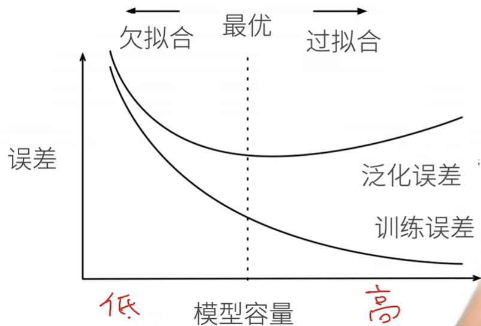
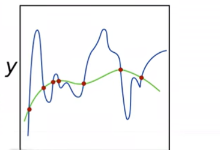
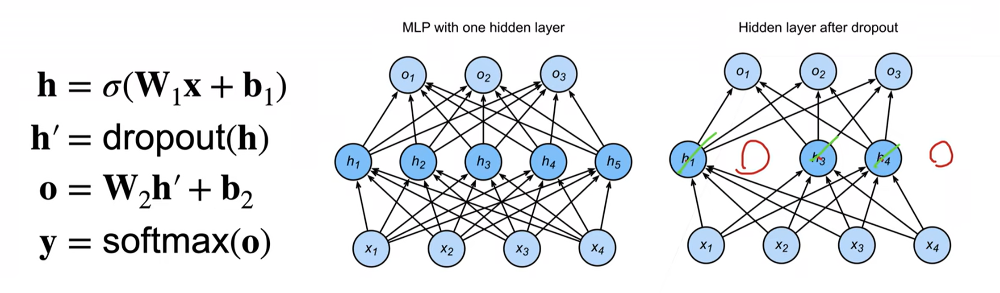

# 深度学习基础

>   **动手学深度学习v2** - https://www.bilibili.com/video/BV18p4y1h7Dr
>
>   个人评价是需要有一点基础
>
>   -   [Pytorch 小土堆](https://www.bilibili.com/video/BV1hE411t7RN) 先把Pytorch基础看一下
>   -   [李宏毅2022春机器学习](https://www.bilibili.com/video/BV1Wv411h7kN)
>       -   理论部分更推荐李宏毅或者吴恩达，会更好理解
>       -   我的策略是理论在李宏毅这里补，作业不做，在李沐这里实操一下代码
>
>   本文不会放太多理论的东西
>
>   记录一下代码实操即可
>
>   理论请移步李宏毅课程的相关笔记

[TOC]

## 前置准备

### 环境

```bash
conda create -n d2l-zh python=3.8 pip
conda activate d2l-zh

pip install -y d2l torch torchvision
```


### Pytorch

这里认为不需要深入太多

可以先看一下Pytorch小土堆的视频，把Pytorch大概的使用方法先学好

有一些细节在后续学习中慢慢扣

#### 张量操作

```python
x = torch.arange(12)
print(x)
print(x.shape)
print( x.numel() ) # number of elements

x = x.reshape(2, 6)
print(x)

print(torch.zeros(3,4))
print(torch.zeros_like(x))
print(torch.ones_like(x))

# from list
x = torch.tensor( [[1,2,3],[4,5,6.]] )
print(x)

'''
tensor([ 0,  1,  2,  3,  4,  5,  6,  7,  8,  9, 10, 11])
torch.Size([12])
12
tensor([[ 0,  1,  2,  3,  4,  5],
        [ 6,  7,  8,  9, 10, 11]])
tensor([[0., 0., 0., 0.],
        [0., 0., 0., 0.],
        [0., 0., 0., 0.]])
tensor([[0, 0, 0, 0, 0, 0],
        [0, 0, 0, 0, 0, 0]])
tensor([[1, 1, 1, 1, 1, 1],
        [1, 1, 1, 1, 1, 1]])
tensor([[1., 2., 3.],
        [4., 5., 6.]])
'''

```


#### 张量连接

```python
x = torch.arange(12.).reshape(3,4)
y = x + 12

print(torch.cat( (x,y), dim=0 ))
print(torch.cat( (x,y), dim=1 ))

'''
tensor([[ 0.,  1.,  2.,  3.],
        [ 4.,  5.,  6.,  7.],
        [ 8.,  9., 10., 11.],
        [12., 13., 14., 15.],
        [16., 17., 18., 19.],
        [20., 21., 22., 23.]])
tensor([[ 0.,  1.,  2.,  3., 12., 13., 14., 15.],
        [ 4.,  5.,  6.,  7., 16., 17., 18., 19.],
        [ 8.,  9., 10., 11., 20., 21., 22., 23.]])
'''
```


#### 内存操作

>   clone detach view reshape 相关原理 留个坑

可使用原地操作避免内存开销

```python
x = torch.arange(12.).reshape(3,4)
before = id(x)
x = x + 12
print(before == id(x))
# False

x = torch.arange(12.).reshape(3,4)
before = id(x)
x[:] = x + 12 # 原地操作
print(before == id(x))
# True
```


正常的赋值是浅拷贝

```python
x = torch.arange(12.).reshape(3,4)
y = x # y和x是同一个 效率较高
y += 10

print(id(x), id(y))
print(x)
'''
140487227237984 140487227237984
tensor([[10., 11., 12., 13.],
        [14., 15., 16., 17.],
        [18., 19., 20., 21.]])
'''
```


深拷贝

```python
x = torch.arange(12.).reshape(3,4)
y = x.clone()
y += 10

print(id(x), id(y))
print(x)

"""
140487208885264 140487208893344
tensor([[ 0.,  1.,  2.,  3.],
        [ 4.,  5.,  6.,  7.],
        [ 8.,  9., 10., 11.]])
"""
```


#### 梯度

```python
x = torch.arange(4.)
print(x, x.requires_grad)

x = x.requires_grad_(True)
print(x)

y = torch.dot(x, x)
print(y)


print(x.grad)
y.backward()
print(x.grad)

print( x.grad == 2 * x )

x.grad.zero_()
print(x.grad)

'''
tensor([0., 1., 2., 3.]) False
tensor([0., 1., 2., 3.], requires_grad=True)
tensor(14., grad_fn=<DotBackward0>)
None
tensor([0., 2., 4., 6.])
tensor([True, True, True, True])
tensor([0., 0., 0., 0.])
'''
```

## 线性回归与优化器

### 线性模型

$$
y = \sum w_i x_i + b
$$

可以理解为单层的神经网络

### 平方损失

$$
L(y, \hat y) = \frac{1}{2}|y- \hat y|^2
$$

### 训练目标

我们对于训练数据$X$，$y$，使用所有样本的损失函数均值作为衡量指标
$$
L(X,y,w,b) = \frac{1}{2n}(y - Xw-b )^2
$$
我们需要找到最佳的参数$w,b$，使得损失函数最小

事实上这是一个凸函数，我们甚至可以直接通过梯度为0，求出最优解：
$$
\frac{\partial L}{\partial w} = \frac{1}{n}(y-Xw)^TX = 0 \\
w^* = (X^TX)^{-1}Xy
$$

### 优化方法 - 梯度下降

直接矩阵计算效率实在是太低了，我们需要引入一些优美的优化方法——梯度下降
$$
w_t = w_{t-1}- \eta \frac{\partial L}{\partial w_{t-1}}
$$
我们一般不会选择整个数据集进行梯度下降

随机选取一个batch大小的子集，进行一次梯度下降——**小批量随机梯度下降法**


### 代码

```python
import torch
from torch import nn
import numpy as np
from torch.utils import data
from d2l import torch as d2l

true_w = torch.tensor([2, -3.4])
true_b = torch.tensor([4.2])

# 创建数据集

# d2l的辅助函数 生成带有噪声的线性回归数据
features, labels = d2l.synthetic_data(true_w, true_b, 1000)
dataset = data.TensorDataset( *(features, labels ) )
'''
* 解包运算符
print( *(1,1), (1,1))
1 1 (1, 1)
'''

batch_size = 10
dataLoder = data.DataLoader(dataset, batch_size, shuffle=True)


# 模型初始化
net = nn.Sequential( nn.Linear(2, 1) )
net[0].weight.data.normal_(0, 0.01)
net[0].bias.data.fill_(0)

loss = nn.MSELoss()
trainer = torch.optim.SGD(net.parameters(), lr=0.03)

# 训练
num_epochs = 3
for epoch in range(num_epochs):

    for X,y in dataLoder:
        l = loss(y, net(X))
        trainer.zero_grad() # 清空梯度
        l.backward()
        trainer.step()

    l  = loss(net(features), labels)
    print( f'epoch {epoch + 1} , loss {l:f}')

print(net[0].weight.data)
print(net[0].bias.data)

'''
epoch 1 , loss 0.000109
epoch 2 , loss 0.000109
epoch 3 , loss 0.000110
tensor([[ 2.0001, -3.4007]])
tensor([4.2004])
'''
```


## 逻辑回归

### Softmax

记$o_i$表示预测为第$i$类的概率（置信度）
$$
y = \text{softmax}(o) \\

\hat y_i = \frac{\exp(o_i)}{\sum_k\exp(o_k)}
$$


### 交叉熵

我们用交叉熵用于衡量两个概率的区别
$$
H(p,q) = \sum - p_i \log q_i
$$
则对于分类问题，我们可以把损失函数定义为：
$$
L(y,\hat y) = H(y, \hat y) =  \sum - y_i \log \hat y_i
$$
并且梯度非常容易计算：
$$
\frac{\partial L}{\partial o_i} = \text{softmax}(o)_i - y_i
$$

### 代码


```python
import torch
import torch.nn as nn
import torch.optim as optim
import torchvision
import torchvision.transforms as transforms
from torch.utils.data import DataLoader

# 定义数据预处理
trans = transforms.Compose([
    transforms.ToTensor()
])

# 加载数据集
train_dataset = torchvision.datasets.FashionMNIST(root="./data", train=True,
                                                  transform=trans, download=True)
test_dataset = torchvision.datasets.FashionMNIST(root="./data", train=False,
                                                 transform=trans, download=True)

train_loader = DataLoader(train_dataset, batch_size=64, shuffle=True)
test_loader = DataLoader(test_dataset, batch_size=len(test_dataset), shuffle=False)

# 定义逻辑回归模型
class LogisticRegressionModel(nn.Module):
    def __init__(self):
        super(LogisticRegressionModel, self).__init__()
        self.linear = nn.Linear(28*28, 10)
    
    def forward(self, x):
        x = x.view(-1, 28*28)
        out = self.linear(x)
        return out

model = LogisticRegressionModel()

# 定义损失函数和优化器
criterion = nn.CrossEntropyLoss()
optimizer = optim.SGD(model.parameters(), lr=0.01)

# 训练模型
num_epochs = 10
for epoch in range(num_epochs):
    model.train()
    for images, labels in train_loader:
        
        outputs = model(images)
        loss = criterion(outputs, labels)
        
        optimizer.zero_grad()
        loss.backward()
        optimizer.step()

    # 测试模型
    model.eval()
    with torch.no_grad():  

        correct = 0
        total = 0

        for images, labels in test_loader:
            
            outputs = model(images)
            loss = criterion(outputs, labels)
            _, predicted = torch.max(outputs.data, 1)
            
            total += labels.size(0)
            correct += (predicted == labels).sum().item()
        
        print(f'Epoch [{epoch+1}/{num_epochs}], Loss: {loss.item():.4f}')
        print(f'Accuracy of the model on the test images: {100 * correct / total} %')

```


##  多层感知机

### 感知机

$$
o = \text{sign}(wx+b)
$$

对于正类输出1，负类输出-1

表示了使用一个超平面对空间进行切分

当数据是线性不可分时很难使用


考虑组合多个感知机

### MLP

激活函数使得多个线性感知机变成非线性

可以理解为：超平面发生扭曲

```python
class MLP(nn.Module):
    def __init__(self):
        super(MLP, self).__init__()
        self.fc1 = nn.Linear(28*28, 28*28)
        self.fc2 = nn.Linear(28*28, 10)
        self.ReLU = nn.ReLU()
    
    def forward(self, x):
        x = x.view(-1, 28*28)
        
        x = self.fc1(x)
        x = self.ReLU(x)

        x = self.fc2(x)
        x = self.ReLU(x)
        return x
        

```

对于Pytorch部分，增加几层即可

由于模型变复杂，拟合的开销和批次需要更多

但是最后的表现可以变好


## 杂谈


### 误差

-   训练误差：训练数据上的误差
-   泛化误差：在新数据上的误差


-   验证数据：用于验证模型的训练，超参数的选择
    -   **K折交叉验证：**数据不足时
-   测试数据：完全未知的数据，一般只会用来测试一次

### 拟合



 

-   模型容量估计（需要同种类模型）
    -   参数个数
    -   参数值的选择范围
-   VC维
    -   能够完美分类的最大数据样本数量
        -   2维感知机：VC=3，即任意3个点都是线性可分，4个点可能出现xianxingbukef
        -   N维感知机：VC=N+1
        -   一些多层感知机：VC$= O(n\log n)$
    -   但一般没什么用

#### 权重衰退（正则化）

我们可以考虑控制模型参数值的范围，从而控制模型的容量（复杂度）




我们相当于压缩了$y$的取值范围，避免拟合的曲线过于离谱，希望它更加平滑


-   硬性要求：（但实现难度大）

$$
\min L(w, b) \text{\quad subject to} \left \| w \right \| ^2 \leq \theta
$$

-   柔性要求：

$$
\min L(w,b) + \frac{\lambda }{2} \left \| w \right \| ^2
$$

 计算梯度：
$$
\frac{\partial (L+ \frac{\lambda }{2} \left \| w \right \| ^2)}{\partial w} = \frac{\partial L}{\partial w} + \lambda w 
$$
参数优化：
$$
w_t = (1-\lambda\eta)w_{t-1}- \eta \frac{\partial L}{\partial w_{t-1}}
$$
$\lambda=0$时与不带正则项的参数优化一致，并且要求：$\eta\lambda < 1$

```python
# 指定lambda 进行L2正则化
optimizer = optim.SGD(model.parameters(), lr=0.01, weight_decay=0.01)


# 也可以手动计算 （optim只有L2）
# L1正则化
l1_reg = torch.tensor(0.)
for param in model.parameters():
    l1_reg += torch.norm(param, p=1)

# 计算总损失
total_loss = loss + 0.01 * l1_reg
```


事实上优化幅度也不大，会更加推荐dropout


####  丢弃法(Dropout)

-   在层之间加入噪音，以期望提高对数据的鲁棒性

对于$x$，加入噪音后得到$x'$，我们期望$E(x') = x$，即噪音是无偏差的

我们可以定义dropout函数：
$$
x_i' = \text{dropout}(x_i) = \left\{\begin{matrix}

0 & \text{with probablity p}
 \\
\frac{x_i}{1-p} & \text{otherwise}
\end{matrix}\right.
$$
则期望
$$
E(x_i') = 0 \times p +  \frac{x_i}{1-p} \times (1-p) = x_i
$$


在训练过程中，我们考虑在**隐藏层的输出**中引入dropout

即会失活一些隐藏层节点



>   dropout的引入目的是通过正则项、噪声，抑制过拟合，增加鲁棒性
>
>   因此我们只需要在训练过程中引入即可
>
>   对于推理阶段：
>   $$
>   h = \text{dropout}(h)
>   $$
>   即不发生变化


手动实现版本：

```python
def Dropout(X, dropout):
    assert 0 <= dropout <= 1

    # 边界
    if dropout == 0: return X 
    if dropout == 1: return torch.zeros_like(X)

    # 随机值超过阈值 
    mask = (torch.randn(X.shape) > dropout).float()
    return X * mask / (1.0 - dropout)

    # 不推荐使用
    # X[mask] = X / (1.0 - dropout) 
    # 乘法比筛选更加高效

```

Pytorch版本：

```python
# 定义MLP模型
class MLP(nn.Module):
    def __init__(self):
        
        super(MLP, self).__init__()
        self.fc1 = nn.Linear(28*28, 28*28)
        self.fc2 = nn.Linear(28*28, 10)
        self.ReLU = nn.ReLU()
        self.dropout = nn.Dropout(p = 0.3)# 引入dropout
    
    def forward(self, x):
        x = x.view(-1, 28*28)
        
        x = self.fc1(x)
        x = self.ReLU(x)
        x = self.dropout(x) # 隐藏层的输出

        x = self.fc2(x)
        x = self.ReLU(x)
        return x
```


实测效果确实很牛（


### 数值稳定

网络层数较大，进行反向传播时

-   梯度爆炸：梯度大于1，梯度累乘溢出
    -   学习率非常敏感
        -   学习率大：容易爆炸
        -   学习率小：无法拟合
-   梯度消失：梯度小于1，梯度累乘趋近0
    -   精度敏感
    -   只能进行顶层训练，底层无法变化


我们希望梯度值在合理的范围：

-   例如：$[10^{-6}, 10^3]$

我们可以考虑如下技巧：

-   ResNet、LSTM中：将乘法转换为加法
-   梯度归一化、梯度剪裁（若超过边界值，赋值为边界值）
-   合理的权重初始化
-   使用合理的激活函数


#### 权重初始化

我们可以考虑使用$N(0,0.01)$进行权重初始化

但是这只对小网络有效，深层网络没有保证（太绝对了）


我们将每层的输出、梯度看作随机变量

**目标：**

-   每层的输出、梯度均值、方差一致

令$h^t_i$表示网络第$t$层第$i$个节点的输出，即：

-   正向
    -   $E(h^t_i) = 0$
    -   $Var(h^t_i) = a$，其中$a$为定值
-   反向
    -   $E(\frac{\partial L }{\partial h^t_i}) = 0$​
    -   $Var(\frac{\partial L }{\partial h^t_i}) = b$$Var(h^t_i) = a$，其中$b$为定值

具体推导：[【动手学深度学习v2李沐】学习笔记09：数值稳定性、模型初始化、激活函数_数值稳定性 + 模型初始化和激活函数【动手学深度学习v2】-CSDN博客](https://blog.csdn.net/weixin_45800258/article/details/127198243)

可以得到：
$$
Var(h^t) = n_{t-1}Var(w_t)Var(h^{t-1}) \\
Var(\frac{\partial L}{\partial h^{t-1}}) = n_{t}Var(w_t)Var(\frac{\partial L}{\partial h^{t}})
$$
此时我们保证$n_{t-1}Var(w_t) = 1, n_{t}Var(w_t) = 1 $即可让方差保持不变

但是$n_{t-1},n_t$作为既定的层的节点数，没法进行修改

所以我们放松条件：$Var(w_t)(n_t+n_{t-1}) = 2 $

因此方差为
$$
Var(w_t) =  \frac{2}{(n_t+n_{t-1})}
$$
我们即可以通过上一层与当前层的节点数，确定本层权重的方差

基于给定均值（0）和方差，进行正态分布或均匀分布的随机数产生即可

拓展阅读：[PyTorch中的Xavier以及He权重初始化方法解释_pytorch中he初始化-CSDN博客](https://blog.csdn.net/weixin_39653948/article/details/107950764)
