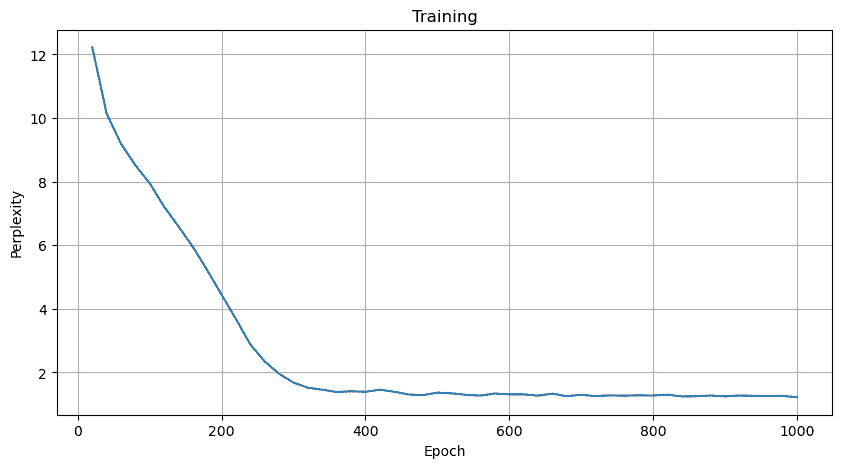
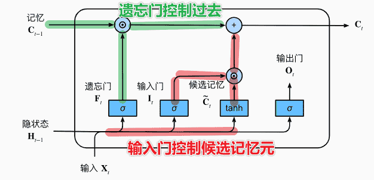
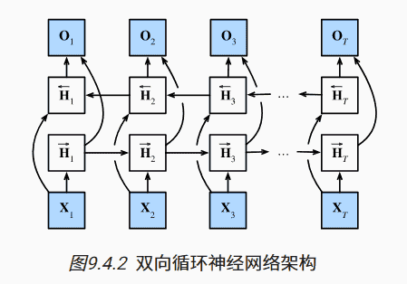

# 现代序列模型与机器翻译实践

>   **动手学深度学习v2** - https://zh-v2.d2l.ai/
>
>   
>
>   个人评价是需要有一点基础
>
>   -   [Pytorch 小土堆](https://www.bilibili.com/video/BV1hE411t7RN) 先把Pytorch基础看一下
>   -   [李宏毅2022春机器学习](https://www.bilibili.com/video/BV1Wv411h7kN)
>       -   理论部分更推荐李宏毅或者吴恩达，会更好理解
>       -   我的策略是理论在李宏毅这里补，作业不做，在李沐这里实操一下代码
>
>   本文不会放太多理论的东西
>
>   记录一下代码实操即可
>
>   理论请移步李宏毅课程的相关笔记

[TOC]


## 门控循环单元GRU 

并不是每个细节都值得关注

随着喂入序列的变长，序列开头的影响占比会变小

但很有可能序列开头存在重要的关键词

因此我们希望我们的网络能够对序列的不同部分，有所侧重、关注、选择


> - 存储：早期重要信息
> - 跳过：无用信息（网页文章的html代码）
> - 重置：书的章节之间的逻辑中断

### 门


$$
R_t = \sigma( X_tW_{xr} +H_{t-1}W_{hr} + b_r ) \\
Z_t = \sigma( X_tW_{xz} +H_{t-1}W_{hz} + b_z )
$$

- 利用sigmoid函数，全连接层通过输入、隐状态，预测出门的值（0-1之间）

### 候选隐状态 <- 重置门

正常情况下，隐状态的计算：
$$
H_t =\phi(X_tW_{xh} + H_{t-1}W_{hh} + b_h)
$$
我们希望引入$R_t$，对状态进行**重置**：

- 设定激活函数为$\tanh$，确保候选隐状态值在(-1,1)内
- 使用Hadamard积（矩阵元素对应相乘）：$R_t \odot H_{t-1}$
    - $R_t \to 0$，此时$H_t$只由当前输入决定。相当于重置了隐状态为一开始的默认值，从头开始
    - $R_t \to 1$​，正常的循环神经网络，隐状态照常保存

综上，定义候选隐状态为：
$$
\tilde{H_t} =\tanh(X_tW_{xh} + (R_t \odot H_{t-1})W_{hh} + b_h)
$$


### 隐状态 <- 更新门

上文中，我们计算得到的是**候选隐状态**

但是如果当前的文本并不让我们感到有意义，我们需要跳过这部分

也就是基本不会修改，直接沿用之前的隐状态

反之，我们希望将当前值更新为最新的隐状态

引入更新门：
$$
H_t = Z_t\odot H_{t- 1} + (1-Z_t)\odot \tilde{H_t}
$$

- $Z_t \to 0$，相当于完全使用当前新的隐状态
- $Z_t \to 1$，直接沿用之前的隐状态


总结：

- 重置门：有助于捕获序列的**短期**依赖关系
- 更新门：有助于捕获序列的**长期**依赖关系

### 代码

`RNN`换成`GRU`即可

```python
class RNNModel(nn.Module):
    def __init__(self, vocab, **kwargs):
        
        super(RNNModel, self).__init__(**kwargs)
        
        self.vocab_size = len(vocab)
        self.num_hiddens = 256
    
        self.rnn = nn.GRU( ##### 唯一区别 ############
            input_size = self.vocab_size, # 输入数据的维度（28种字符）
            hidden_size = self.num_hiddens,  # 隐藏层维度
            num_layers = 1  # 隐藏层层数
        )
        
        # 输出层 由rnn的隐藏层 预测-> 每一个vocab的概率
        self.linear = nn.Linear(self.num_hiddens, self.vocab_size)
```



- 相比RNN，困惑度整体会变更低


## 长短期记忆网络LSTM

>   设计上比GRU更加复杂，但是早了20年

### 门


-   输入门：

$$
I_t = \sigma(X_tW_{xi} + H_{t_1}W_{hi} + b_i)
$$

-   遗忘门：
$$
F_t = \sigma(X_tW_{xf} + H_{t_1}W_{hf} + b_f)
$$

- 输出门：

$$
O_t = \sigma(X_tW_{xo} + H_{t_1}W_{ho} + b_o)
$$

>   通过sigmoid激活函数，三个门的值都在(0,1)内

### 候选记忆元

使用$\tanh$做激活函数，取值`[-1,1]`


$$
\tilde{C_t} = \tanh(X_tW_{xc}+H_{t-1}W_{hc}+b_c)
$$

### 记忆元

记忆元主要来自两个部分：

-   过去的记忆：即$C_{t-1}$，由遗忘门$F_t$控制保留多少过去的记忆
-   新的记忆：即当前输入带来的候选记忆元$\tilde{C_t}$，由输入门控制引入多少

则：
$$
C_t = F_t\odot C_{t-1}+I_t\odot \tilde{C_t}
$$


>   这种机制有助于模型记录下非常久远以前的记忆
>
>   某种程度上缓解了梯度消失，捕获长距离依赖关系


### 隐状态

$$
H_t = O_t\odot\tanh(C_t)
$$

-   确保隐状态仍然在$[-1,1]$
-   输出门接近1：完整保留记忆作为隐状态
-   输出门接近0：隐状态被重置，只保留了记忆信息


## 深度RNN

前一篇讲过了（

其实就是隐状态由单个全连接层，变成多个隐藏层


## 双向RNN

普通的RNN只能考虑到上文，无法考虑到下文：

```python
'''
我___。

我___饿了。

我___饿了，我可以吃半头猪。
'''
```



将隐状态分为正向隐状态、反向隐状态

对于正向隐状态：


$$
\overrightarrow{H_t}=  \phi( X_tW_{xh}^{\text{front}} + \overrightarrow{H}_{t-1}W_{hh}^{\text{front}}+b_h^{\text{front}})
$$

-   由输入、上一个前向隐状态得到

对于反向隐状态：


$$
\overleftarrow{H_t}=  \phi( X_tW_{xh}^{\text{back}} + \overleftarrow{H}_{t+1}W_{hh}^{\text{back}}+b_h^{\text{back}})
$$

-   由输入、后一个反向隐状态得到


对于输出，我们把$\overrightarrow{H_t},\overleftarrow{H_t}$合并成$H_t$（矩阵连起来）
$$
O_t = H_TW_{hq} + b_q
$$


#### 代价

-   计算速度非常慢，计算链条很长
-   需要存储的内存非常大

-   用处有限
    -   填充缺失单词、词元、注释
    -   机器翻译


## 机器翻译 

>   [数据集下载](https://d2l-data.s3-accelerate.amazonaws.com/fra-eng.zip)

### 数据读入与处理

```python
'''
Go.	Va !

Hi.	Salut !

Run!	Cours !

Run!	Courez !

Who?	Qui ?

Wow!	Ça alors !

Fire!	Au feu !
'''
```

-   每行两个字符串，前者是英文，后者是法语，使用`\t`隔开
-   文本中含有一些不间断空格、不可见空格（`\u202f`、`\xa0`），我们需要替换成普通空格
-   将大写字母转化成小写字母，简化数据

```python
"go away.	fous le camp !"
```

我们希望最后切分成多个词元列表，因此需要处理字符串：

-   单词、标点符号之间需要有空格

```python
def filter(s):
    out = []
    s = s.strip()
    for i,char in enumerate(s): 
        if i > 0 and char != ' ':
            if (not s[i-1].isalpha()) and char.isalpha(): 
                out.append(' ' +  char)
            elif char in set('.,?!') : out.append(' ' + char)
            else: out.append(char)
        elif char != ' ': out.append(char)
    return ''.join(out)  


def read_data_fra(num_samples=None):

    with open('data/fra.txt') as f:
        # 替换字符
        source_txt = f.read().replace('\u202f', ' ').replace('\xa0', ' ').lower()
        lines = source_txt.split('\n') # 切分单个数据
        
        # 每个词元前后添加空格
        lines = [filter(line) for line in lines]
        source, target = [], []
        
        for i, line in enumerate(lines):
            
            # 自定义数量
            if num_samples and i > num_samples:
                break
            
            part = line.split('\t')
            if len(part) == 2:
                # 词元化
                source.append(part[0].strip().split(' '))
                target.append(part[1].strip().split(' '))
                
        return source, target
                
        
source, target = read_data_fra()
print( source[:5])
print( target[:5])

'''
[['go', '.'], ['hi', '.'], ['run', '!'], ['run', '!'], ['who', '?']]
[['va', '!'], ['salut', '!'], ['cours', '!'], ['courez', '!'], ['qui', '?']]
'''
```


我们可以绘制图表：

```python
import matplotlib.pyplot as plt
from collections import Counter

source_counts = Counter([len(sentence) for sentence in source])
target_counts = Counter([len(sentence) for sentence in target])

# 计算每个柱子的宽度
width = 0.35

# 绘制直方图
plt.bar(source_counts.keys(), source_counts.values(), width=width, color='blue', label='Source')
plt.bar([x + width for x in target_counts.keys()], target_counts.values(), width=width, color='red', label='Target')

# 添加图例和标签
plt.legend()
plt.xlabel('Words')
plt.ylabel('Counts')

# 显示图形
plt.show()

```


-   大部分句子的词元数量都不超过20，主要集中在10

接下来我们需要构建词表

沿用的是之前RNN的代码：

```python
import collections

def count_corpus(tokens):  #@save
    """统计词元的频率"""
    # 这里的tokens是1D列表或2D列表
    if len(tokens) == 0 or isinstance(tokens[0], list):
        # 将2D词元列表展平成一个1D列表
        tokens = [token for line in tokens for token in line]
    # 使用collections.Counter统计词元的频率
    return collections.Counter(tokens)

class Vocab:  #@save
    """文本词表"""
    def __init__(self, tokens=None, min_freq=0, reserved_tokens=None):
        # 如果没有提供词元列表，则使用空列表
        if tokens is None:
            tokens = []
        # 如果没有提供保留词元列表，则使用空列表
        if reserved_tokens is None:
            reserved_tokens = []
        # 统计词元的频率并按频率降序排序
        counter = count_corpus(tokens)
        self._token_freqs = sorted(counter.items(), key=lambda x: x[1],
                                   reverse=True)
        # 初始化词表，未知词元的索引为0
        self.idx_to_token = ['<unk>'] + reserved_tokens
        # 创建从词元到索引的映射字典
        self.token_to_idx = {token: idx
                             for idx, token in enumerate(self.idx_to_token)}
        # 遍历按频率排序后的词元和对应频率
        for token, freq in self._token_freqs:
            # 如果词元的频率小于最小频率，则停止添加
            if freq < min_freq:
                break
            # 如果词元不在词表中，则将其添加到词表并更新映射字典
            if token not in self.token_to_idx:
                self.idx_to_token.append(token)
                self.token_to_idx[token] = len(self.idx_to_token) - 1

    def __len__(self):
        # 返回词表的长度
        return len(self.idx_to_token)

    def __getitem__(self, tokens):
        # 如果输入的是单个词元，返回其对应的索引
        if not isinstance(tokens, (list, tuple)): #不是列表或元组
            return self.token_to_idx.get(tokens, self.unk) # 字典中不存则自动返回unk
        # 如果输入的是一个词元列表，递归获取每个词元的索引
        return [self.__getitem__(token) for token in tokens]

    def to_tokens(self, indices):
        # 如果输入的是单个索引，返回其对应的词元
        if not isinstance(indices, (list, tuple)):
            return self.idx_to_token[indices]
        # 如果输入的是一个索引列表，递归获取每个索引对应的词元
        return [self.idx_to_token[index] for index in indices]

    @property
    def unk(self):  # 未知词元的索引为0
        # 返回未知词元的索引
        return 0

    @property
    def token_freqs(self):
        # 返回词元及其对应频率的列表
        return self._token_freqs
    
# 将出现次数少于2的词元过滤为unk
# 引入填充词元<pad> 开始词元 结束词元
src_vocab = Vocab(source, min_freq=2, reserved_tokens=['<pad>', '<bos>', '<eos>'])
len(src_vocab)
```


在序列模型中，我们会使用定长序列进行训练

但一般数据是不定长的：

-   超长度，截断
-   长度不足，填充`<pad>`

```python
def truncate_pad(src, padding_token, num_steps):
    # 超过长度则截断
    if (len(src) > num_steps): return src[:num_steps]
    
    # 长度不足 则补充<pad>
    return src + [padding_token] * (num_steps - len(src))

truncate_pad(src_vocab[source[0]], src_vocab['<pad>'], 10)
'''
[51,4] -> [51, 4, 1, 1, 1, 1, 1, 1, 1, 1]
'''
```


接下来我们构建小批量训练数据

-   每个序列最后需要添加一个`<eos>`，表示句子的结束

```python
def build_array(tokens, vocab, num_steps):
    # 将词元列表转换为索引列表
    tokens = [vocab[token] for token in tokens]
    # 每个序列最后添加一个eos
    tokens = [token + [vocab['<eos>']] for token in tokens]
    
    # 将处理后的定长序列构造为张量
    array = torch.tensor([
        truncate_pad(token, vocab['<pad>'], num_steps)
        for token in tokens
    ], dtype=torch.float32)
    
    # 统计非pad的词元数量
    valid_len = (array != vocab['<pad>'] ).type(torch.int32).sum(1)
    return array, valid_len
```


最后封装一下：

```python
class fraDataset(Dataset):
    def __init__(self, src_array, src_valid_len, tgt_array, tgt_valid_len):
        self.src_array = src_array
        self.src_valid_len = src_valid_len
        self.tgt_array = tgt_array
        self.tgt_valid_len = tgt_valid_len

    def __len__(self):
        return len(self.src_array)

    def __getitem__(self, idx):
        X = self.src_array[idx]
        X_valid_len = self.src_valid_len[idx]
        Y = self.tgt_array[idx]
        Y_valid_len = self.tgt_valid_len[idx]
        
        return X, X_valid_len, Y, Y_valid_len
    
def load_data(batch_size, num_steps, num_examples=600):
    source, target = read_data_fra()
    
    # 构造词表
    src_vocab = Vocab(source, min_freq=2, reserved_tokens=['<pad>', '<bos>', '<eos>'])
    tgt_vocab = Vocab(target, min_freq=2, reserved_tokens=['<pad>', '<bos>', '<eos>'])
    
    # 构造训练数据
    src_array, src_valid_len = build_array(source, src_vocab, num_steps)
    tgt_array, tgt_valid_len = build_array(target, tgt_vocab, num_steps)

    print( src_array.shape , tgt_array.shape )
    print( src_valid_len.shape , tgt_valid_len.shape )
'''
torch.Size([167130, 8]) torch.Size([167130, 8])
torch.Size([167130]) torch.Size([167130])
'''
  
    
    # 构造数据迭代器
    data_arrays = (src_array, src_valid_len, tgt_array, tgt_valid_len)
    dataset = fraDataset(*data_arrays)
    return DataLoader(dataset, batch_size, shuffle=True), src_vocab, tgt_vocab

train_iter, src_vocab, tgt_vocab = load_data(batch_size=2, num_steps=8)


for X, X_valid_len, Y, Y_valid_len in train_iter:
    print('X:', X.type(torch.int32))
    print('X的有效长度:', X_valid_len)
    print('Y:', Y.type(torch.int32))
    print('Y的有效长度:', Y_valid_len)
    break  # 只打印第一个批次的内容
'''
X: tensor([[  66,   12,   77, 2545,    4,    3,    1,    1],
        [ 454,   74,   57,  491,   23,  109,    7,  265]], dtype=torch.int32)
X的有效长度: tensor([6, 8])
Y: tensor([[  12,   22,   43,   20,  321, 4770,    4,    3],
        [3050,    9,    6,   44, 2765,   92,   80,   13]], dtype=torch.int32)
Y的有效长度: tensor([8, 8])
'''

```

