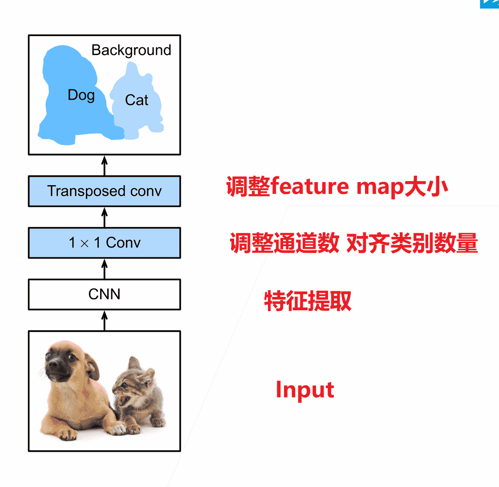

# 计算机视觉

>   **动手学深度学习v2** - https://www.bilibili.com/video/BV18p4y1h7Dr
>
>   个人评价是需要有一点基础
>
>   -   [Pytorch 小土堆](https://www.bilibili.com/video/BV1hE411t7RN) 先把Pytorch基础看一下
>   -   [李宏毅2022春机器学习](https://www.bilibili.com/video/BV1Wv411h7kN)
>       -   理论部分更推荐李宏毅或者吴恩达，会更好理解
>       -   我的策略是理论在李宏毅这里补，作业不做，在李沐这里实操一下代码
>
>   本文不会放太多理论的东西
>
>   记录一下代码实操即可
>
>   理论请移步李宏毅课程的相关笔记

[TOC]

## 硬件

-   CPU角度：避免显式的`for`，利用原生代码可以提高并行速度

-   GPU角度：少用控制语句，多计算

-   不要频繁交换CPU、GPU数据

### GPU并行训练

-   数据并行：将小批量数据分成若干块，在不同GPU上用同一模型参数进行计算
    -   性能更好
-   模型并行：切割模型，不同GPU负责不同部分
    -   一般用于模型非常大，单GPU无法支持的情况
-   通道并行（数据+模型并行）

以数据并行为例


>   1.   切割数据，不同GPU进行数据读取
>   2.   从Key-Value store拿回当前参数
>   3.   并行计算
>   4.   传回梯度
>   5.   更新梯度


### 代码

```python

device = 'cuda' if torch.cuda.is_available() else 'cpu'
model = base_resnet().to(device)
loss_fn = nn.CrossEntropyLoss()
optimizer = torch.optim.Adam(filter(lambda p: p.requires_grad, model.parameters()), lr=1e-3)

# 多了这个
if torch.cuda.device_count() > 1:
    # [0, 1]
    devices_id = list(range(torch.cuda.device_count()))
    model = nn.DataParallel(model, devices_id) # 自动切分数据
    
def training(dataloader, model, loss_fn, optimizer):
    
    model.train()

    loss, correct= 0.0, 0.0
    n = 0

    for X,y in dataloader:
    
        X,y = X.to(devices_id[0], non_blocking=True), y.to(devices_id[0], non_blocking=True) 
        # 先放到同一个gpu上
        # val同理
        
        output = model(X)

        cur_loss = loss_fn(output, y)
        _, pred = torch.max(output, axis = 1)
        _, ypred = torch.max(y, axis = 1)
            
        optimizer.zero_grad()
        cur_loss.backward()
        optimizer.step()

        loss += cur_loss * len(y)
        correct += torch.sum(ypred==pred).item()
        n += len(y)

    return loss / n, correct / n
```

训练效果：

```python
'''
单卡训练
start train
epoch 5/5: loss = 0.08559861779212952 acc = 0.9735049720746493
Validation: loss = 0.33436986804008484 acc = 0.8986652138381912

finish:353.13479590415955s
'''

'''
双卡训练
epoch 5/5: loss = 0.0956471711397171 acc = 0.9695545565999183
Validation: loss = 0.31762591004371643 acc = 0.8994824298556252

finish:204.22283124923706s
'''
```


-   模型副本：在每个GPU上，都会创建一个模型的副本。这些副本共享相同的参数，但每个副本都独立地处理一部分输入数据。
-   结果合并：在所有GPU上的处理完成后自动合并
-   默认是放在0号gpu，因此显存稍微会大一点

注意事项：

-   如果多块GPU的计算能力、显存不一致，需要调节数据划分比例，榨干性能


## 数据增强

-   对已有数据集进行增强（相当于正则项），添加多样性

### 代码

```python
# 展示对比
def print_img(image,trans):
    fig, axes = plt.subplots(2, 4, figsize=(12, 6))
    axes = axes.ravel()  # 将 2x4 的数组转换为一维数组
    # 原图
    axes[0].imshow(image)
    axes[0].set_title('Original Image')
    axes[0].axis('off')

    # 变换后的图像
    for i in range(1,8):
        axes[i].imshow(trans(image))  # 变换
        axes[i].set_title(f'Transformed Image{i}')
        axes[i].axis('off')
    plt.show()

    
# 读取图片
image = Image.open('data/Muelsyse.png')


```

-   翻转

```python
# 随机水平翻转 有可能不翻转
print_img(image, transforms.RandomHorizontalFlip() )

# 注意，是否使用垂直翻转需要结合具体情况
print_img(image, transforms.RandomVerticalFlip() )
```

垂直翻转对于人、动物，或是其他在实际情况下很少倒立的物体，不建议使用

需要结合生产需求，否则没有什么引入噪声的意义

（例如：颜色变化，实际情况确实大概率会因为光线问题而出现，因此有加入此数据增强的必要）


-   裁剪与缩放

```python
trans3 = torchvision.transforms.RandomResizedCrop (
    (200, 200), scale=(0.1, 1), ratio=(0.5, 2)
    # (200,200) 裁剪之后需要拉伸输出图片的尺寸（单位：像素）
    # scale: 裁剪矩形的面积需要在原图像的(0.1,1)范围内
    # ratio: 裁剪矩形的高与宽的比，需要在(0.5,2)的范围
)
print_img(image, trans3)
```


-   亮度

```python
print_img(
    image,
    transforms.ColorJitter(
        brightness=0.2, contrast=0.2, saturation=0.2, hue=0.2
    )
)
# brightness=0.5 等价于brightness=[1-0.5,1+0.5]（可以直接指定min max范围）
# 1是原亮度

# 同理 constrast是对比度 saturation是饱和度 都不能是负数

# hue是色相范围 其取值为[-0.5,0.5]
# 即hue=x 等价于 hue=[-x,x]
# 也可以直接指定范围
# 注意：：：：：：：：：：
# 要求输入的像素值不能为负！！！
# 避免使用此操作前 归一化到负值范围
```


通常我们只需要结合多种方法即可：

```python
trans = transforms.Compose([
    transforms.RandomHorizontalFlip(),
    torchvision.transforms.RandomResizedCrop(
        (200, 200), scale=(0.1, 1), ratio=(0.5, 2)
    ),
    transforms.ColorJitter(
        brightness=0.3, contrast=0.3, saturation=0.3, hue=0
    )
])
print_img(image, trans)
```


## 微调

在较大的源数据集上进行训练后得到的预训练模型

可以微调后在较小的（同种类）训练模型上使用

微调时需要加强正则化力度（本身已经训练得差不多了）

-   更小的学习率
-   更少的训练epoch


微调时需要与源数据进行相同的数据增强、数据处理：

```python
# 源数据的性质 可以直接使用
normalize = torchvision.transforms.Normalize([0.485, 0.456, 0.406],
                                             [0.229, 0.224, 0.225])

train_augs = torchvision.transforms.Compose([
    torchvision.transforms.RandomResizedCrop(224),
    torchvision.transforms.RandomHorizontalFlip(),
    torchvision.transforms.ToTensor(), normalize])

test_augs = torchvision.transforms.Compose([
    torchvision.transforms.Resize(256),
    torchvision.transforms.CenterCrop(224),
    torchvision.transforms.ToTensor(), normalize])
```


需要修改最后的分类层

```python
finetune_net = torchvision.models.resnet18(pretrained=True)
finetune_net.fc = nn.Linear(finetune_net.fc.in_features, 2)
nn.init.xavier_uniform_(finetune_net.fc.weight) # 初始化数据
```


可以直接冻结底层的梯度

但也可以让底层的学习率更低，高层学习率

```python
params_1x = [ 
    param for name, param in net.named_parameters() 
    	if name not in ["fc.weight", "fc.bias"]
]

trainer = torch.optim.SGD([
    {'params': params_1x}, 
    {'params': net.fc.parameters(),'lr': learning_rate * 10}], # 对高层放大学习率
    lr=learning_rate,weight_decay=0.001
)
```


## 计算机视觉

### 目标检测

-   之前接触是对图片中的单对象进行分类，目标检测需要找到物体的**位置、类别**

-   使用**边缘框**进行表示，记录左上角右下角（或左上角、长宽）四个参数


-   批量进行预测时，设定单张图片的预测物体上限
    -   超过上限，舍弃
    -   低于上限，填充0
    -   从而保证返回的物体张量是规则的

### 锚框

-   边缘框代表真实位置

-   提出多个锚框

    -   第一步预测：每个锚框内是否有物体
    -   第二步预测：锚框到真实位置的偏移

-   IoU交并比：计算两个框的相似度

    -   $$
        J(A,B) = \frac{|A\cap B|}{|A\cup B|}
        $$

-   锚框作为训练样本
    -   标注：背景（大量，因此噪声非常多）
    -   标注：真实边缘框


计算每个锚框和边缘框的IoU值，进行最大匹配，匹配完成后删除同行同列


-   NMS（非极大值抑制）：选择置信度最高的锚框，去除所有与这个锚框IoU大于阈值的其他锚框（避免重复冗余）


### 物体检测算法

-   Two-Stage：R-CNN系算法（Region-based CNN），先通过启发式搜索（或CNN网络）提取出候选锚框，第二阶段再对候选框进行分类、回归，准确度高
-   One-Stage：（Yolo和SSD），均匀地在图片的**不同位置**进行**密集**抽样，采取不同尺度和长宽比，抽取后使用CNN提取特征后直接进行分类与回归，速度更快

#### R-CNN

[【参考】R-CNN系列算法全面概述（一文搞懂R-CNN、Fast R-CNN、Faster R-CNN的来龙去脉](https://blog.csdn.net/z135733/article/details/136005255)


-   抽取一定量的候选框
-   使用CNN提取特征
-   依次送入每个类对应的SVM分类器，判断是否是这一类
-   使用线性回归器，调整锚框偏移位置

#### Fast R-CNN

R-CNN将每个候选框都送入CNN进行特征提取

Faster R-CNN将整张图片送入CNN，共享卷积层，重复部分不再计算，直接提取对应值


#### Fasterr R-CNN

使用**区域提议网络（region proposal network，RPN）**得到候选框，其他部分不变


####  单发多框检测SSD

single-shot 其实是算法一步到位的意思


-   对于提取好特征的图片，**每个像素**将以自己为中心，生成不同大小、高宽比的锚框，进行分类、回归
-   网络没加深一次，就会做一次这样的操作
-   相当于越高层检测的是越大的物体，越底层检测越小的物体


#### YOLO

-   SSD锚框的锚框生成策略导致重复率非常高
-   将当前网络层的图像进行切分为$S\times S$个均匀的锚框，每个锚框检测$B$个边缘框，防止一个锚框内有多个物体
-   其他和SSD差不多


### 语义分割

>   检测每个像素属于哪一类


-   实例分割：需要分类出具体是哪个物体


#### 上采样：转置卷积

语义分割需要做像素级别的输出

但是不断卷积会使得feature map变小

以及其他需要增大feature map的操作 我们需要通过上采样进行实现

使用转置矩阵进行变大操作


```python
x = torch.arange(4.)
k = x.clone()

x = x.reshape(1,1,2,2)
k = k.reshape(1,1,2,2)

tconv = nn.ConvTranspose2d(1, 1, kernel_size=2, bias=False)
tconv.weight.data = k
tconv(x)

# tensor([[[[ 0.,  0.,  1.],
#          [ 0.,  4.,  6.],
#         [ 4., 12.,  9.]]]], grad_fn=<ConvolutionBackward0>)
```


对于转置卷积来说，padding相当于删掉最外面一圈数字

```python
tconv = nn.ConvTranspose2d(1, 1, kernel_size=2, padding=1, bias=False)
tconv(x)
# tensor([[[[4.]]]], grad_fn=<ConvolutionBackward0>)
```


>   原文：[卷积操作总结（二）—— 转置卷积（transposed convolution） - 知乎 (zhihu.com)](https://zhuanlan.zhihu.com/p/549164774?utm_psn=1803937412205920257)


- 对于一般的卷积操作，会使得feature map减小

-   我们展开inputs成一维向量，kernel展开成二维矩阵，则可以表示为：


-   卷积操作可以将16维的向量通过矩阵乘法输出一个4维的向量。那么，如何从4维的向量计算得到一个16维的向量呢？


-   转置一下就好了


#### 全连接卷积神经网络FCN

-   使用FCN替换全连接网络，实现每个像素的预测



### 样式迁移


-   左：每层都对图片**内容**进行特征提取，可以预训练

-   右：每层都对图片**样式**进行特征提取，可以预训练
-   中间：我们的训练目标就是这个网络，希望做到每一层和左边对于内容的误差尽可能小、和右边对于样式的误差尽可能小，并且需要降低噪点，有一个自己的loss

