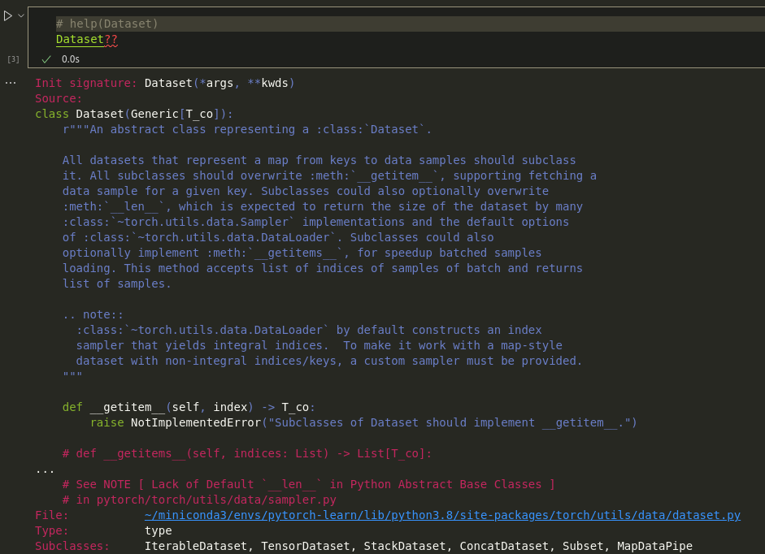
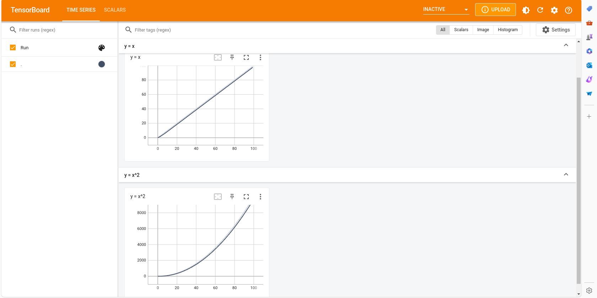
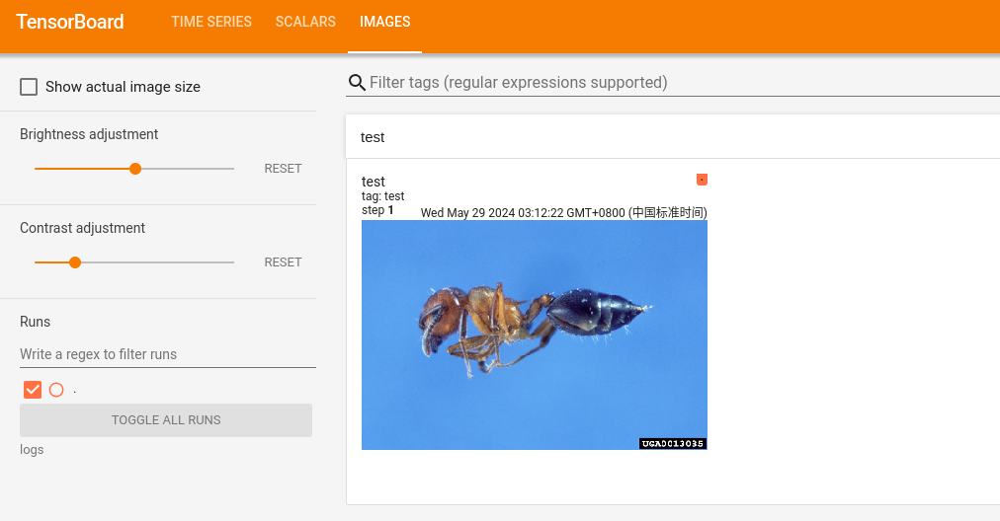

# Pytorch入门

[TOC]

## 环境配置

```bash
conda create -n pytorch-learn python=3.8
```

查看cuda版本：

```bash
nvcc --version
```

根据cuda版本进行选择：[Pytorch本地安装](https://pytorch.org/get-started/locally/)

```bash
conda install pytorch torchvision torchaudio pytorch-cuda=11.8 -c pytorch -c nvidia
```

安装检测

```cpp
(pytorch-learn) aoijays@aoijays-ubuntu:~/Desktop/note$ python                                       
Python 3.8.19 (default, Mar 20 2024, 19:58:24)                                                      
[GCC 11.2.0] :: Anaconda, Inc. on linux                                                             
Type "help", "copyright", "credits" or "license" for more information.                              
>>> import torch                                                                                     
>>> torch.cuda.is_available()
True        
```

此时说明安装成功


## 前言

### 法宝函数

```python
dir( ... ) # 显示下属对象列表
help( ... ) # 显示当前对象的说明
## 但我更喜欢加两个问号??
```



### Dataset

 以[蜜蜂蚂蚁数据集](https://www.kaggle.com/datasets/ajayrana/hymenoptera-data)进行说明

其文件目录：

```bash
│   └── hymenoptera_data
│       ├── train
│       │   ├── ants
│       │   └── bees
│       └── val
│           ├── ants
│           └── bees
```

子文件夹小附有若干张jpg

接下来我们需要使用torch的Dataset去加载数据集


>  |  An abstract class representing a :class:`Dataset`.
>  |  
>  |  All datasets that represent <u>**a map from keys to data samples**</u> should subclass
>  |  it. All subclasses should overwrite :meth:`__getitem__`, supporting fetching a
>  |  data sample for a given key. Subclasses could also optionally overwrite
>  |  :meth:`__len__`, which is expected to return the size of the dataset by many
>  |  :class:`~torch.utils.data.Sampler` implementations and the default options
>  |  of :class:`~torch.utils.data.DataLoader`. Subclasses could also
>  |  optionally implement :meth:`__getitems__`, for speedup batched samples
>  |  loading. This method accepts list of indices of samples of batch and returns
>  |  list of samples.

省流：

- 需要继承
- 必须重写`__getitem__`
- 可以重写`__len__`

```python
from torch.utils.data import Dataset
from PIL import Image
import os

class MyDataet(Dataset):

    def __init__(self, root_dir, label):
        
        # 自定义 怎么方便怎么来
        self.root_dir = root_dir # 记录数据地址以及对应的标签
        self.label = label
        self.imglist = os.listdir(self.root_dir) # 以列表形式展示文件夹内所有文件
    
    def __getitem__(self, idx):
        img_name= self.imglist[idx]
        img_path = os.path.join( self.root_dir, img_name )
        
        img = Image.open(img_path) # 打开图片
        label = self.label

        return img, label # 返回数据与标签
    
    def __len__(self):
        return len(self.imglist)
    
train_ants = MyDataet('../Dataset/hymenoptera_data/train/ants', 'ants')  
train_bees = MyDataet('../Dataset/hymenoptera_data/train/bees', 'bees')  

train_data = train_ants + train_bees # 拼接数据集
print( train_ants.__len__(),  train_bees.__len__(), train_data.__len__())
print(train_data[123], train_data[124], sep='\n')
# 124 121 245
# (<PIL.JpegImagePlugin.JpegImageFile image mode=RGB size=500x375 at 0x775FB149ADF0>, 'ants')
# (<PIL.JpegImagePlugin.JpegImageFile image mode=RGB size=311x387 at 0x775FB0EB29A0>, 'bees')
```

写法非常自由，你只要保证重写的函数返回正确结果即可


### Tensorboard

```bash
conda install tensorboard
```
#### Scalars

绘制一些图表，观察训练的loss变化


```python
from torch.utils.tensorboard import SummaryWriter
writer = SummaryWriter("logs") # 创建对象 在logs文件夹下保存文件
for i in range(100):
    writer.add_scalar("y = x", i, i) # 图像名 y值 x值

for i in range(100):
    writer.add_scalar("y = x^2", i*i, i) # 图像名 y值 x值

writer.close()

```

在终端中：

```bash
tensorboard --logdir=logs --port=6007 # 默认6006
```



#### Images

可视化实际的训练效果，上传图片进行展示

```python
img = Image.open(
    '../Dataset/hymenoptera_data/train/ants/0013035.jpg'
)
print(type(img)) # <class 'PIL.JpegImagePlugin.JpegImageFile'>

# 不支持此类型 需要转化为numpy对象
img_array = np.array(img)
print(img_array.shape) # (512, 768, 3)

# 高 宽 通道数 -> HWC
# 标题 添加的图像 步 格式
writer.add_image("test", img_array, 1, dataformats="HWC")

# 我们可以第1步展示一张图，第2步展示一张图……
# 即可观察随着训练步数，图片发生变化
```





### Transforms

 留个印象就好，能通过这个方法对数据、图片等进行互相转换、变化

常见的有：

- ToTensor：转化为Tensor数据
- Normalize：归一化
- Resize：对图片数据进行缩放
- Compose：用列表记录多个变化，进行一次性操作

可能用到的时候查一下就行

适合对多个数据同时进行相同的处理


### Torchvision数据集的下载与使用

```python
import torchvision
train_set = torchvision.datasets.CIFAR10(root='../Dataset', train=True, download=True) # 训练集
test_set = torchvision.datasets.CIFAR10(root='../Dataset', train=False, download=True) # 测试集

print(train_set[0])
print(train_set.classes)
img, target = test_set[0]
print(img, target)

'''
(<PIL.Image.Image image mode=RGB size=32x32 at 0x7202D3007670>, 6)
['airplane', 'automobile', 'bird', 'cat', 'deer', 'dog', 'frog', 'horse', 'ship', 'truck']
<PIL.Image.Image image mode=RGB size=32x32 at 0x7202D3007310> 3
'''
```

此时我们得到的数据集都是`(PIL对象，标签索引)`

我们可以使用Transform统一把图片转化为Tensor，方便Pytorch使用

最简单的方法：

```python
dataset_transform = torchvision.transforms.Compose([ # 封装所有需要进行的转换列表
    torchvision.transforms.ToTensor()
])

# 在加载数据时直接进行参数化修改
train_set = torchvision.datasets.CIFAR10(root='../Dataset', train=True, transform=dataset_transform, download=True) # 训练集
test_set = torchvision.datasets.CIFAR10(root='../Dataset', train=False, transform=dataset_transform, download=True) # 测试集

```


### DataLoader

```python
import torchvision
from torch.utils.data import DataLoader

test_set = torchvision.datasets.CIFAR10(root='../Dataset', train=False, transform=torchvision.transforms.ToTensor(), download=True) # 测试集

# 除了官方数据集 也可以选择之前自己实例化的Dataset
test_loader = DataLoader(dataset=test_set, batch_size=64, shuffle=True, drop_last=False)

for data in test_loader: # 按batch_size数量进行遍历
    imgs, targets = data
    print(targets)
```


## 网络

 

```python
import torch
from torch import nn

# 需要从nn.Module进行继承
class Mynn(nn.Module):
    
	def __init__(self):
		super().__init__() # 调用父类的初始化函数
   
	def forward(self, input): # 前向传播
		output = input + 1
		return output
        

mynn = Mynn()
x = torch.tensor(1.0)
output = mynn(x)
print(output)
```

 

### 卷积层

对于一张H*W的RGB图片，其通道数channel为3

我们使用多少个卷积核，就会产生多少个out_channels

```python
class Mycnn(nn.Module):
    
	def __init__(self):
		super().__init__() 
        # 输入3通道 用6个3*3的卷积核得到6通道输出 步长为1 不填充
		self.conv1 = nn.Conv2d(in_channels=3, out_channels=6, kernel_size=3, stride=1, padding=0)

	def forward(self, input): # 前向传播
		output = self.conv1(input)
		return output
        
mycnn = Mycnn()
x = torch.FloatTensor([
	[[1,2,3,4,5],[1,2,3,4,5],[1,2,3,4,5],[1,2,3,4,5],[1,2,3,4,5]],
	[[1,2,3,4,5],[1,2,3,4,5],[1,2,3,4,5],[1,2,3,4,5],[1,2,3,4,5]],
	[[1,2,3,4,5],[1,2,3,4,5],[1,2,3,4,5],[1,2,3,4,5],[1,2,3,4,5]]
])

mycnn(x)
```


### 池化层

 
