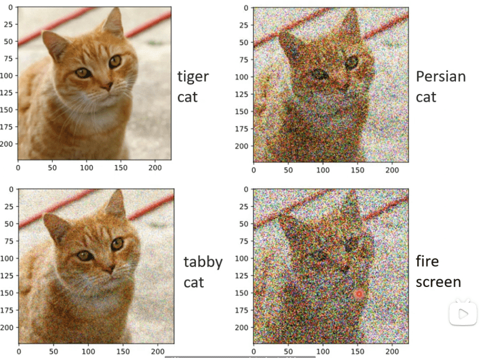
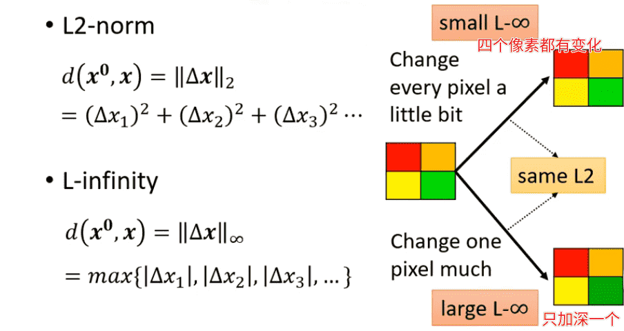

# L10. Adversarial Attack

>   [ML 2022 Spring (ntu.edu.tw)](https://speech.ee.ntu.edu.tw/~hylee/ml/2022-spring.php)
>
>   https://www.bilibili.com/video/BV1VN4y1P7Zj
>
>   [【《2021机器学习-李宏毅》学习笔记】_李宏毅机器学习2021github-CSDN博客](https://blog.csdn.net/chh13502/article/details/121210730)

[TOC]

## Background

正确率高的模型不代表能应付人类的恶意攻击

我们需要在遭受欺骗的情况下，也能让模型获得较高正确率

但有时肉眼看不见的攻击，反而效果更好

以下图片到底也还是可解释、相似的

上图完全看不出来

 

## How to Attack White Box

> 已知模型参数

攻击方式：

- Non-targeted：只要判断错误即可
- Targeted：要求必须误判为指定类型

### Non-targeted

我们希望得到一个$x$，使其输出$\hat y$与标准答案$y_0$越远越好

我们知道我们可以使用交叉熵函数$e(y_0,\hat y)$衡量分类误差

因此需要让误差越大越好：
$$
L(x) = -e(y_0,\hat y)\\
x^* = \arg \min L(x)
$$

### Targeted

首先设计$y_{target}$

我们需要让$\hat y$与标准答案$y_0$越远越好

**并且$\hat y$与$y_{target}$越近越好**
$$
L(x) = -e(y_0,\hat y) + e(y_{target}, \hat y)\\
x^* = \arg \min L(x)
$$
 

### Distance

不管是哪一种攻击，我们希望$x$和$x_0$相似，这样不会被看出来

因此我们限制$x$不能超过$x_0$一定距离
$$
d(x_0,x) \leq \epsilon
$$
距离函数、距离阈值取决于人类的感官能力

- L2-norm
- L-infinity

实际采用哪一种需要根据任务涉及到视觉、听觉的具体情况分析

 

实际训练中，如果优化后超出距离

找到可行域内最近的一个点强行拉回来即可

 

也有更快的方法

我们直接靠梯度判断优化方向

直接取边界

## How to Attack Black Box

> 未知模型参数

### Proxy Network

使用相似的训练集去训练一个类似的代理模型

白箱攻击代理网络，兴许也可以成功攻击黑箱

 

也可以准备大量输入，让黑箱生成对应输出

根据输入输出进行新模型的训练

事实证明非常容易攻击成功

> 容易做到non-targeted
>
> targeted比较难

对于聚合多个模型进行聚合攻击效果会更好

可以成功骗过多个Network 的时候，黑箱攻击成功率会很高

#### Reason

攻击成功的原因来自于数据，而不是模型本身

在有限的数据上训练得到的特征，在多个模型上是差不多的

（蓝色区域代表正确区域，五个模型都很像）

因此找到一个模型的攻击方向，其他模型基本也会被攻击

如果训练数据足够，就有机会避免被攻击

