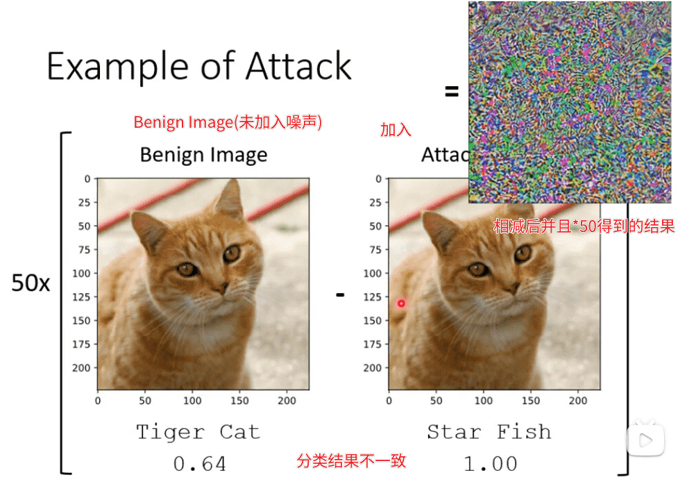
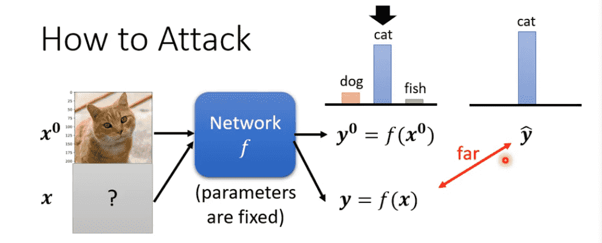
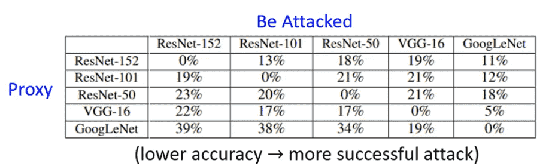

# L10. Adversarial Attack

>   [ML 2022 Spring (ntu.edu.tw)](https://speech.ee.ntu.edu.tw/~hylee/ml/2022-spring.php)
>
>   https://www.bilibili.com/video/BV1VN4y1P7Zj
>
>   [【《2021机器学习-李宏毅》学习笔记】_李宏毅机器学习2021github-CSDN博客](https://blog.csdn.net/chh13502/article/details/121210730)

[TOC]

## Background

正确率高的模型不代表能应付人类的恶意攻击

我们需要在遭受欺骗的情况下，也能让模型获得较高正确率

但有时肉眼看不见的攻击，反而效果更好

以下图片到底也还是可解释、相似的

上图完全看不出来

 

## How to Attack White Box

> 已知模型参数

攻击方式：

- Non-targeted：只要判断错误即可
- Targeted：要求必须误判为指定类型

### Non-targeted

我们希望得到一个$x$，使其输出$\hat y$与标准答案$y_0$越远越好

我们知道我们可以使用交叉熵函数$e(y_0,\hat y)$衡量分类误差

因此需要让误差越大越好：
$$
L(x) = -e(y_0,\hat y)\\
x^* = \arg \min L(x)
$$

### Targeted

首先设计$y_{target}$

我们需要让$\hat y$与标准答案$y_0$越远越好

**并且$\hat y$与$y_{target}$越近越好**
$$
L(x) = -e(y_0,\hat y) + e(y_{target}, \hat y)\\
x^* = \arg \min L(x)
$$
 

### Distance

不管是哪一种攻击，我们希望$x$和$x_0$相似，这样不会被看出来

因此我们限制$x$不能超过$x_0$一定距离
$$
d(x_0,x) \leq \epsilon
$$
距离函数、距离阈值取决于人类的感官能力

- L2-norm
- L-infinity

实际采用哪一种需要根据任务涉及到视觉、听觉的具体情况分析

 

实际训练中，如果优化后超出距离

找到可行域内最近的一个点强行拉回来即可

 

也有更快的方法

我们直接靠梯度判断优化方向

直接取边界

## How to Attack Black Box

> 未知模型参数

### Proxy Network

使用相似的训练集去训练一个类似的代理模型

白箱攻击代理网络，兴许也可以成功攻击黑箱

 

也可以准备大量输入，让黑箱生成对应输出

根据输入输出进行新模型的训练

事实证明非常容易攻击成功

> 容易做到non-targeted
>
> targeted比较难

对于聚合多个模型进行聚合攻击效果会更好

可以成功骗过多个Network 的时候，黑箱攻击成功率会很高

#### Reason

攻击成功的原因来自于数据，而不是模型本身

在有限的数据上训练得到的特征，在多个模型上是差不多的

（蓝色区域代表正确区域，五个模型都很像）

因此找到一个模型的攻击方向，其他模型基本也会被攻击

如果训练数据足够，就有机会避免被攻击

## Case

-   One pixel attack：改变一个像素点完成攻击
-   Universal Adversarial Attack：同一套攻击方式攻击所有对象，不需要客制化

 

在实际环境中，观察一个物体会从多个角度进行观察

因此只对一个角度进行欺骗的意义不大

需要Universal Adversarial Attack对任意角度都进行欺骗

 

除了图像分类，还有其他形式的攻击

-   对合成声音添加噪声，欺骗模型是真实的声音而不是合成声音
-   对文本添加一些内容，控制模型的QA结果

 

### Adversarial Reprogramming

也可以利用攻击，对模型进行重编程

通过这种方式不需要重新训练一个模型

 

### Backdoor

之前的方式都是测试过程中的攻击

我们考虑在训练中进行攻击

>   有可能在训练资料里面加一些特别的、人看起来没有问题、但实际上有问题的资料
>
>   让模型训练完以后,模型就开了一个后门
>
>   只会对某一张图片辨识错误
>
>   对其他的图片还是没有问题的
>
>   **小心在网络上公开的资料集。**

目前不是很成功，需要很多限制才能做到

 

## Defence

### 被动防御

我们在输入数据进入模型前过一个filter

例如模糊化

-   但是过度模糊化会导致正常的置信度也会下降

>   其他方式：
>
>   -   对图片进行压缩后再解压缩
>   -   generator对图片重新生成

被动的防御是不能被别人知道的

否则完全可以看成多了几层的新模型

可以引入一些随机防御

-   前提是不要泄露`distribution`

### 主动防御

采用`Adversarial Training`

对于当前数据，先训练一个模型

我们迭代多次下述过程：

-   使用若干种攻击算法进行攻击
-   对攻击成功的数据进行正确标注，添加到数据集中重新训练

本质上是一种数据增强

实际操作中不一定可以用来防止攻击，单纯用来增加模型鲁棒性、避免过拟合也不错

-   运算量大
-   不一定能防住模型没见过的攻击算法

