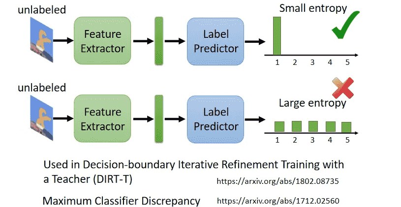

# L11. Domain Adaptation

>   [ML 2022 Spring (ntu.edu.tw)](https://speech.ee.ntu.edu.tw/~hylee/ml/2022-spring.php)
>
>   https://www.bilibili.com/video/BV1VN4y1P7Zj
>
>   [【《2021机器学习-李宏毅》学习笔记】_李宏毅机器学习2021github-CSDN博客](https://blog.csdn.net/chh13502/article/details/121210730)

[TOC]

当训练数据和测试数据分布不同，会产生不同的效果

`Domain shift`：测试数据和训练数据有不同的分布

-   输入分布
-   输出分布
-   输入和输出对应的关系
    -   同一张图片，不同的标签

本章只解决输入分布不同的问题

>   当手上有大量target data时，直接使用target data部分进行训练，不需要做Domain Adaptation
>
>   只有少量时，我们先用source data训练，再用target data微调
>
>   不要在少量的target data上跑过多次迭代，防止过拟合

对于真实环境，我们用source data，和一些无标注的target data

 

## Basic Idea

对于手写数字识别这个任务，我们可考虑让模型忽略颜色的feature

target data就可以直接套用source data的模型

 

## Domain Adversarial Training

-   为了完成剔除颜色特征的任务，我们希望我们抽出来的向量的分布是相似的

 

-   引入GAN的思想

-   但是问题可能会出在Discriminator上，其最后故意判错，我们无法让Generator生成相似的分布
-   但实际上其实效果还是不错的

 

## Decision Boundary

-   从boundary的角度解释，显然右边这种分布会更好
-   无标签的分布远离boundary，尽可能集中在某一个类别上，对于domain adaptation会更加轻松

实际上就是让概率分布集中一点

 

## Universal Domain Adaptation

事实上我们不总是让source和target有相似的distribution

target是无标签的，两者可能有交集、互相包含

## 省流

-   target没有label、只有一份：Testing Time Training
-   完全没有target：Domain Generalization
    -   训练数据的domain非常丰富
    -   训练数据只有一个domain，测试数据domain多

只给出了论文链接

