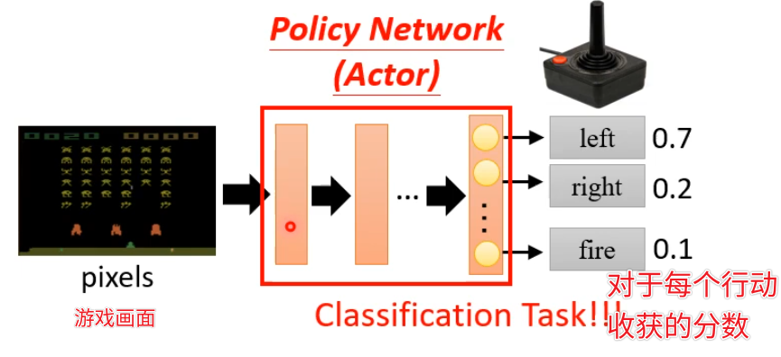
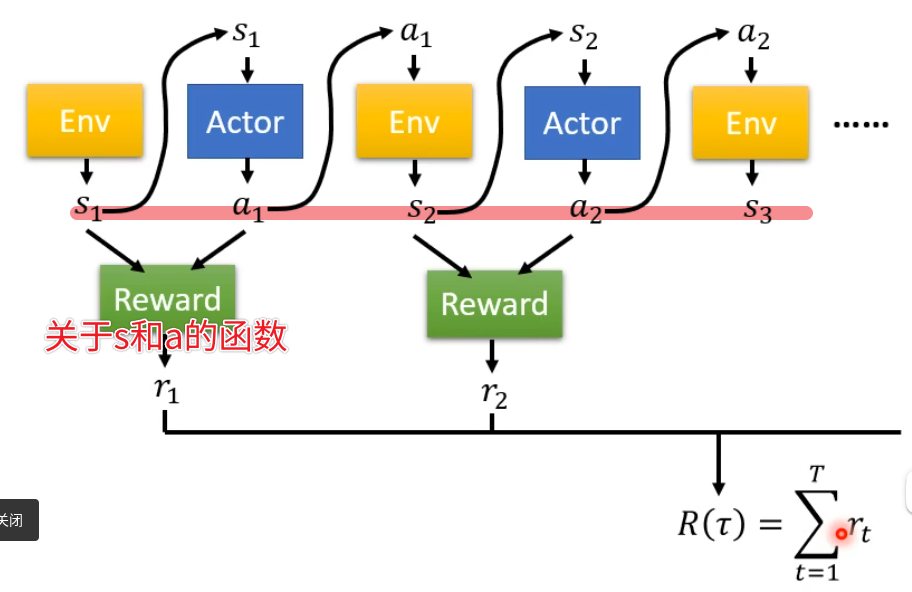
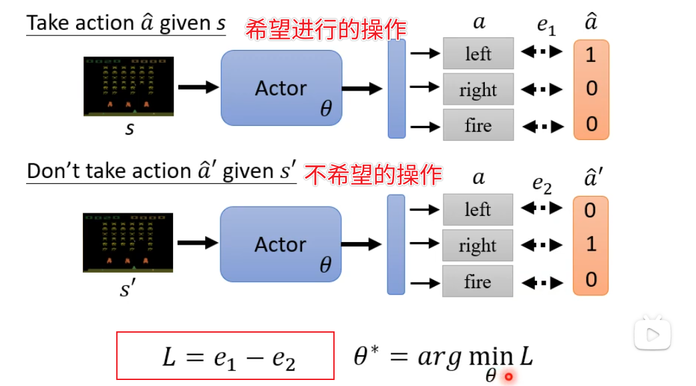
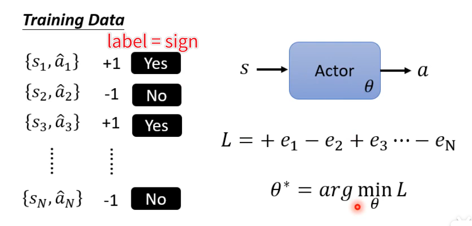
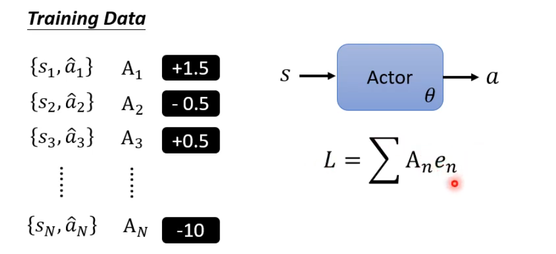
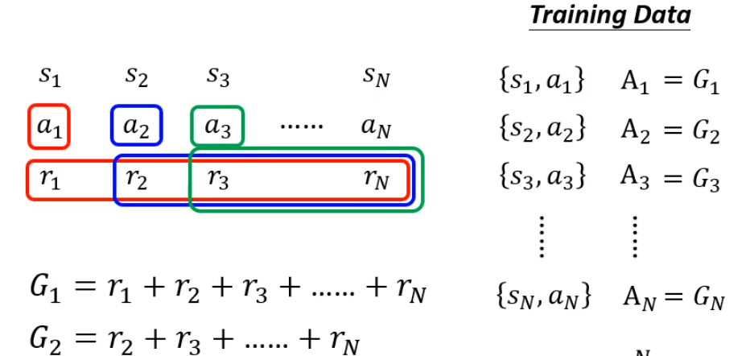
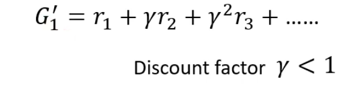

# L12. Reinforcement Learning

>   [ML 2022 Spring (ntu.edu.tw)](https://speech.ee.ntu.edu.tw/~hylee/ml/2022-spring.php)
>
>   https://www.bilibili.com/video/BV1VN4y1P7Zj
>
>   [【《2021机器学习-李宏毅》学习笔记】_李宏毅机器学习2021github-CSDN博客](https://blog.csdn.net/chh13502/article/details/121210730)

[TOC]

## 概述

RL模型（Actor）：

- 输入：对环境的Observation
- 输出：模型的Action

Action会实时改变环境，从而产生新的Observation

 

### 架构

本质上是在做一个分类任务

对不同的行动预测出可以获得的分数

> 其实预测的还是概率
>
> 根据概率分布进行sample，带来一些随机性

 

### Loss

定义一个`episode`：

- Actor开始采取行动
- 每次行动后计算一个`reward`
- 直到游戏结束

计算总的`total reward(return)`，我们需要最大化这个值
$$
R = \sum r
$$
加一个负号就变成loss了

### Optimization

我们需要优化的参数就是Actor网络的参数

使得R越大越好

 

并不是一个一般的优化问题

- Reward和Env都是黑盒子，并且有一定随机性
- Actor的输出也有随机性

> 让模型有尝试其他机会的可能，防止陷入单一策略

 

## Policy Gradient

使用监督学习进行训练

- 通过$L=e_1-e_2$控制Actor的行为

 

- 我们可以通过label表示希望与不希望
- 控制符号

 

- 我们也可以通过label定义成期望的程度
- 数值越大越希望

 

### How to define A

#### Version0: A = reward

我们多做几个`episodes`去收集$(s_i,a_i)$

粗略认为得到的$r_i$就是我们的希望程度$A_i$

> 但是训练出来会非常短视
>
> 只考虑当前的reward最高

 

#### Version1: A = 后缀和

把$A_i$定义为执行完操作$a_i$之后获得的$r_j$之和

> 过程非常漫长
>
> 非常后面的reward不一定能归功于非常前面的操作

因此我们引入一个系数，离当前操作$a_i$越远，贡献越低

 

#### Version2: 标准化

- 好坏是相对的

> reward永远都是正的时候就不太对劲
>
> 需要标准化一下

定义一个`baseline`，高于`baseline`是优秀的，低于是劣的

所有`reward`都需要减掉`baseline`
