# L2. What to do if my network fails to train

>   [ML 2022 Spring (ntu.edu.tw)](https://speech.ee.ntu.edu.tw/~hylee/ml/2022-spring.php)
>
>   https://www.bilibili.com/video/BV1J94y1f7u5

[TOC]

## General Guide

-   检查Training Loss
    -   Training Loss大
        -   Model Bias
            -   模型不够复杂
            -   提高模型复杂度即可
        -   Optimization
            -   可以尝试使用浅层神经网络等容易优化的模型进行训练，若Train Loss比复杂模型更低，说明优化出问题了
            -   解释：复杂模型包含了简单模型（多出来的部分全部不训练，剩下的就是简单模型），因此简单模型能做到的Training Loss，对于复杂模型也需要做到
    -   Training Loss小
        -   检查Testing Loss
            -   Testing Loss小（这不结束了吗）
            -   Testing Loss大
                -   Overfitting
                    -   增加训练数据
                    -   数据增强（Data augmentation）
                    -   减少模型复杂度
                    -   Early Stopping
                    -   Regularization
                    -   Dropout
                -   Mismatch
                    -   与过拟合不同，没法使用增加训练数据避免
                    -   训练数据与测试数据有着不同的分布

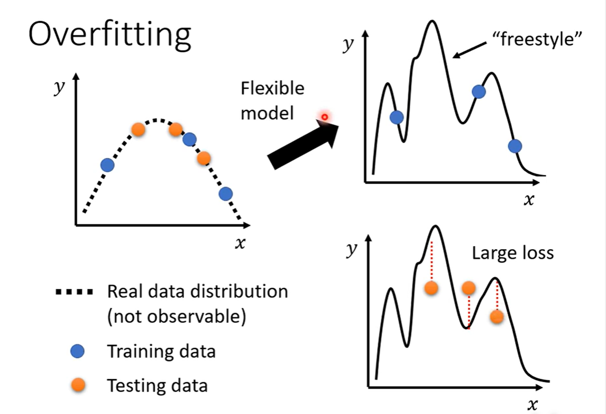

>   -   训练数据少，不足以限制模型
>   -   模型太复杂，过于自由

## Optimization Failed

### Critical Point

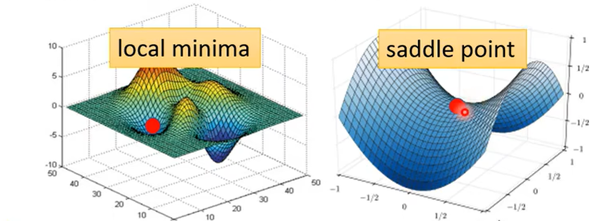

处于局部极值点（极大值、极小值）或鞍点时，梯度值为0，此时没有办法继续更新梯度

#### Tayler Series Approximation

为了判别`critical point`，我们要是能够知道损失函数$L(\theta)$的形状就会非常容易

我们考虑使用泰勒展开，对参数$\theta'$周围的损失函数进行近似
$$
L(\theta) \approx L(\theta') + (\theta-\theta')g+\frac{1}{2}(\theta-\theta')^T\times H\times (\theta-\theta')
$$
当我们处在`critical point`时，中间项为0：
$$
L(\theta) \approx L(\theta') + \frac{1}{2}(\theta-\theta')^T\times H\times (\theta-\theta')
$$
此时取决于最后一项：

-   永远大于0，则$L(\theta) > L(\theta')$，是局部极小值
- 	永远小于0，则$L(\theta) < L(\theta')$，是局部极大值
- 	否则：鞍点

判断$\frac{1}{2}(\theta-\theta')^T\times H\times (\theta-\theta')$的正负是一个经典问题

即$\forall v, v^THv > 0$，此时$H$被称为正定矩阵（特征值都是正值）

反之，负定矩阵所有的特征值均小于0

但是每次都需要计算矩阵及其特征值，是一件开销很大的事情

我们考虑从其他方式进行规避鞍点

#### Batch Size

-   大的Batch会花费更多时间进行计算，但是减少梯度更新次数
-   大的Batch会花费更少时间进行计算，但是增加梯度更新次数

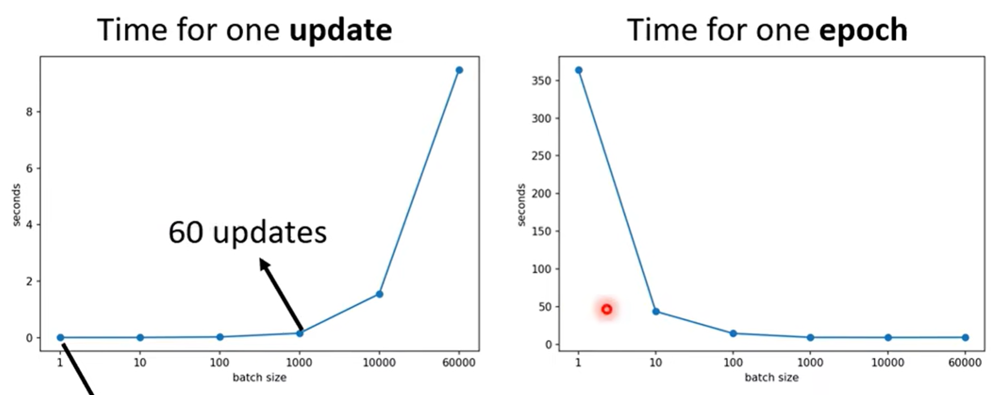

得益于GPU并行计算，batch在不是非常大的时候，多条数据计算loss计算梯度是并行的，因此时间非常少

但是小的batch确确实实需要更多次梯度更新，因此小的batch事实上在单个epoch上花费时间很大

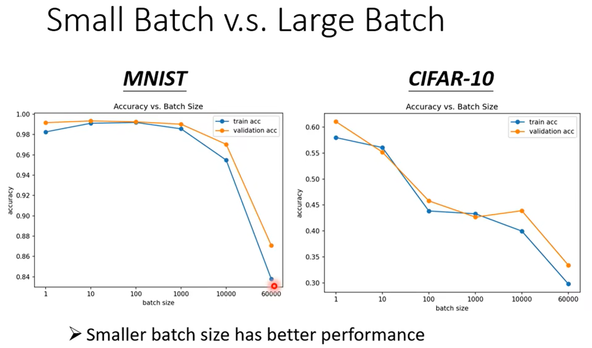

​	但是似乎小的batch可以对Optimization带来更好的效果

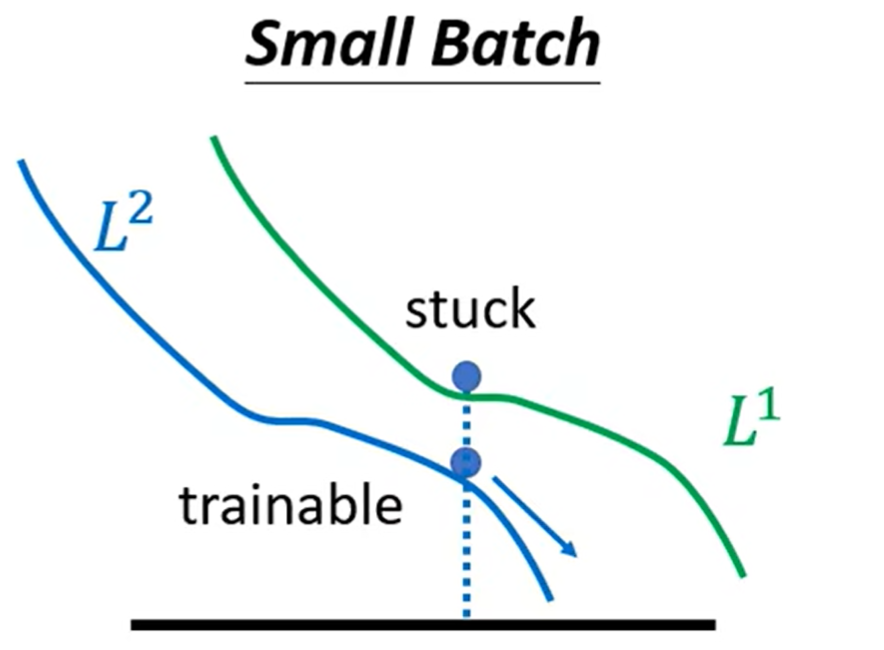

每次使用不同batch的数据进行更新，某种程度上引入了噪声

在第一份batch上进入鞍点，但是对于第二份就不一定是鞍点

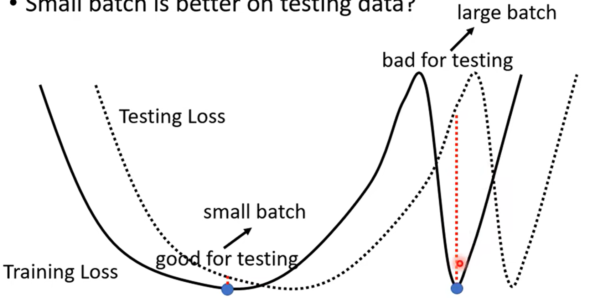

甚至你会发现，小batch训练出来的模型，泛化性能更好，在测试集上表现更好

一种比较玄学的解释：

极值点有平坦的、陡峭的两种（如图左、右）

由于测试集多少与训练集有一些mismatch，如果是平坦的极值点，稍微的偏移不会引起损失函数变化太多

而陡峭的极值点会表现糟糕

小batch在训练时引入的噪声，非常跳脱，峡谷很难困住其更新方向

而大batch的梯度下降方向稳定，因此容易进入陡峭的峡谷

### Learning Rate

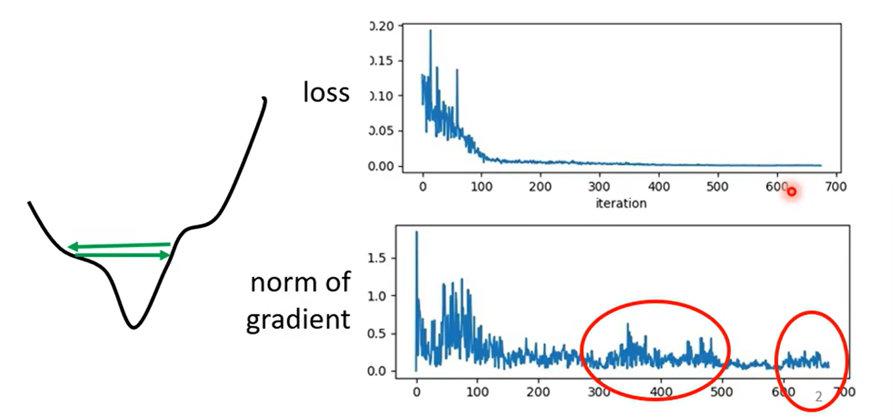

非常多时候Loss并不是卡在`critical point`

我们观察训练末期的梯度，发现并不是0

原因是在山谷之间来回跳动，无法下降

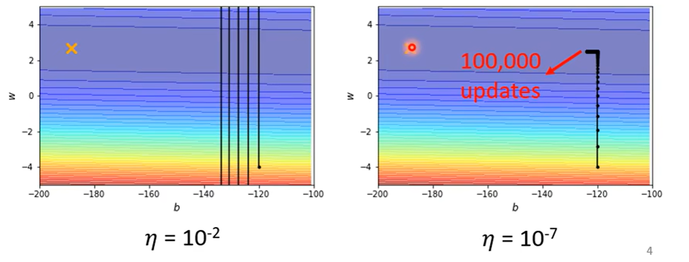

-   学习率较大，会在山谷来回跳
-   学习率较小，在稍微平坦的地方完全走不动

因此一般的梯度下降很难进入`critical point`

我们考虑自适应学习率

-   陡峭的地方学习率高
-   平坦的地方学习率低

梯度的更新应该由
$$
\theta^{t+1} =\theta^t - \eta g^t
$$
转变为：
$$
\theta^{t+1} =\theta^t - \frac{\eta}{\sigma^t}g^t
$$

#### Root Mean Square（Adagrad）

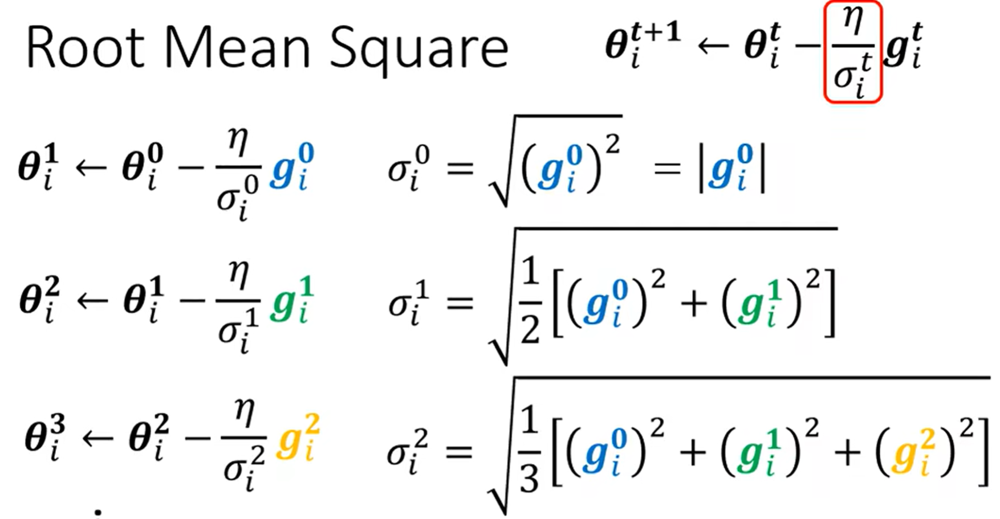

及对应维度上的梯度均方根作为分母

但是这样的方法不够灵活

有时候同一个维度，在不同时间点可能又陡峭又平缓，因此需要更加灵活、动态变化的学习率

#### RMSProp+Adam

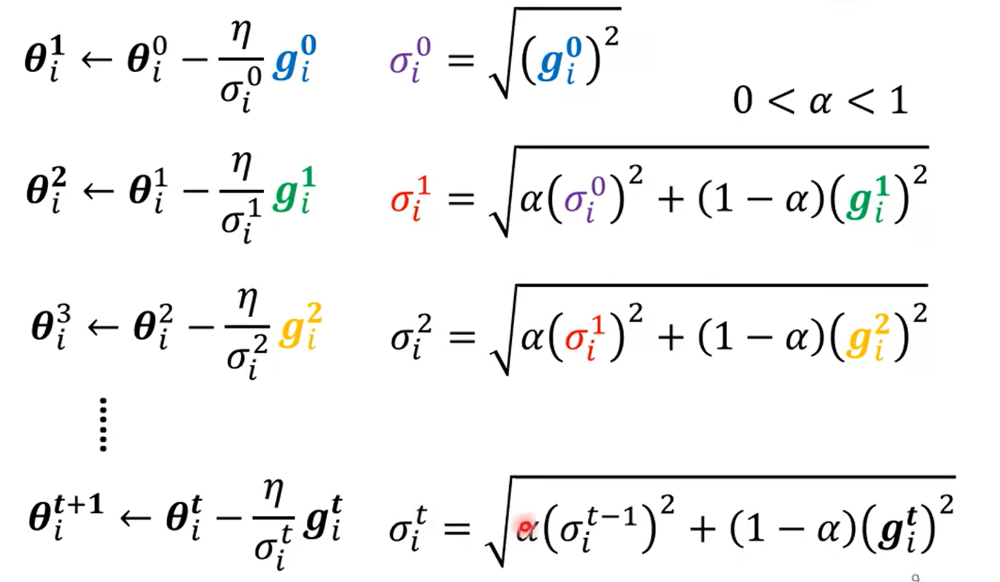

定义权重$\alpha$，每次结合上一次的$\sigma^{t-1}$与当前梯度进行计算
$$
\sigma^{t} = \sqrt{\alpha(\sigma^{t-1})^2+(1-\alpha)(g^t)^2}
$$

但此时我们仍然无法解决卡在`critical point`的问题

<u>Adam = RMSProp + Momentum</u>

#### Momentum

我们考虑在优化时引入动量的概念

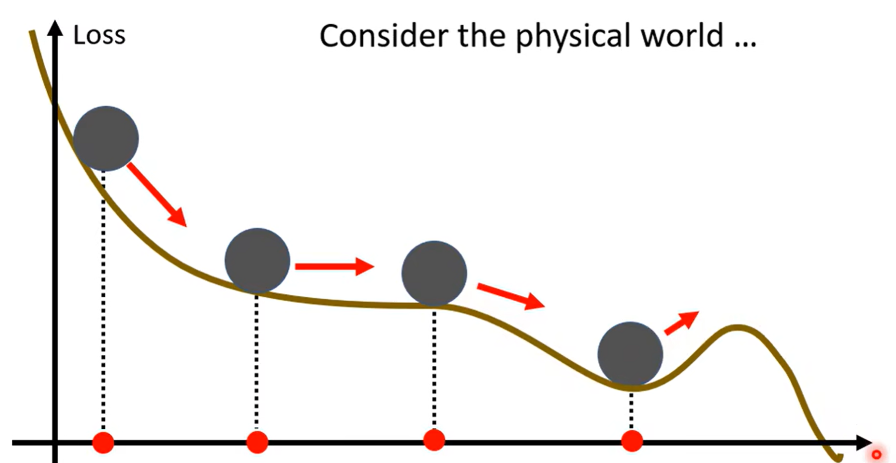

物体在下降时，到达谷底仍拥有一定的动量，还会沿之前的方向继续冲一会

这样有机会冲到更低的极值点

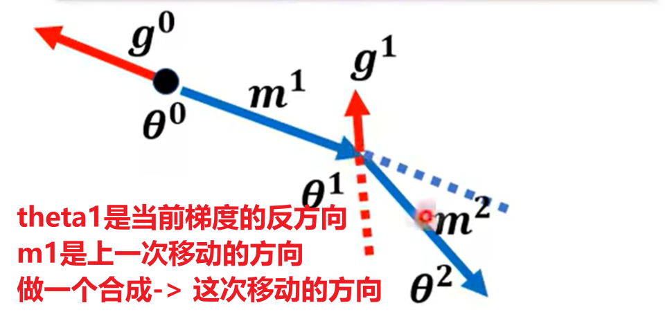

并且：每次移动的$m_i$都可以表示为之前所有梯度的综合（一个关于$g_0,g_1,...$的式子）

### Adam

结合 RMSProp + Momentum，我们就得到了Adam

 **Momentum：**
$$
\theta^t = \theta^{t-1} - \eta m^t\\
m^t = \beta m^{t-1} + (1-\beta)g^{t-1}
$$
**RMSProp:**
$$
\theta^t = \theta^{t-1} - \frac{\eta}{\sigma^t}g^{t-1}\\
\sigma^{t} = \sqrt{\alpha(\sigma^{t-1})^2+(1-\alpha)(g^t)^2}
$$
结合一下，**Adam**：
$$
\hat m^{t} = \frac{m^t}{1-\beta}\\
\hat \sigma^t = \sqrt{\frac{(\sigma^t)^2}{1-\alpha}}\\
\epsilon = 10^{-8}\\
\theta^t = \theta^{t-1} - \frac{\eta}{\hat \sigma^t + \epsilon}\hat m^{t}
$$

#### Learning Rate Scheduling

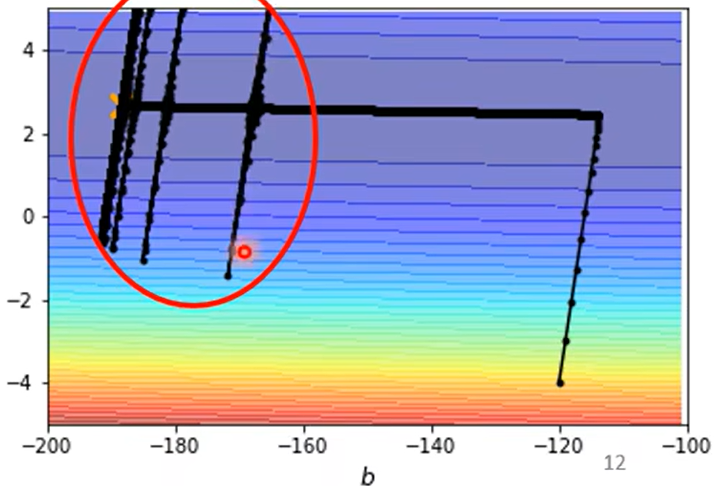

我们采用Adagrad，此时就可以进行正常的下降

但是会出现奇怪的波动

原因是对于纵轴维度：
$$
\sigma^{t} = \sqrt{\frac{1}{t+1}\sum_k (g^k)^2}
$$
刚进入平坦区时，得益于一开始积累了下降的较高梯度

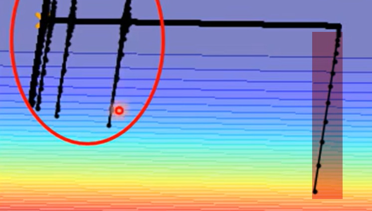

$\sigma_y$仍然可以维持在一个比较大的范围

但随着迭代次数增加，$\sigma_y$每次只能加上非常小的梯度，平均值不断变小，最终引起了学习率爆炸

如何解决这个问题呢

回顾
$$
\theta^{t+1} =\theta^t - \frac{\eta}{\sigma^t}g^t
$$
我们除了对$\sigma$进行变化，我们可以本身对$\eta$​进行变化

即随着时间，$\eta$慢慢变小

时间越长，本身肯定也已经离终点越来越近，因此就会抵消之前的梯度积累

或者变大再变小

-   Learning Rate Decay
  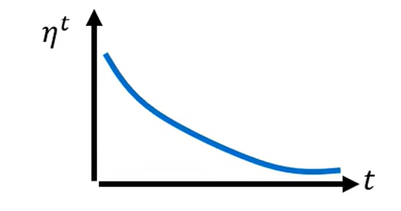
-   Warm Up

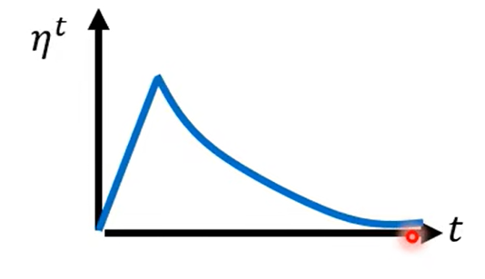

>   Warm Up貌似更黑科技一点
>
>   Warm Up可能的解释：
>
>   -   一开始希望多收集周围的梯度信息，因此不希望走太快
>   -   信息足够后，开始正式的大踏步前进
