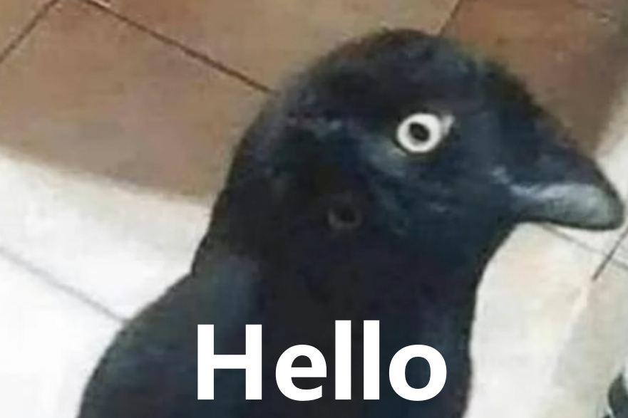
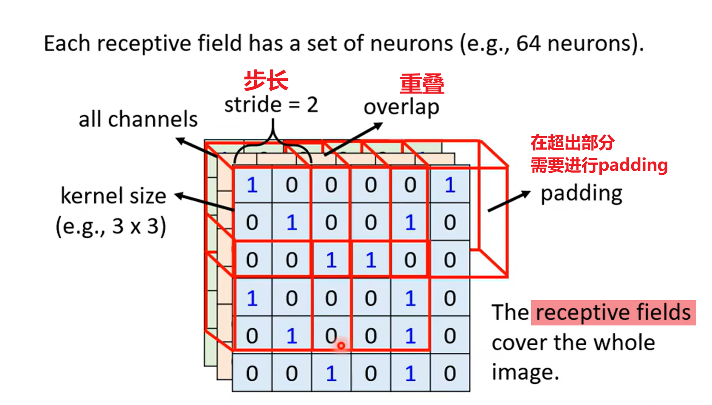
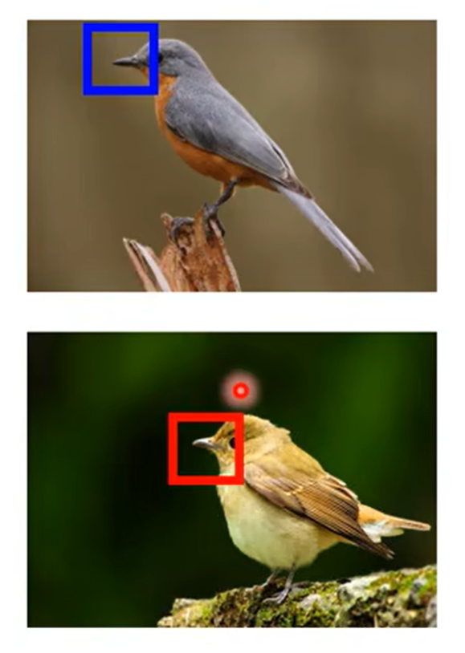
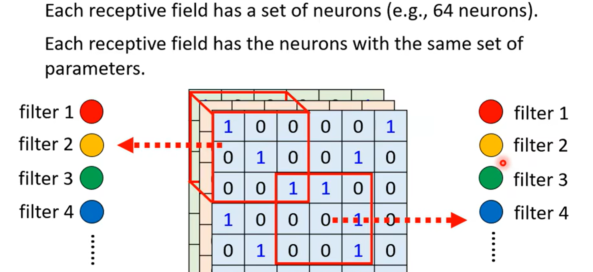
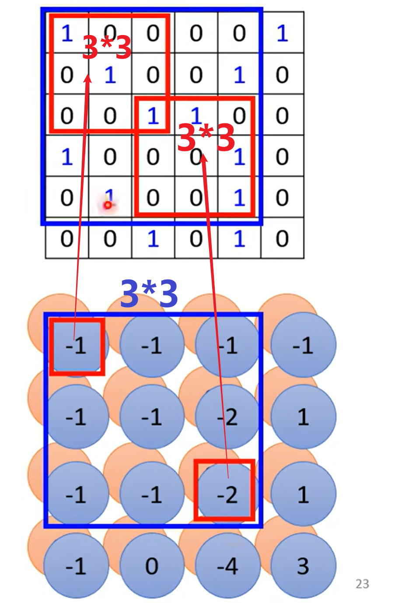
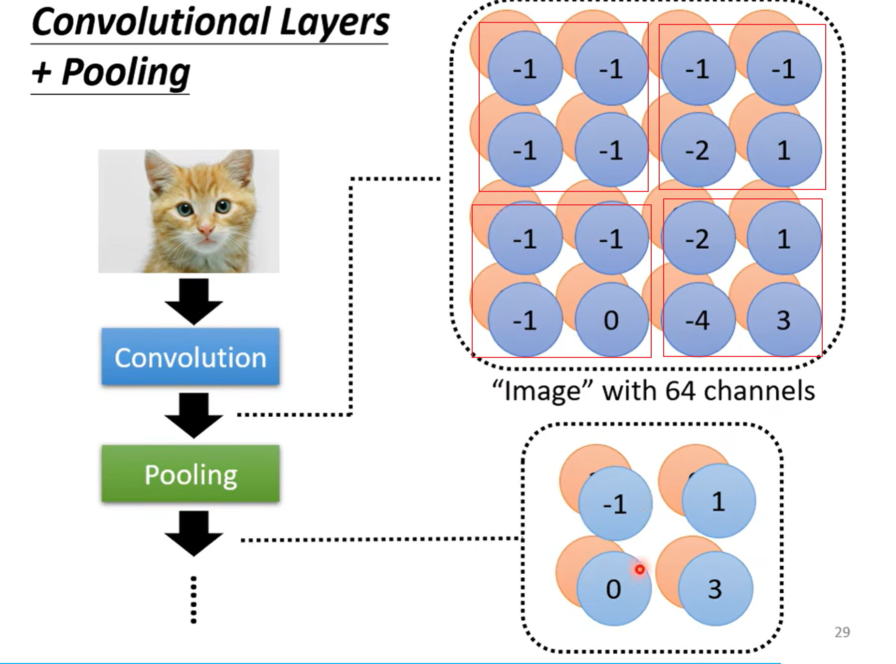

# L3. Image as input

>   [ML 2022 Spring (ntu.edu.tw)](https://speech.ee.ntu.edu.tw/~hylee/ml/2022-spring.php)
>
>   https://www.bilibili.com/video/BV1J94y1f7u5

[TOC]

## 原则

### 局部性

-   图片的识别往往需要注意一小块的特征

-   就算是人类也会根据局部特征，被误导进行分类（其实这是一只猫而不是一只鸟）

-   图像会被切分成多个感受野，感受野之间需要有所重叠（否则会遗失边界上的信息）

-   因此我们需要用感受野覆盖整个图像

-   用一组神经元，识别同一个感受野，即负责这一块区域的图像识别

### 平移不变性

-   同一个特征可以出现在不同的位置，因此理论上识别同一个特征的单元应该有相同的参数

-   对于同一个感受野，它应该携带多个神经元，即多个识别单元filter，以识别不同的特征
-   不同感受野的同一个filter，需要**共享参数**

## 卷积神经网络

### 卷积层

我们从一般的全连接神经网络出发，引入了两个限制

-   一组神经元只会接受图片上一块区域的张量（感受野）
    -   断掉了这些神经元与其他位置的连接
-   不同组神经元的同一类识别单元需要共享参数

此时我们相当于对MLP大砍一刀，变成了一个限制非常大的神经网络，即卷积层

-   但实际实现我们其实对于一个filter，就是一个卷积核，直接让它扫一遍整个图像即可

一个卷积核会产生一个新的通道

- 如图，同样一个3*3的卷积核，恢复到原图像中，会对应上超过9个以上的像素

-   随着深度增加，一个卷积核的真实感受野也会变大

### 池化层

-   大量的卷积核，产生大量的通道，因此对于原图像的尺寸来说参数会非常多

-   我们考虑通过池化缩减原图像尺寸（通道数不变）
-   Max、Mean Pooling

在计算量足够的时候，不一定需要使用Pooling（会丢失很多信息）

### 数据增强

旋转、缩放图像，可能会使得CNN变得很差

所以推荐在训练前使用数据增强

### Spatial Transformer Layer

但我们为什么不直接在网络结构中加一个层呢

[详细解读Spatial Transformer Networks（STN）-一篇文章让你完全理解STN了-CSDN博客](https://blog.csdn.net/qq_39422642/article/details/78870629)

没学太明白，知道个大概
