# L4. Sequence as input

>   [ML 2022 Spring (ntu.edu.tw)](https://speech.ee.ntu.edu.tw/~hylee/ml/2022-spring.php)
>
>   https://www.bilibili.com/video/BV1VN4y1P7Zj

[TOC]

## Sequence

对于Sequence Labeling任务，我们需要对一段文本中的所有单词标注词性。

-   显然不能单独考虑一个单词，需要结合上下文
    -   同一个单词在不同的上下文中会有不同的词性

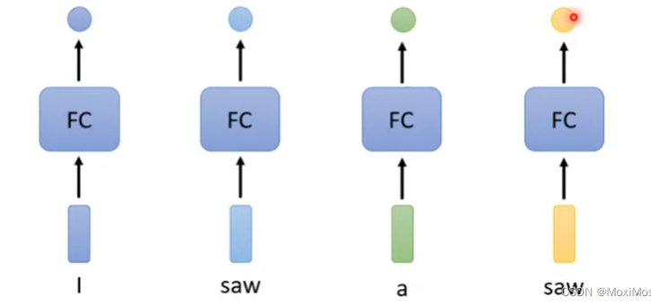

-   我们考虑定义一个window：
    -   每个Fully-Connected需要连接前后若干个单词作为输入

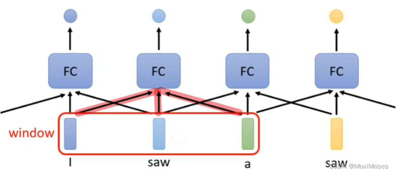

-   但是我们有时需要考虑整个Sequence去获得信息，我们很难通过扩大Window进行操作，复杂度会非常高


## Self-Attention

### 概述

-   整个Sequence作为输入
-   输出向量数量等于输入向量

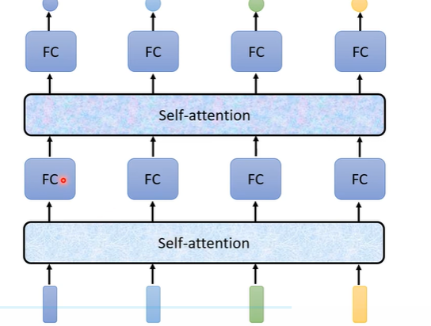

-   每次完成Self-Attention后，喂入FC进行操作
-   可以多次叠加

### Dot-Product

我们会对多个输入向量之间的相关性感兴趣

Self-Attention常使用Dot-Product求出两个向量之间的相关性

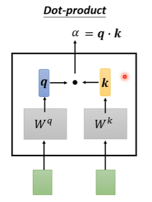

-   两个输入$\text{query},\text{key}$向量分别乘上$W_q,W_k$，得到向量$q,k$
-   对向量$q,k$进行点积，得到$\alpha$，同时也被称为attention-score

### Forward

-   对于其中一个向量$i$，计算出自己作为查询向量的$q_i$值

-   所有向量都需要计算自己作为被查询向量的$k_j$值

-   通过Dot-Product，得到$\alpha_{i,j}$，即向量$i$对所有向量$j$的相关性
-   做一下Softmax，得到$\alpha'_{i,j}$

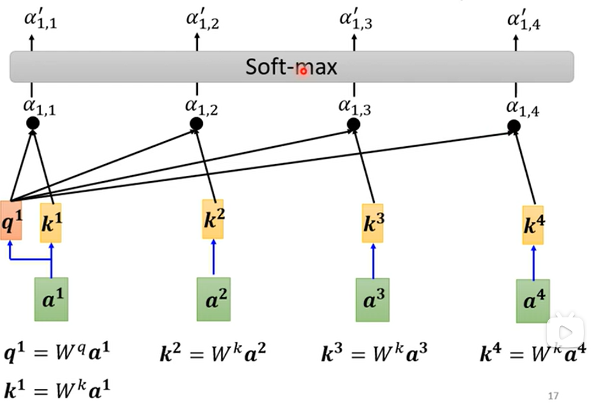

-   每个向量都需要通过$W_v$矩阵计算出向量$v$

-   $v_j$乘上标量$\alpha_{i,j}$，求和

-   $$
    b_i = \sum_{j} \alpha'_{i,j}v_j
    $$

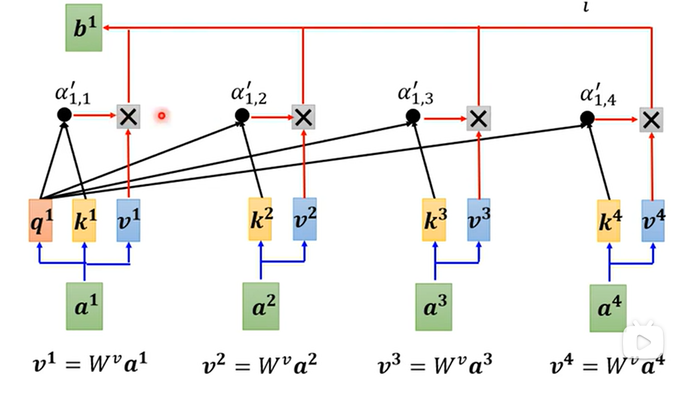

-   关联性越高的向量，它会$b$占有很大的成分

**每个向量$a_i$得到$b_i$的计算过程是并行进行的**


### Forward（矩阵形式）

-   $W_q,W_k,W_v$都是通用的，每个向量$a_i$都需要使用，因此很容易就能表示成矩阵形式

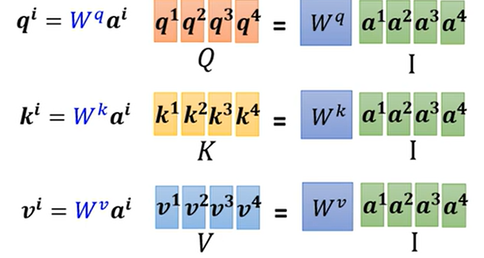


-   对于$q_1$，我需要让它与所有$k_j$​进行点积运算
-   实质上就是与$k_j^T$进行相乘

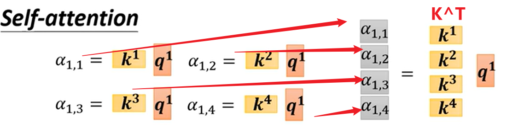

-   对于其他$q_i$也是同理，计算得到矩阵$A$
-   通过矩阵$A$，每一列过一遍激活函数（softmax）得到$A'$

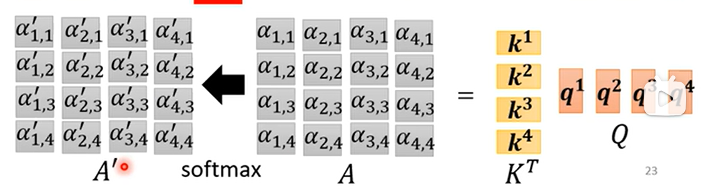

-   计算输出矩阵

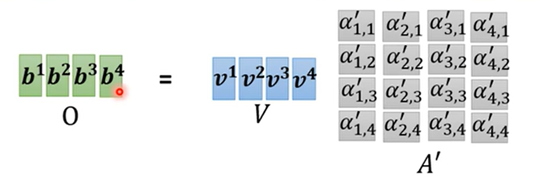

-   整理一下：

$$
O = VA' = (W_vI)\text{softmax}(A) \\
O =(W_vI)\text{softmax}( K^TQ ) = (W_vI)\text{softmax}( I^TW_k^TW_qI ) \\
$$

-   $W_q,W_k,W_v$则是我们需要学习的参数矩阵


### Multi-head Self-Attention

一般的Self-Attention只会有一种$W_q$得到的一组$q$向量，作为相关性的度量

但是有时候需要丰富多个相关性指标

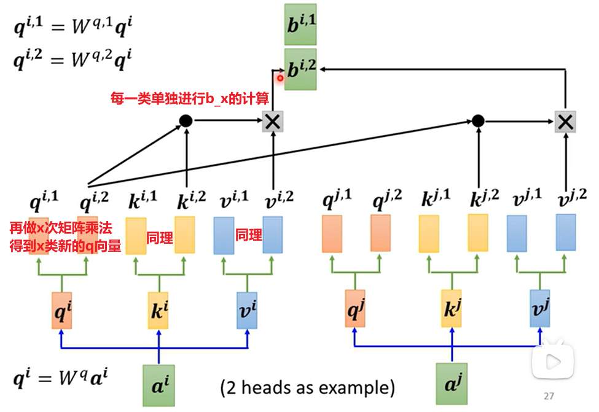

-   得到的多类$b_i$输出，拼起来乘一个矩阵，得到最后的输出

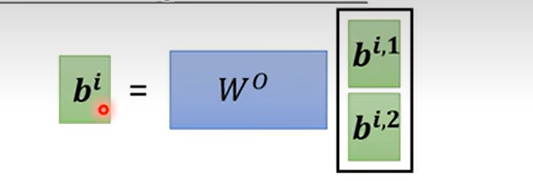


### Position Encoding

-   对于$a_1, a_2, a_3, a_4$，其对于上文算法来说，并没有距离的概念（交换位置后没什么差别）

-   但对于实际文本来说，$a_1,a_4$是距离较远的向量，$a_2,a_3$​是距离较近的向量
-   （需要分析一下位置对实际要的输出是有影响，才会考虑引入Position Encoding）
-   在求解前，每个$a_i$需要加入一个位置向量$e_i$即可

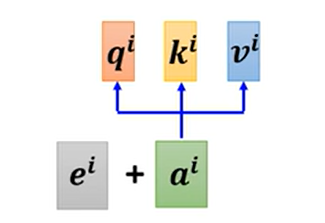

-   hand-crafted（人为设置）：会使用一些三角函数进行组合
    -   方式非常多，暂时没有最好的

```cpp
// 好像自己写过这个东西
__global__ void cu_matrixPositionalEmbedding(float* d_C, float* d_A, int M, int N, int level) {
    int idx = blockIdx.x * blockDim.x + threadIdx.x;
    if (idx < M * N) {
        int row = idx / N;
        int col = idx % N;
        
        int pos = row * N + col;
        d_C[pos] = d_A[idx]; pos += M * N;
        
        float powf2 = 1.0;
        for (int l = 0; l < level; ++l, powf2 *= 2) {
            float val = d_A[idx] * powf2;
            d_C[pos] = sinf(val); d_C[pos + M * N] = cosf(val);
            pos += 2 * M * N;
        }
    }
}
```


-   learn from data：直接作为参数进行学习

### 非文本应用

>   省流：只要是一个vector set，就可以进行self-attention

-   Self-attention for Speech
    -   声音讯号转换成向量会更加复杂
    -   导致整体的矩阵会变得非常大
    -   所以需要引入window，考虑一小段话进行识别
-   Self-attention for Image
    -   每个像素的所有通道值看作一个向量
    -   则我们可以得到分辨率数个向量，构成了一个vector set
    -   相比CNN来说，可以考虑整个图像的所有像素，而不是一个感受野
        -   自动学习出附近哪些像素是相关的，本质上自动学习了感受野
        -   不需要人为设定感受野大小
        -   认为：Self-Attention经过调整可以做到CNN一样的事情，因此对于function set层面上，CNN被Self-Attention所包含，是有所限制的特例

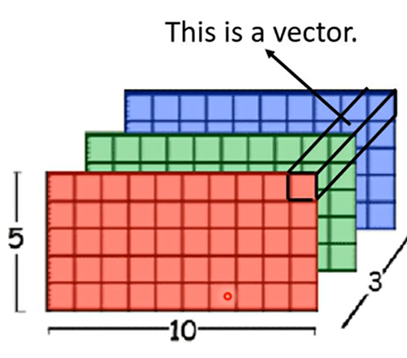

-   Self-attention for Graph
    -   对于有边的结点对，需要计算attention-score
    -   没有边可以直接认为无关，设为0
    -   改改就是GNN

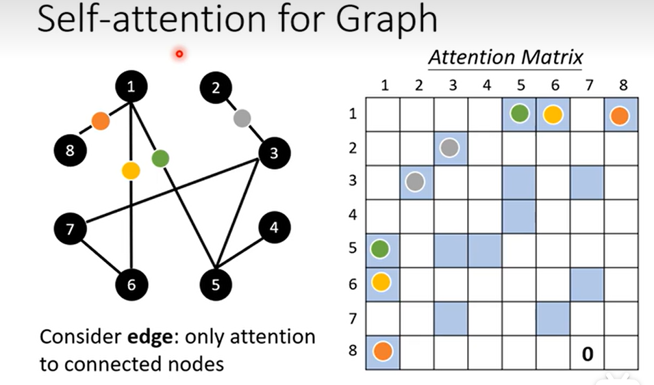

### RNN

>   似乎被Self-Attention替代了

-   RNN没法并行
-   普通的RNN只会考虑左边序列的输出，而Self-Attention考虑整个序列
-   双向RNN需要大量memory去存储结果，才能做到考虑整个序列

