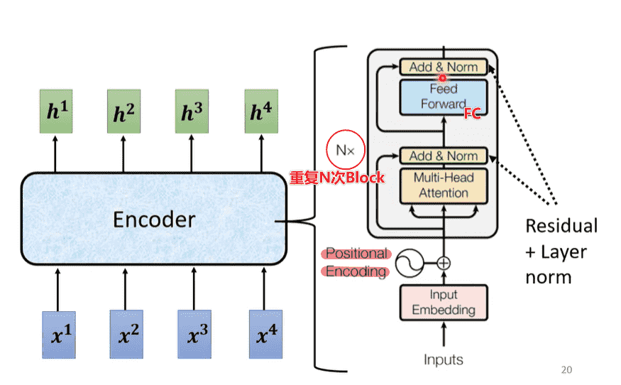

# L5. Sequence to Sequence

>   [ML 2022 Spring (ntu.edu.tw)](https://speech.ee.ntu.edu.tw/~hylee/ml/2022-spring.php)
>
>   https://www.bilibili.com/video/BV1VN4y1P7Zj

[TOC]

输出的长度取决于model

-   Speech Recognition：语音到文本
-   Machine Translation：文本到文本
-   Speech Translation：语音到文本

-   Seq2Seq = encoder + decoder
    -   encoder：输入->向量
    -   decoder：向量->输出
        -   接受encoder的输入，每次输出一个结果，输出的结果会影响下一个输出
        -   加入`<BOS>`表示开始解码，`<EOS>`表示结束

## Transformer - Encoder

### Block

Encoder内以block为单位

每个block的设计：

### Encoder

-   输入需要Position Embedding
-   重复N次block

>   这是原始的Transformer结构
>
>   后续发现把LayerNorm放在Attention前和FC前，效果会更好

## Transformer - Decoder

-   `BOS`：Begin of Sentence
-   `EOS`：End of Sentence

### 输入输出

### 结构

-   Transformer的block中，相当于添加了一段新的，其他部分相似

-   **Masked Multi-Head Attention**：与encoder部分相比，有所改变
    -   encoder可以拿到整个sequence，因此可以考虑全局
    -   而decoder只有前文，因此只会考虑出现过的向量（因为根本不存在）

-   `EOS`同时会作为预测内容之一，当输出一个结束符出现时，结束预测，生成的文本即为结果

### Autoregressive vs. Non-Autoregressive

-   上面的内容被称为自回归
-   非自回归：一次性喂入多个begin进行预测
    -   方便控制长短
        -   使用另一个分类器进行长度预测（对输出长度再做一次乘法、乘法，能直接调整）
        -   或生成足够数量的token，查看第一个end
    -   方便并行
    -   效果会更差

## Encoder - Decoder

-   Transformer中多出来的一个block，起到了连接encoder的作用

 

-   堆叠Encoder和Decoder，我们就得到了Transformer
-   原始论文中，decoder只拿了encoder最后一层的输出
-   但事实上可以拿非常多

## Training

-   看作一个分类问题，使用交叉熵损失函数

-   但是我们需要强制喂入Decoder正确的输入，只有这样才能进行比较
-   即我们不会每次把Decoder的输出作为新的输入，而是直接设定好
-   这个过程叫做**Teacher Forcing**
    -   在训练的时候进行Teacher Forcing，最后的误差自然会偏低
    -   而在做测试时是无法做到的，造成mismatching
-   `EOS`也需要被当作预测字符进行预测

### Copy Mechanism

>   Copy Mechanism指在文本生成领域，生成的输出是输入序列元素的复制或者指向。

-   有时候不需要自己创造输出
-   直接从输入中进行复制

>例如：
>
>-   对模型进行询问时含有一些“人名”（模型从未见过），此时需要直接复述这个人名作为指代
>-   文章摘要

### Guided Attention

-   有时候需要对输入输出进行引导

-   例如语音合成等相关内容，Attention会产生一些奇怪的错误，而你又对整个流程有明确的认识，就需要对Attention加入限制进行引导
    -   Monotonic Attention
    -   Location-aware Attention
    -   （没有详讲）

### Beam Search

-   每次都贪心选择概率最高的输出不一定是一件好事
-   我们无法穷举每一种可能，可以考虑使用Beam Search
-   基础版本：

-   对于答案明确的任务，Beam Search会有帮助（需要尽力找到较优的结果）
-   对于发挥创造力（编故事），反而不是一件好事

### BLEU Score

有时候会需要一些奇奇怪怪的NLP的评价指标去评估训练

但是这些指标是很难进行微分的，所以很难用于训练

>   对于很难微分的函数计算，我们可以考虑使用强化学习

### Exposure Bias

回到前文，我们在训练时每次喂给decoder的都是绝对正确的

但是在测试时只能看自己的输出，这个不一致的现象叫做Exposure Bias

-   解决方法：**Scheduled Sampling**：我们在喂入decoder的时候，故意弄错一点东西（引入噪声）
