# L6. Generation

>   [ML 2022 Spring (ntu.edu.tw)](https://speech.ee.ntu.edu.tw/~hylee/ml/2022-spring.php)
>
>   https://www.bilibili.com/video/BV1VN4y1P7Zj

[TOC]

## Generative Adversarial Network(GAN)

GAN分成两个部分：

- 生成模型：Generative Model
- 判别模型：Discriminative Model

我们一开始拥有分别拥有这两个初始化的模型

以图片生成为例进行训练，我们需要采集大量图片

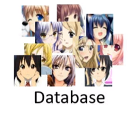

- 固定生成模型，并且生成大量图片，对判别模型进行分类训练
    - Database中的图片标签为1
    - 生成的图片标签为0
    - 我们希望判别模型能够判断图片是否生成或真实
- 固定判别模型，对生成模型进行训练，喂入判别模型，希望输出尽可能大（更加接近真实图片）

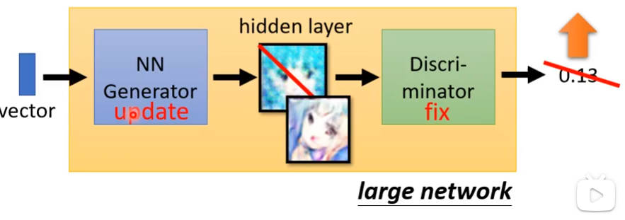

交替两个步骤重复多次即可

- 生成模型经过多次迭代，产生的图片能够尽可能混淆判别模型，也就会更加接近真实图片
- 判别模型由于生成模型变得更加真实，为了进行正确分类，对分类的要求也会更加苛刻

### Distribution

- 特别是需要**创造力**的任务
- 同样的输入可以有多种输出

> Drawing、Chat bot
>
> 模型为了讨好损失函数，对于多种输出会既要又要
>
> 例如视频生成，比如一辆车有左转和右转的可能，可能就会分裂成两辆车，一个左转一个右转
>
> 因此我们需要引入概率分布，对每种选择都以概率形式进行表达

Generator如何生成不同的图片或其他结果

我们可以给定一个输入向量，向量经过网络结构后则会得到一个输出

这个输入向量来源于一个用于输入的Distribution

比如正态分布……

从输入Distribution中sample多个向量作为输入，就可以产生大量生成

### Objective

接下来我们从Distribution的角度对GAN进行解释

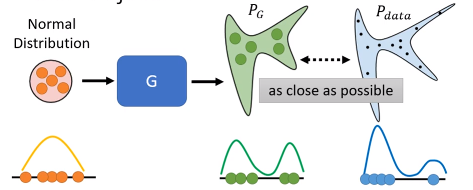

假设我们的输入服从正态分布

输入经过Generator后产生的输出服从$P_G$

而我们的真实数据集的分布为$P_{data}$

我们的目标就是让这两个尽可能接近

但是我们很难通过函数的方式计算两个概率分布的距离，从而设计损失函数进行训练

> Divergence（散度）：可以用来表示，但是需要积分运算，对于应用来说不现实

- 从$P_{data}$中sample
- 从正态分布中sample（也相当于$P_G$中sample）

用Discriminator进行分类器训练

（损失函数不是交叉熵函数）

设计了一个特殊函数，和交叉熵函数比较相似，实质上与Divergence是相关的

- Divergence越大，说明越容易分类
- Divergence越小，说明越困难分类

### Wasserstein Distance

GAN的训练比较困难

我们生成符合要求的图片，其$P_{data}$实质上是高维向量空间中一段非常狭窄的区域（假设为直线）

因此大部分时候$P_G$和$P_{data}$根本不相交

- 从Divergence的角度，只要是不相交，Divergence都是一个值

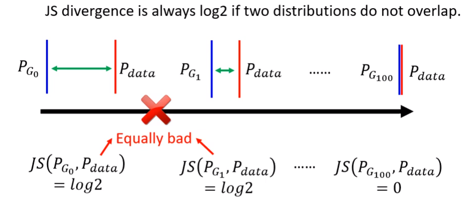

- 从二分类的角度来说，由于图片差距过大，我们非常容易得到100%的分类正确结果，因此损失函数值的大小完全没有意义（相关的Divergence是常数）

> 一般的梯度下降问题只要看Loss下降就知道是work的
>
> 但是这个问题使得我们难以通过Loss知道是否在正确训练

引入了Wasserstein Distance

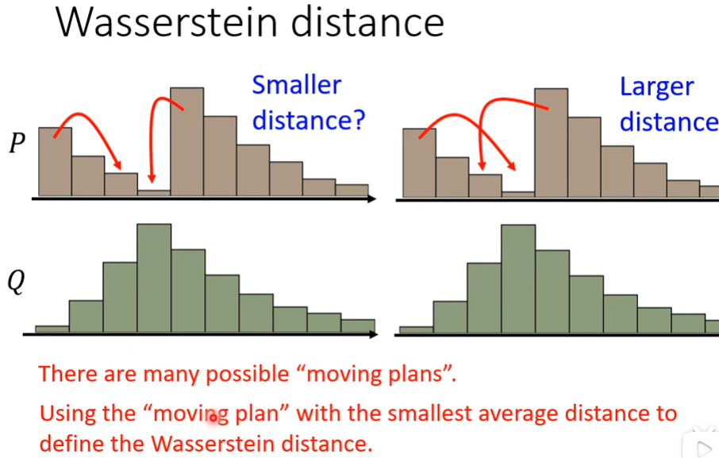

> 把P通过搬运每个点，使其变成Q的最小移动距离

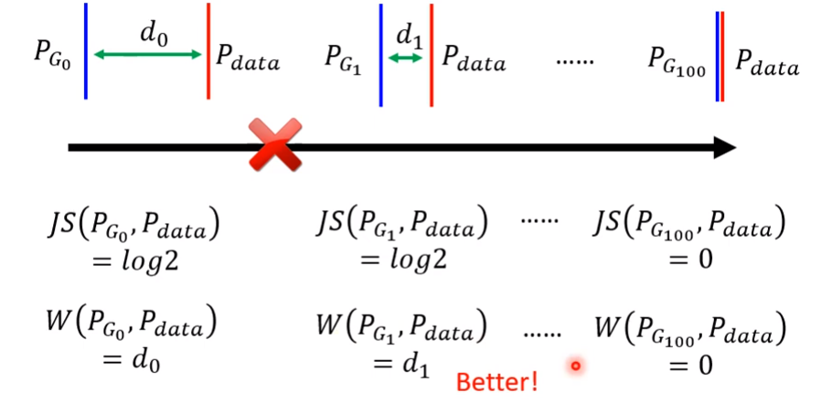

这样我们就可以在不相交的情况下衡量优劣

具体的实现方式需要修改损失函数

**并且要求Discriminator足够平滑**

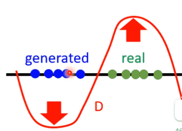

如果不够平滑，分类器Discriminator对毫不相交的两类进行分类时

会希望两类差距尽可能大

因此generated的函数值会变成负无穷，real的函数值会变成正无穷

那么两个无穷的差值仍然是无穷，我们依旧无法衡量两者的差距

不能解决Divergence的问题

但如果足够平滑（变化不会很剧烈）

- 距离近：函数值有界，两个值差距不会太大，减一下就是差值
- 距离远：减一下就是差值
- 距离特别远：那么无穷减去无穷也没什么问题，因为差距确实很大

#### WGAN

就是使用Wasserstein Distance的GAN

那么要如何使得Discriminator平滑

- WGAN的近似方法：对参数裁剪，绝对值超过c就赋值为c，压缩函数空间
- Improved WGAN的方法：Gradient Penalty，没听懂
- SNGAN最终方法：Spectral Normalization，让梯度的标准差在任意处小于1 

 

### GAN for Sequence

**我们发现很难训练出一个产生sequence的GAN**

我们使用某种架构产生一个关于多个token的distribution

Discriminator则会根据概率最大的token作为输入进行判别打分

但是当我们进行训练时，对Generator进行一点调整，很有可能原本的token仍然是概率最大的

因此不会改变Discriminator的打分输出，微分为0，很难进行梯度下降

### Evaluation

#### 分类器评估 - Quality

我们希望评估GAN生成的图片质量

我们可以使用VGG、Inception等已有的图像分类网络

对GAN生成的图片进行评估，Distribution如果非常集中，说明分类器非常笃定这是某一类，代表生成的图片非常好

反之无法确定是什么，说明生成的图片质量差

 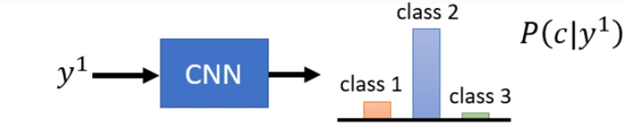

---

但是坏处是我们无法避免`Mode Collapse`

> Mode collapse **occurs when the generator fails to represent the full range of possible outputs and produces a limited set of outputs that do not resemble the training data**
>
> 模式奔溃：GAN 训练的后期阶段，生成器生成图像样式单一

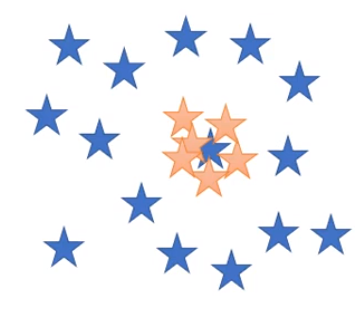

可能GAN只会输出狗的图片，我们只对狗进行了测试，但是训练集中还有其他动物

我们只靠这些生成出来的图片，无法判断GAN的综合表现

> 本质上是输出的Distribution方差太小

#### Diversity

我们希望在Quality高的情况下，图片多样性Diversity也是尽可能高

我们会对一张图片的概率分布评估Quality

而要想评估Diversity，我们需要衡量所有生成的图片

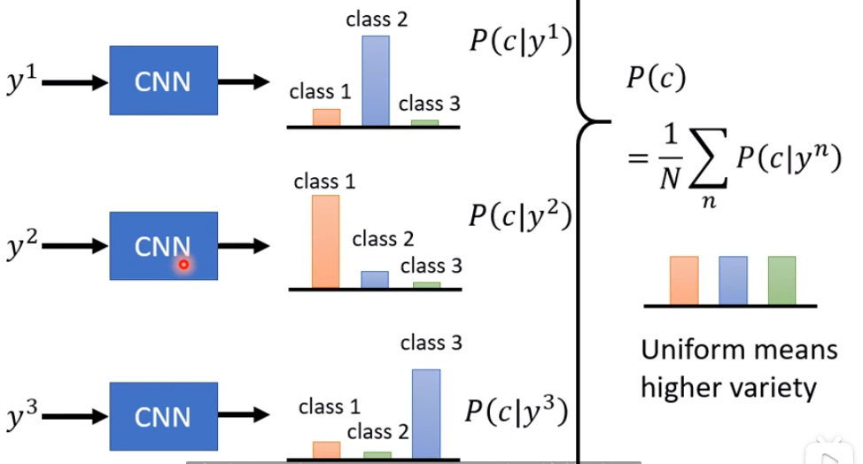

把所有的概率分布相加求平均

那么最后的概率分布如果平坦，说明各种类别都会均匀产生

则代表Diversity高（注意！是所有图片一起衡量）

#### Frechet Inception Distance

我们简单的拿分类结果看不一定合适

同样是人脸类别，但是也需要有各种各样的面貌

我们喂入Inception网络

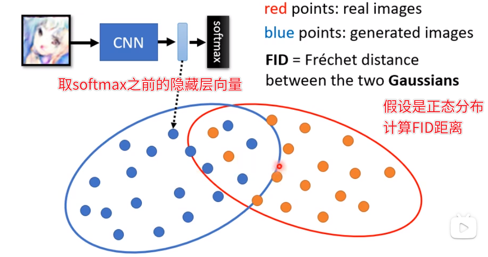

- FID越小越好
- 需要大量的sample去近似分布

> 当然实际输出的分布并不一定是正态分布
>
> 因此还需要结合多种指标

也可以采用多轮不同的random seed去sample

也能得到一个关于FID的分布

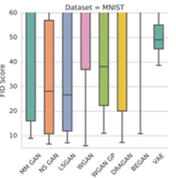

总体偏低的自然比较好

但是还有`Mode Dropping`的问题

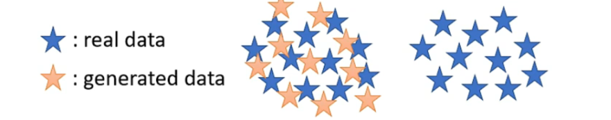

虽然可能能够对训练集做不错的分布近似

但是来来回回只认识训练集，对于训练集之外的不认识

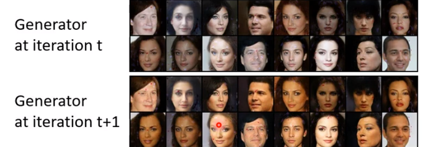

> 多次迭代并没有发生本质性的变化

记住训练集内容（或者输出一个左右翻转的图片），似乎就无敌了

但是这并不是一个好的GAN

> 课程没有给出好的解决方法

## Conditional GAN

比如说`text-to-img`

我们希望在生成的图片的时候加入一些图片描述

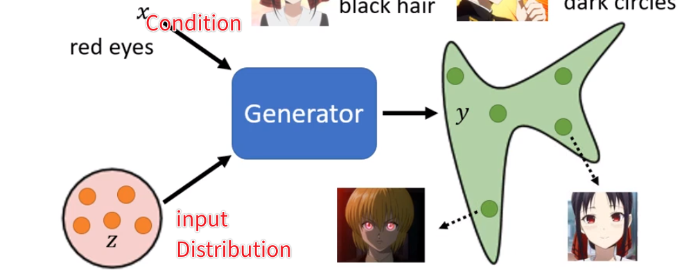

我们需要调整Discriminator的输入

将condition加入到Discriminator的判别打分之中

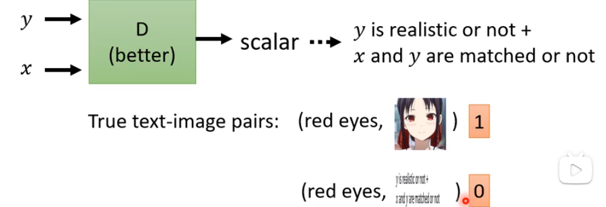

- 打包好`condition,real-img`作为正例
- `condition,generated-img`作为负例

但是这样不够充分，还需要添加：

- `condition, wrong-real-img`作为负例

故意乱配图片，加强对`condition`的限制能力

---

我们也可以考虑结合`supervised-learning`

> 单用监督学习会造成前文所说的既要又要

让生成的结果有几份标准答案兜底

防止GAN生成出来的东西太肆意妄为

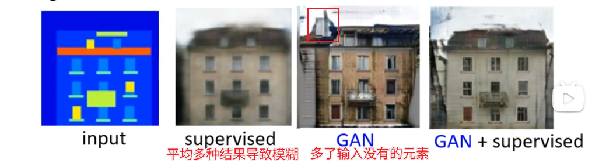

## Unsupervised Learning

我们可以使用GAN做一些无监督学习的事情

即从`unpaired data`中进行学习

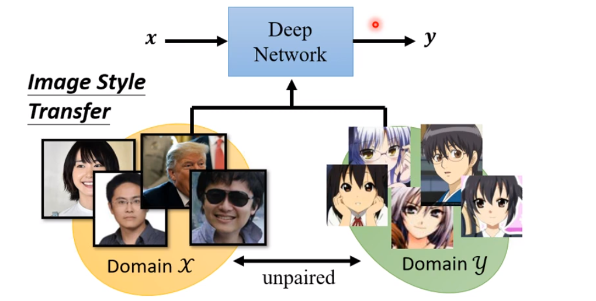

例如样式迁移，对于x中的原图，并没有与y中某一张图片形成pair

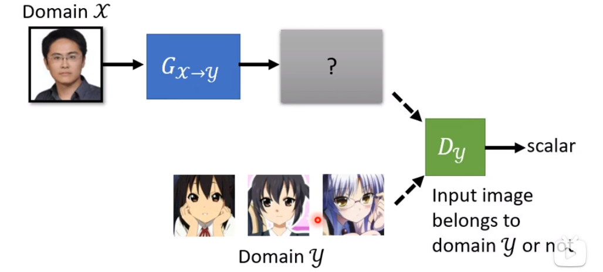

我们只需要喂入x到Generator中生成一张图片

让Discriminator判断是否是y的风格即可

但是我们无法避免生成的图片和原图片无关的问题

兴许Generator只学会了生成y中的图片，而和x没太大关系

> 对于pairded-data，我们可以用打乱的配对关系进行样式迁移前后的对比，从而强化输入关系

### Cycle GAN

 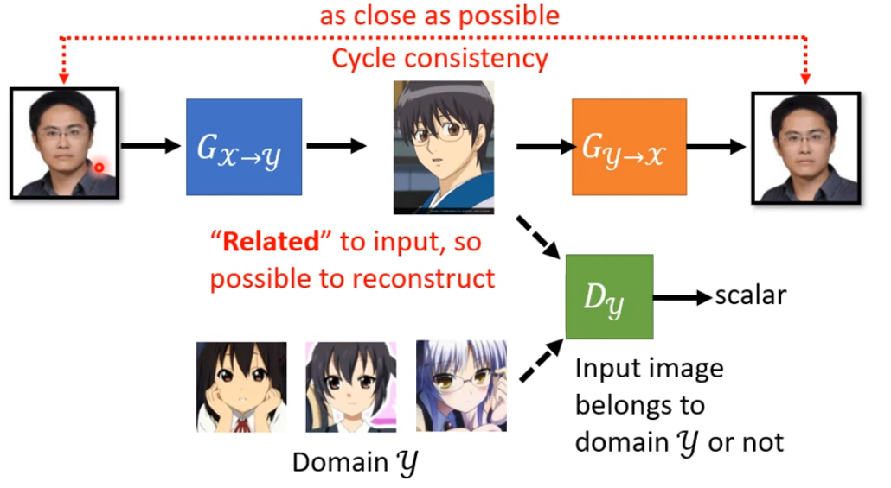

引入第二个Generator，把第一个生成出的图片进行反向样式迁移

我们希望两张图片尽量一致

