# L7. Self-Supervised Learning

>   [ML 2022 Spring (ntu.edu.tw)](https://speech.ee.ntu.edu.tw/~hylee/ml/2022-spring.php)
>
>   https://www.bilibili.com/video/BV1VN4y1P7Zj
>
>   [【《2021机器学习-李宏毅》学习笔记】_李宏毅机器学习2021github-CSDN博客](https://blog.csdn.net/chh13502/article/details/121210730)

[TOC]

自监督学习本质上是一种无监督学习

它将原数据集进行切分得到$x',x''$

希望模型通过$x'$输出$y$并且尽可能接近$x''$

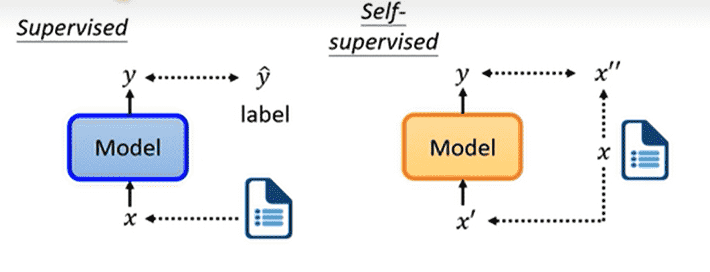

 ## BERT

### Masking Input

Bert的自监督学习对于输入序列进行mask

**随机**选择若干个token**随机**进行如下一种操作

-   替换成特殊的token：`<MASK>`
-   替换成词表中的其他token

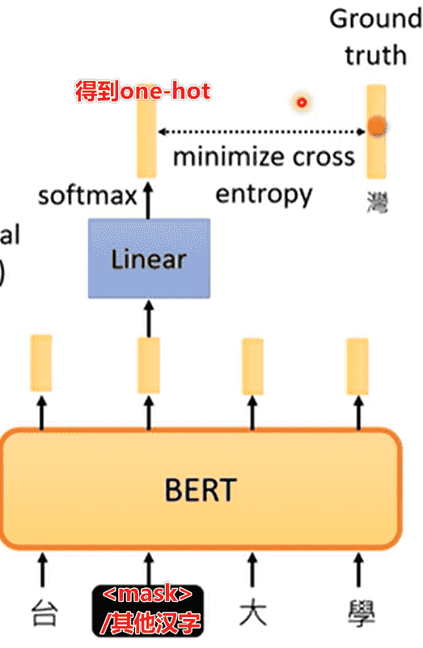

通过BERT以及输出层之后，通过交叉熵计算损失函数

本质上是一个分类训练

### Next Sentence Prediction

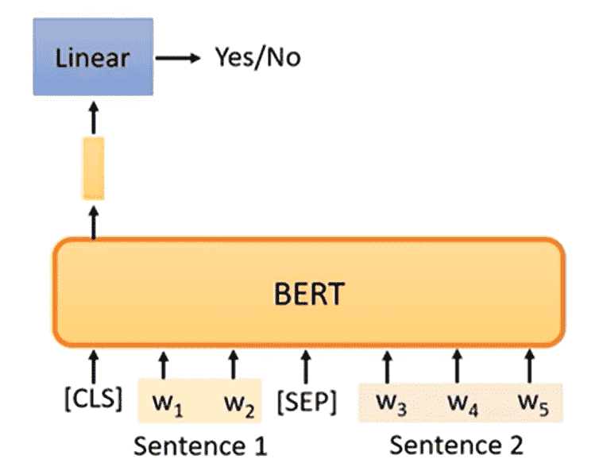

-    选择两个句子，用`<SEP>`拼在一起
-   开头加上`<CLS>`（分类）

喂入BERT中，只取`<CLS>`的输出层结果，判断句子1和句子2是否是连在一起的

>   但是后续证明这个训练意义不大
>
>   抽取两个句子本身连在一起的可能性就不大，预测结果并不是很难
>
>   -   SOP（Sentence order prediction Used in ALBERT）
>       -   抽取两个贴在一起的句子1和句子2
>       -   调换顺序进行拼接
>       -   让BERT预测是否调换顺序
>
>   这个效果更好

### Downstream Tasks

被训练好的BERT，目前只学会如何做填空题

因此我们可以通过**微调**去适应不同的下游任务

常用GLUE（General Language Understanding Evaluation）的九个任务及其指标进行评判

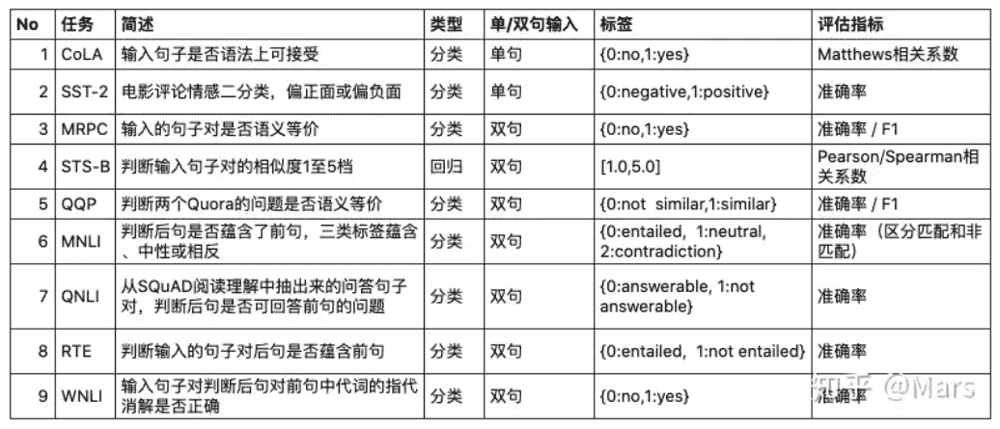

>   进行评判时，单独看正确率其实没什么好看的
>
>   常常会参考人类的准确率（作为1）

注意，在下游任务的训练中，使用的是**带标注的数据**

总体来看，我们用大量无标注数据对BERT进行训练，少量有标注的数据训练输出层

因此本质上是半监督学习

#### Sequence-to-class

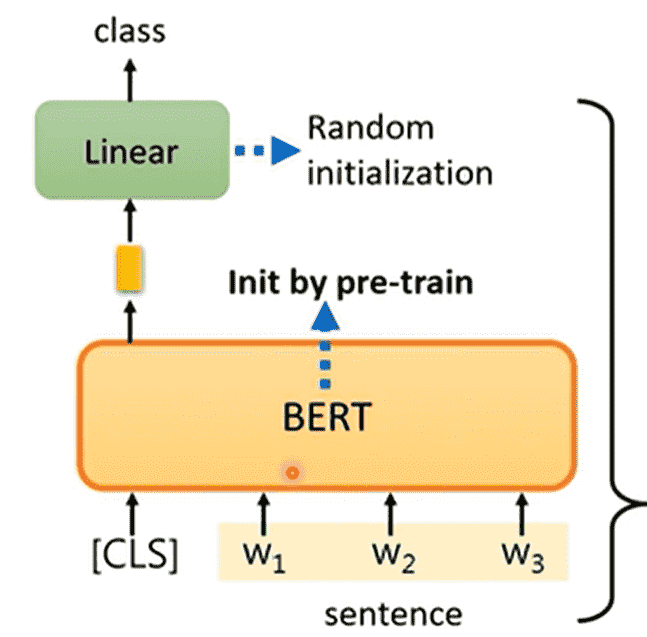

我们需要对文本序列进行分类，例如：**情感分类**

-   序列开头带一个`<CLS>`
-   微调Linear层，只看CLS的输出类别

注意，保持BERT，只对Linear进行随机初始化

#### POS tagging

对于词性标注这一类**输入长度等于输出长度**的任务

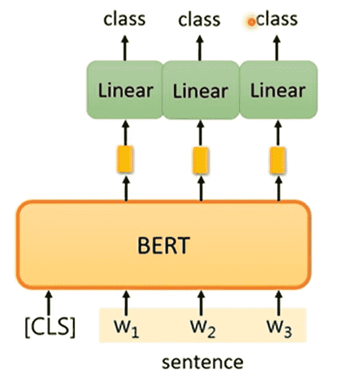

同样需要添加`<CLS>`，只保留原本token对应的输出层

#### two-sequence-to-class

由两个序列得到一个分类类别，例如：

-   给定前提、假设，判断是否能够从前提推出假设
-   给定文章、评论，判断评论是赞成文章意见还是反对文章意见

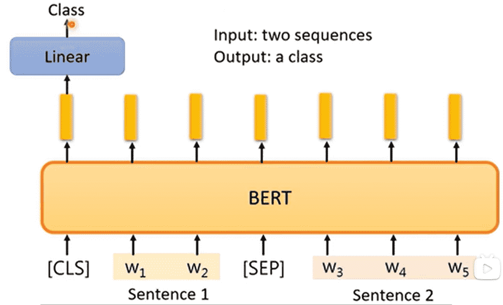

差别不大

#### QA

给定一个文档，对文档进行一个询问，让模型输出回答

**假设问题的答案一定会出现在文档之中**

长期以来会将文档和询问喂入，让模型输出两个整数$s,e$

那么文档的第$s$个token到第$e$​个token之间句子即为答案

对于BERT，我们引入两个向量

分别对文档对应输出进行内积

softmax之后取出最大的位置下标

作为$s,e$的值

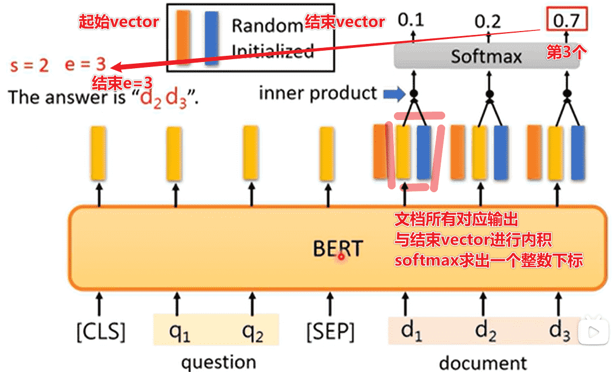

#### Seq2Seq

BERT本身是Transformer的Encoder

如果我们希望预训练一个Encoder-Decoder

我们可以对Encoder的输入进行干扰

让Decoder输出重建后的输入

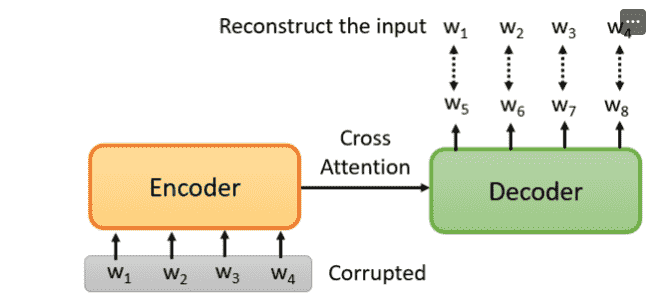

如何添加干扰？

我们可以对输入序列进行屏蔽、删除、翻转顺序……

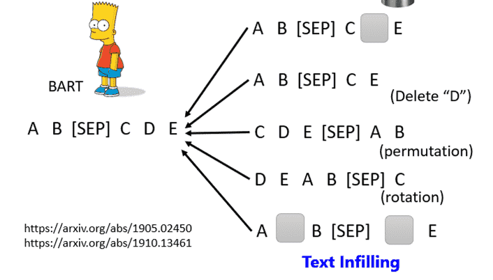

### Why does BERT work?

首先BERT接受的都是Embedding后的向量

意思相近的向量接近，并且会结合上下文

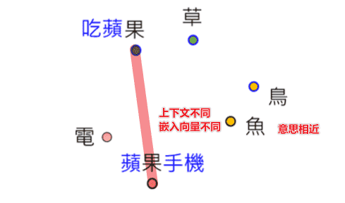

那么BERT做的事情：

-   遮蔽掉一个token
-   通过上下文去理解这个token

>   John Rupert Firth: "You shall know a word by the company it keeps"
>
>   一个词的含义完全可以通过上下文去概括

那么本质上BERT在W2处的输出代表了该词的含义，因此BERT在填空的过程中学会了每个token的含义

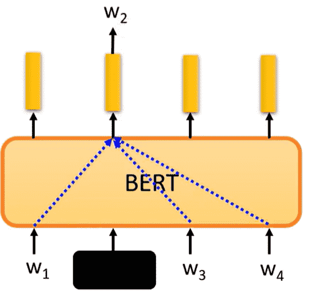

>   但喂入毫无语义的序列BERT 也能做的不错
>
>   例如DNA序列ATGC，似乎BERT能理解到更深层次的内容，而不只是token

### Multi-lingual BERT

>   Train BERT by many different languages.

BERT如果学会多种语言的填空题之后

我们使用单一语言（例如英语）进行问答训练

其自动能学会其他语言（例如中文）的相关问答

>   不同语言差异不大
>
>   相同含义单词的嵌入向量接近

 同时数据量非常关键，基于大量数据和足够的算力，才能达到上述结果

---

但是如果多种语言差异不大的情况下，会出现语言混杂的情况

但实际上并没有出现

因此BERT显然学习到了语种的特征

我们取大量中文、英文的向量sample，对向量进行平均，然后相减

那么我们自然应该得到的是中文和英文的差距

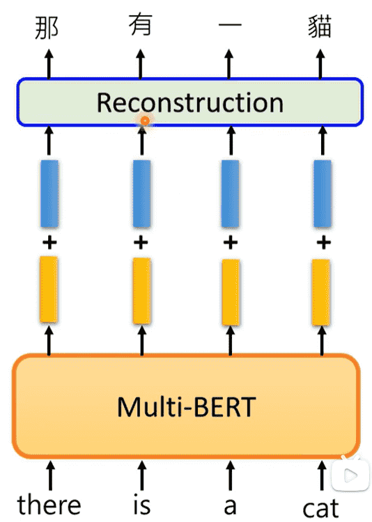

我们喂入一句英文，得到的向量加上中英文差距的距离向量

经过Decoder重建之后，发现完成了翻译

## GPT

GPT系列做的自监督是**Predict Next Token**

不断预测下一个token，并且输出作为下一次的输入

进行自回归

>   BERT：Encoder
>
>   GPT：Decoder

但是GPT的模型非常大，因此效果好

但是GPT非常大，微调会比较贵

因此并不会像BERT一样做一些任务时重新训练一个分类

而是对问题进行加工，进行`Few-shot Learning`

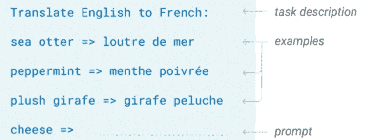

然后直接使用GPT继续进行预测，补全完后续的问题

并且不需要**梯度下降**

也可以使用`one-shot`

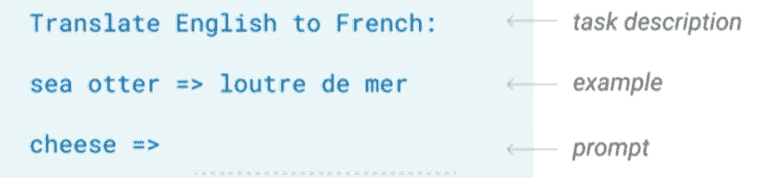

GPT足够强的话就可以使用`zero-shot`

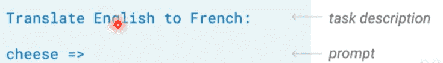

