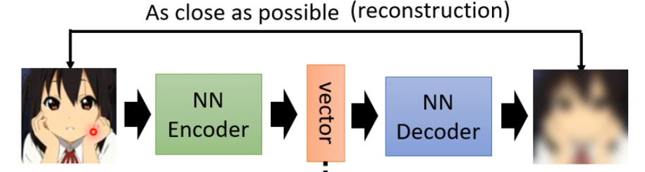
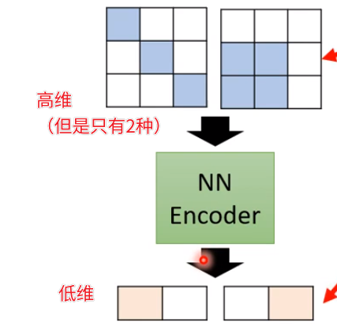
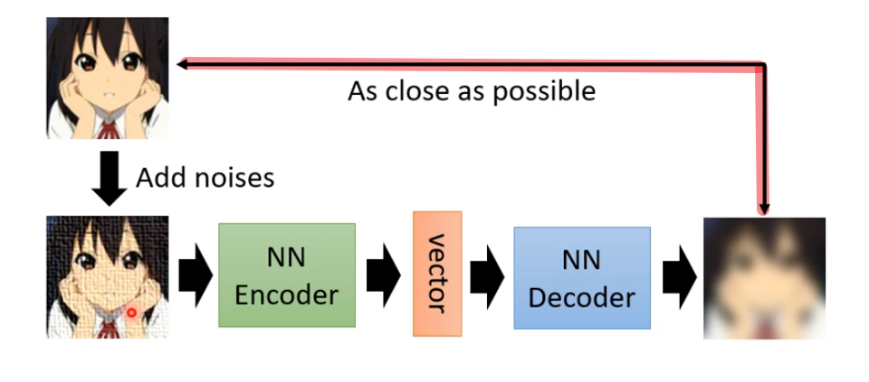

# L8. Auto-Encoder

>   [ML 2022 Spring (ntu.edu.tw)](https://speech.ee.ntu.edu.tw/~hylee/ml/2022-spring.php)
>
>   https://www.bilibili.com/video/BV1VN4y1P7Zj
>
>   [【《2021机器学习-李宏毅》学习笔记】_李宏毅机器学习2021github-CSDN博客](https://blog.csdn.net/chh13502/article/details/121210730)

[TOC]

## Basic Idea

- Encoder：将数据进行嵌入
- Decoder：向量重建数据

Auto-Encoder要求输入和输出尽可能接近

在这个训练过程中不需要数据标注

也是一种自监督训练

> Cycle GAN也有相似的idea

- 数据降维（Dimension Reduction）：**Auto-Encoder的encoder将高维的输入数据压缩成低维向量**

### Why Auto-Encoder

原数据相对高维、复杂

但其实内在的变化可能没有想象中那么多样

用低维数据进行表示，更加有效地进行表示

### De-noising Auto-Encoder

对输入加入噪声

希望输出图片与加入噪声前的输入相似

> 某种程度上BERT也是De-noising Auto-Encoder
>
> BERT接受MASK后的输入，经过Encoder后进行输出层（看作一种Decoder）输出，希望输出未MASK的数据

## Feature Disentanglement

> 特征分解
