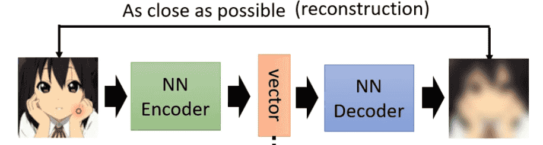
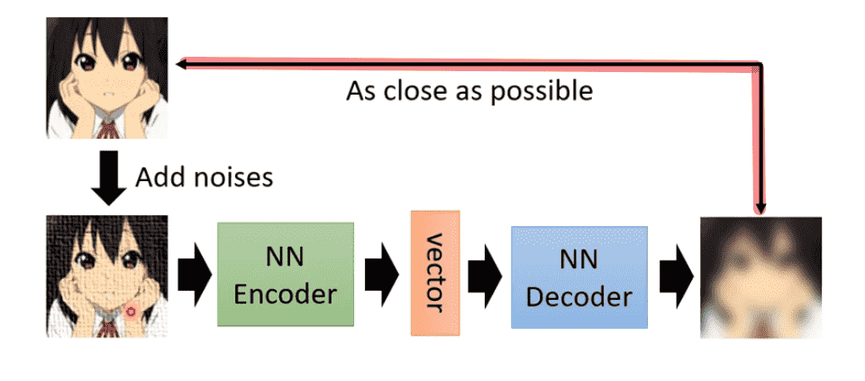
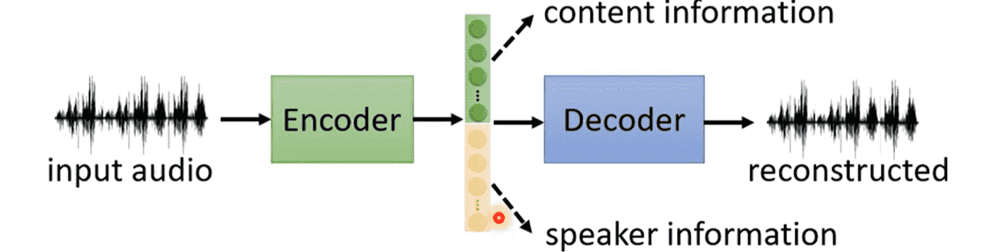
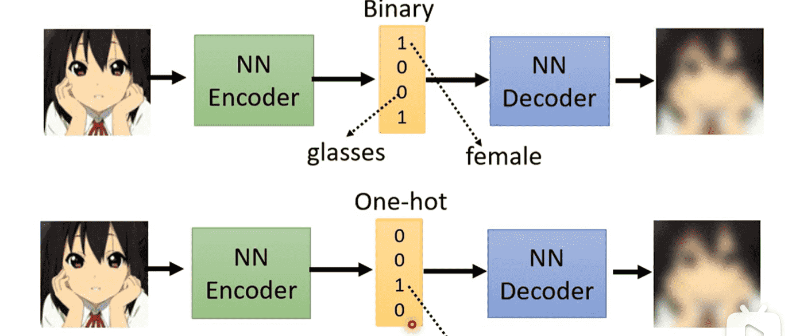

# L8. Auto-Encoder

>   [ML 2022 Spring (ntu.edu.tw)](https://speech.ee.ntu.edu.tw/~hylee/ml/2022-spring.php)
>
>   https://www.bilibili.com/video/BV1VN4y1P7Zj
>
>   [【《2021机器学习-李宏毅》学习笔记】_李宏毅机器学习2021github-CSDN博客](https://blog.csdn.net/chh13502/article/details/121210730)

[TOC]

## Basic Idea

- Encoder：将数据进行嵌入
- Decoder：向量重建数据

Auto-Encoder要求输入和输出尽可能接近

在这个训练过程中不需要数据标注

也是一种自监督训练

> Cycle GAN也有相似的idea

- 数据降维（Dimension Reduction）：**Auto-Encoder的encoder将高维的输入数据压缩成低维向量**

### Why Auto-Encoder

原数据相对高维、复杂

但其实内在的变化可能没有想象中那么多样

用低维数据进行表示，更加有效地进行表示

### De-noising Auto-Encoder

对输入加入噪声

希望输出图片与加入噪声前的输入相似

> 某种程度上BERT也是De-noising Auto-Encoder
>
> BERT接受MASK后的输入，经过Encoder后进行输出层（看作一种Decoder）输出，希望输出未MASK的数据

## Feature Disentanglement

> 特征分解

Encoder输出的Embedding是一个低维高度压缩的向量

能够被Decoder解码重建，说明向量本身包含了所有信息

Feature Disentanglement希望能够解析这个向量

想知道哪些部分表示了哪些内容

>   没细说，就告诉你这件事能做

相关应用：语者转换

-   抽取语者A向量中声音特征部分
-   抽取语者B向量中内容特征部分
-   合并新的向量，得到A的声音说B的话

## Discrete Representation

Embedding一般是实数

但是我们可以强制其变成离散值

在Vector Quantized Variational Auto-encoder中

此时我们可以灯具Codebook的大小设置输出种类（固定输出）

比如One-Hot代表一种类型的标准输出：例如音符

Binary则可以代表多个属性是否具备

### Text as Representation

Embedding甚至可以不需要是向量

我们把Encoder和Decoder都换成seq2seq

那么中间的Embedding就是一段文字

一个文档的压缩，因此Embedding实际上就是文档的summary

>   但实际训练时，中间的Embedding是一串你看不懂的文字（
>
>   encoder和decoder有自己的理解

可以通过GAN的方式，引入一个Discriminator，判断encoder的输出是否是人类书写的文章

经过多次迭代，就可以逼迫encoder输出我们看得懂的

>   我们把Encoder单独提出来就可以变成文章摘要器
>
>   那么把Decoder单独提出来就是扩写类的Generator

## Anomaly Detection

>   用一堆宝可梦数据集进行训练，喂入一个数据判断是否是宝可梦

判断一个行为是否正常、异常

但大部分时候只能收集到正常的数据

因此很难通过监督训练二分类完成

-   有大量银行交易记录，判断交易是否正常
-   有大量网络连接记录，判断连接是否正常
-   ……

我们可以使用Auto-encoder避免收集数据的问题

对于训练数据中的数据，我们后续喂入一个正常数据，它就可以正常重建，前后误差较小

对于异常数据，很难被重建，误差较大

这个时候设定一个阈值就好，高于阈值说明是异常的，否则是正常的

