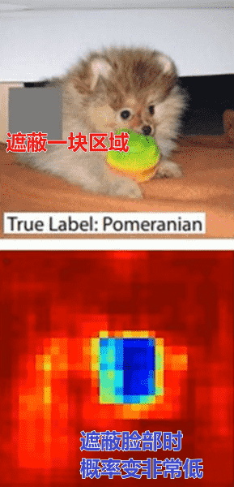
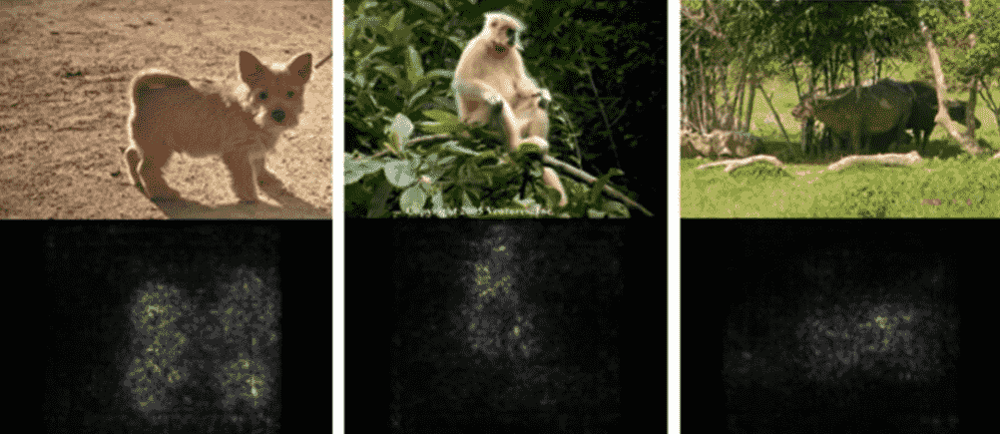
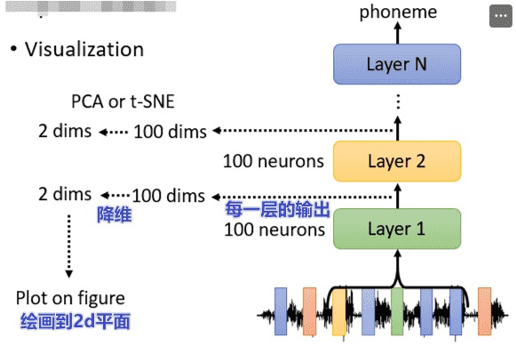
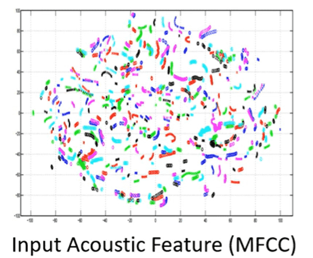
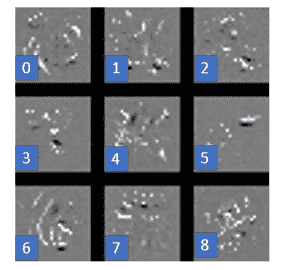
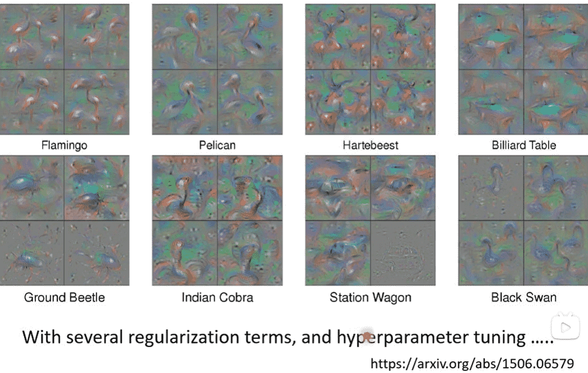

# L9. Explainable ML

>   [ML 2022 Spring (ntu.edu.tw)](https://speech.ee.ntu.edu.tw/~hylee/ml/2022-spring.php)
>
>   https://www.bilibili.com/video/BV1VN4y1P7Zj
>
>   [【《2021机器学习-李宏毅》学习笔记】_李宏毅机器学习2021github-CSDN博客](https://blog.csdn.net/chh13502/article/details/121210730)

[TOC]

有时候模型输出正确的结果并不是因为一个正确的过程

而是因为一些奇奇怪怪的因素

>   医疗、法律等使用环境中，模型给出的判断必须要具有理由

但是人脑本身也是个黑盒子，却能被接受

因此explainable的目标`Make People Comfortable.`

 

Explainable ML主要分成两类

-   Local Explanation：`Why do you think img is a cat?`
    -   对于单个数据
-   Global Explanation：`What does a cat look like?`
    -   不针对单个数据

## Local Explanation

我们将数据拆成若干个component

-   图片的component：像素
-   序列的component：token

我们删除或者修改一些component，如果模型的推断发生了改变

则说明这些component是重要的，对于原本的推断起到关键作用

但是这样的方法比较粗糙

### Saliency Map

我们也可以从梯度的角度进行解释

对于Component序列$x_1, ...., x_n, ..., x_N$​

此时我们计算loss得到$e$

 

我们考虑对其中一个component进行扰动

得到$x_1, ...., x_n+\Delta x, ..., x_N$

我们再计算一个loss得到$e +\Delta e$

 

那我们就可以用$\frac{\Delta e}{\Delta x}$表示这个component的重要性

实际上这个值就是$\frac{\partial e}{\partial x_n}$

我们只需要求解损失函数和所有component的梯度即可

在cv领域可以用这个梯度绘制出`c`

亮点处即为梯度较大的地方

  

#### Smooth Grad

有时候画出来的图有一点杂乱

但确实好像挺对的

这个时候你可以对原图添加一定的噪声，然后每一张图片都绘制一个Saliency Map

最后加起来平均一下：

效果明显好了很多，也证明不管怎么加噪声，模型确确实实是根据正确的位置进行分类

  

#### 梯度饱和Gradient Saturation

对于gradient-based的方法，只要模型是一个非线性的函数，不可避免的将存在一个梯度饱和的区域（梯度趋于0）

例如对于一个大象来说，鼻子越长，就越有可能是一个大象

但当鼻子长到一定程度时，鼻子变得更长时，不会显著提升是大象的概率

此时可能存在某种数据集，使得我们分析出来鼻子长度并不是一个重要的指标特征（什么情况下会发生这个问题我也不知道）

>   ChatGPT：
>
>   -   数据集中大部分大象的鼻子长度都在一定范围内，比如鼻子占身体长度的比例大约在0.2到0.5之间。
>   -   少部分图片中的大象鼻子比例超过了0.5。
>
>   模型学会了将鼻子长度在0.2到0.5之间的图片作为大象的显著特征，但是对于那些鼻子比例大于0.5的大象，由于对置信度提高不大，觉得不重要

这与实际不符

解决方法：Integrated Gradient

  

### 解析各层网络模型

#### Visualization

肉眼观察法

我们可以把每一层的结果弄出来

但是一般维度都很高，可以用PCA降维到2d上

以一个语音识别的例子：

-   不同人说不同句子

对于输入层（同一个颜色一个人）一开始是杂乱的

但随着网络层变深，聚拢成一条一条的

每一条代表同一个句子，同一个句子中分别有代表每个人的颜色

符合我们对模型分类的预期

  

#### Probing探针

假设我们需要探测一个BERT

我们可以对每层的输出向量进行分类（词性、实体……）

如果正确率高，说明Embedding有相关信息

否则说明没有

>   但是也有可能是你的分类器没训练好

对于语音模型，我们可以插入一个序列转语音模型

希望将输出的向量重建为原来的语音

-   假设我们训练的网络的目标是去掉说话的人的声音特征，只保留文本特征

    -   那么我们就可以听探针的输出，在哪一层听不出来是谁

-   假设作用是去掉噪音
    -   那么我们就可以听探针的输出，在哪一层噪声消失

    

## Global Explanation

### Filter visualization

以手写数字识别的CNN为例

我们想知道每个卷积核在识别什么样的模式

对于卷积核卷出来的feature map

如果数值越大，说明越重要

因此如果我们能构造一个$X^*$，使得feature map的数值之和最大

那么这个$X^*$就是该卷积核最能够识别的模式

由于卷积核已经是给定的，我们把X当作可学习的参数，梯度上升求解即可

这样我们就可以可视化每个卷积核识别的内容

>   对于手写数字识别，有横有竖有斜线非常合理

  

### CNN-visualization

我们可以使用类似的方法，直接对整个网络进行反推

比如我要得到CNN心目中数字$i$的样子

那么就需要求解
$$
X^* = \arg \max_X y_i
$$
同样进行梯度梯度上升

但是只能得到一团噪声

>   CNN模型有非常强大的表达能力，卷积核能够捕捉图像中各个位置中的细小特征、模式
>
>   模型会利用其高维空间中的自由度，通过生成对抗性样本（adversarial examples）极大地增加$y_i$ 的值
>
>   但是为了增加$y_i$​而引入的各种小特征，组合起来就不一定是人类看得懂的内容

题外话：

>   对抗样本（Adversarial Examples）是指经过精心设计的输入数据，这些数据在人类看来与正常数据非常相似，但经过模型处理后会导致模型产生错误的分类结果或预测。

  

  

为了看见比较好的东西，我们不能让$X$肆意妄为地进行优化

需要加入一些限制，也就是正则项

对于二值化图像，手写数字只会出现在若干像素点上，这些像素点的颜色都是白色

因此我们可以考虑限制白色点的数量，最小化白色点
$$
X^* = \arg \max_X y_i + R(X) \\
R(X) = -\sum|X_{i,j}|
$$
也就是对结果减去所有像素的像素值，如果白色点太多就会被减很多数值

稍微勉强有那么一点能看

  

只要添加的限制足够充分，是可以取得非常好的效果的

（某篇识别动物的论文结果，形状非常好

