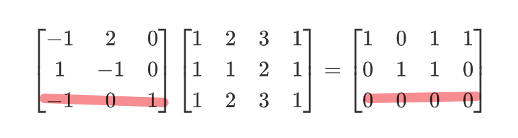
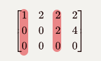
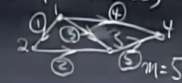

# MIT18.06: Linear Algebra

> [MIT18.06哔哩哔哩](https://www.bilibili.com/video/BV16Z4y1U7oU)

[TOC]

## L1. 方程组的几何解释

有如下方程组
$$
2x-y = 0 \\
-x + 2y = 3
$$
我们当然可以通过绘制两条直线（因为是直线，所以被称为线性方程组）

求出交点

故可以表示为：
$$
A =\begin{bmatrix}
 2 & -1\\
 -1 & 2
\end{bmatrix} \\
x = \begin{bmatrix}
  x \\
  y
\end{bmatrix} \\
b = 
\begin{bmatrix}
  0 \\
  3
\end{bmatrix}
$$
则有：$Ax = b$

但是对于高维的情况不够友好

我们可考虑表现成：
$$
x\begin{bmatrix}
  2 \\
  -1
\end{bmatrix} + y\begin{bmatrix}
  -1 \\
  2
\end{bmatrix}
= \begin{bmatrix}
  0 \\
  3
\end{bmatrix}
$$
那么就相当于用两个向量，组合出一个新的向量

我们把左侧部分称为：**线性组合**

当两个向量共线（不独立），我们发现线性组合无法表示出整个向量空间

则存在一些$b$是无解的

> 无解的详细情况见L5+6

 

## L2. 消元法

将矩阵变成对角矩阵，斜对角上的元素为主元

主元不能为0，可以通过行交换进行避免

无法避免则方程组无解

### 行列变化

对矩阵进行变化，需要在左边乘上初等矩阵

对矩阵进列变化，需要在右边边乘上初等矩阵
$$
\begin{bmatrix}
 a & b\\
 c & d
\end{bmatrix}
$$

 以交换两行为例：
$$
\begin{bmatrix}
 0 & 1\\
 1 & 0
\end{bmatrix}
\begin{bmatrix}
 a & b\\
 c & d
\end{bmatrix}
=
\begin{bmatrix}
 c & d\\
 a & b
\end{bmatrix}
$$
可以理解为：按行看，每行第一列表示原矩阵第一行的系数……

第几行就会保留在答案矩阵的第几行

以交换两列为例：
$$
\begin{bmatrix}
 a & b\\
 c & d
\end{bmatrix}
\begin{bmatrix}
 0 & 1\\
 1 & 0
\end{bmatrix}
=
\begin{bmatrix}
 b & a\\
 d & c
\end{bmatrix}
$$
可以理解为：按列看，每列第一行表示原矩阵第一列的系数……

第几列就会保留在答案矩阵的第几列

## L3. 矩阵乘法与逆

$$
c_{i,j} = \sum_k a_{i,k}\times b_{k,j}
$$

### 可逆矩阵（非奇异矩阵）

$$
\begin{bmatrix}
1 & 3\\
2& 6
\end{bmatrix}
$$

以列向量为例，显然其乘上一个非零矩阵，得到的矩阵结果，每列都是$\begin{bmatrix}
1 \\
2
\end{bmatrix}$的倍数，因此不可能得到单位向量

换种说法，若存在一个列（行）向量可以被其他表示

则必然有：$AX=0$有解，且$X\neq0$​

> 解释：若一个有$n$个向量，则假设第$n$个向量可以被其他$n-1$个向量表示，那么第$n$个向量取一个负号即可

假设$A$存在逆矩阵
$$
A^{-1}AX=0 \\
X = 0
$$
与假设矛盾

### 逆矩阵

$$
\begin{bmatrix}
1 & 3\\
2& 7
\end{bmatrix}
$$

我们现在求解一个可逆矩阵的逆矩阵$A^{-1}$

可以表示为：
$$
\begin{bmatrix}
1 & 3\\
2& 6
\end{bmatrix}
\begin{bmatrix}
a & c\\
b& d
\end{bmatrix}
=
\begin{bmatrix}
1 & 0\\
0& 1
\end{bmatrix}
$$
事实上我们可以拆成两个线性组合的问题
$$
\begin{bmatrix}
1 & 3\\
2& 6
\end{bmatrix}
\begin{bmatrix}
a \\
b
\end{bmatrix}
=
\begin{bmatrix}
1\\
0
\end{bmatrix}
$$

$$
\begin{bmatrix}
1 & 3\\
2& 6
\end{bmatrix}
\begin{bmatrix}
c \\
d
\end{bmatrix}
=
\begin{bmatrix}
0\\
1
\end{bmatrix}
$$

每个问题都可以以增广矩阵的形式，用前面的消元法进行解决

并且我们发现，主元只会以$\begin{bmatrix}
1 & 3\\
2& 6
\end{bmatrix}$有关，共两个，增广矩阵新部分$\begin{bmatrix}
1\\
0
\end{bmatrix}$与$\begin{bmatrix}
0\\
1
\end{bmatrix}$都是顺便跟着前面求解主元的情况下一起被修改

所以我们直接一起进行增广：
$$
\begin{bmatrix}
1 & 3 & 1 & 0\\
2& 6 & 0 & 1
\end{bmatrix}
$$
得到
$$
\begin{bmatrix}
1 & 0 & 7 & -3\\
0& 1 & -2 &1
\end{bmatrix}
$$
则有：$\begin{bmatrix}
a=7\\
b=-2
\end{bmatrix}$,$\begin{bmatrix}
c=-3\\
d=1
\end{bmatrix}$

那其实就是可以直接把后面当成结果矩阵：
$$
A^{-1} = \begin{bmatrix}
7 & -3\\
-2 & 1
\end{bmatrix}
$$
再换种理解方式：

我们对增广矩阵进行了行变化，相当于左乘了一系列初等矩阵$E$

则有：
$$
E\begin{bmatrix}
A,I
\end{bmatrix} = \begin{bmatrix}
I,
B
\end{bmatrix}
$$
其中:$EA = I$，$EI = E = B$

我们发现$E=A^{-1} = B$

所以我们乘上的一系列初等矩阵的乘积即为逆矩阵

所以逆矩阵就是通过一系列初等变换，使得矩阵变成单位矩阵

## L4. LU分解

我们有初始的系数矩阵$A$，考虑先将其进行通过行变化进行消元，得到矩阵$U$
$$
E_pE_{p-1}...E_1A = U
$$
消元所得到的矩阵$U$显然是一个上三角矩阵

等式两边乘上$E^{-1}$
$$
A = (E_1^{-1}...E^{-1}_{p-1}E^{-1}_{p})U = LU
$$
而我们所得到的$L$是一个下三角矩阵

### 一般情况

我们考虑固定$A$，对不同的$b$，我们需要求解出$x$

一般情况下，我们构造出增广矩阵：$\begin{bmatrix}
A & b
\end{bmatrix}$进行消元

假设$A$的大小为$n$，**每次求解**时间开销为$O(n^3)$

> 枚举主元，逐行减法，计算每一列

### LU分解优化

事实上我们并不需要每次都带着$A$去计算

我们实现花费$O(n^3)$的预处理时间得到$L,U$
$$
Ax = LUx = b
$$
我们先求解问题：$Ly = b$

注意，$L$已经是一个下三角矩阵

例如：
$$
\begin{bmatrix}
1 & 0 & 0 & 0\\
-2 & 1 & 0 & 0 \\
-3 & -2 & 1 & 0 \\
9 & 2 & 3 & 1
\end{bmatrix}
$$
因为每行带有非常多的0，所以每次消元每行只需要操作**一列**的数进行加减法即可（0不需要加减0）

故时间复杂度$O(n^2)$

我们求出$y$后，问题变为：$Ux = y$

同理，此时的时间开销仍为$O(n^2)$

## L5+6+10. 向量空间

常常需要用行变换，使得主元不为0（甚至希望避免非常小的数字

### 转置

$A^T_{i,j} = A_{j,i} $

任意矩阵$R$，有$R^TR$是对称矩阵

>$(R^TR)^T = R^T(R^T)^T = R^TR$
>
>故矩阵$R^TR$等于自己的转置，因此为对称矩阵

### 向量空间

-   $R^n$：$n$维向量空间

向量空间对**数乘**和**加法**，也就是线性组合必须是封闭的

即任意向量空间中的向量的线性组合，都必须要在向量空间中

#### 子空间

>   过原点的直线是$R^2$内部的子空间

-   $R^3$的子空间
    -   $R^3$
    -   过原点的平面
    -   过原点的直线
    -   原点

四个基本子空间（第十节课的内容）

- 矩阵的列空间
- 矩阵的零空间
- 矩阵的行空间（矩阵**转置**的列空间）
- 矩阵**转置**的零空间（左零空间）

####  列空间

问题：什么情况下$Ax = b$无解
$$
Ax = \begin{bmatrix}
 1 &  1&2 \\
 2 & 1 & 3\\
 3 & 1 & 4\\
 4 &1  &5
\end{bmatrix}\begin{bmatrix}
  x_1   \\
  x_2  \\
  x_3 
  
\end{bmatrix}
=
\begin{bmatrix}
  b_1 \\
  b_2 \\
  b_3 \\
  b_4
\end{bmatrix}
$$
我们将其看作三个列向量的线性组合：
$$
Ax =x_1\begin{bmatrix}
 1  \\
 2 \\
 3 \\
 4 
\end{bmatrix}+x_2\begin{bmatrix}
 1  \\
 1 \\
 1 \\
 1 
\end{bmatrix}+x_3\begin{bmatrix}
 2  \\
 3 \\
 4 \\
 5 
\end{bmatrix} =b
$$
三个四维列向量的线性组合，显然不足以表示一个完整的四维空间

**因此，$Ax=b$有解，当且仅当$b$属于$A$的列向量空间**

 #### 零空间

求解
$$
Ax = \begin{bmatrix}
 1 &  1&2 \\
 2 & 1 & 3\\
 3 & 1 & 4\\
 4 &1  &5
\end{bmatrix}\begin{bmatrix}
  x_1   \\
  x_2  \\
  x_3 
  
\end{bmatrix}
=
0
$$
显然可以找到：$0, [1,1,-1]^T, [-1,-1,1]^T,...$

归纳为：$[c,c,-c]^T, c\in R$

 可以证明**$Ax=0$的所有解，可以构成一个向量空间**

- 数乘：若$Ax=0$，则$A(ax) = a(Ax) = a \times 0 = 0$，因此$ax,\forall a\in R$都属于这个解集
- 加法：$Ax=0, Ay = 0$，则$Ax+Ay = A(x+y) = 0$

在所有$Ax=b$的解集中，只有$b=0$时，$x$的解集构成一个向量空间

#### 总结（四个子空间）

对于矩阵$A_{m\times n}$，记列空间$C(A)$，零空间$N(A)$，秩为$r$

- 列空间$C(A)$的维数等于$r$​（见L9）
- 零空间$N(A)$的维数等于$n-r$

我们证明一下$r(C(A))=r(C(A^T))$，即矩阵的列秩等于矩阵的行秩

> 我们假设$A_{m\times n}$的列秩为$c$，行秩为$r$
>
> 说明$A$的列空间可以由$A$中**$c$个线性无关的列向量**进行线性组合得到
>
> 我们把这$c$个$m$维的列向量组合成一个新的矩阵$B_{m\times c}$
>
>  
>
> $A$中的每个列向量$a_j$，都可以被矩阵$B$中的列向量$b_i$线性组合得到
>
> 即：
> $$
> a_j = d_1b_1 + d_2b_2+...+d_cb_c = \begin{bmatrix}
> b_1 & b_2 & ... & b_c
> \end{bmatrix}\begin{bmatrix}
>  d_1  \\
>  d_2 \\
>  ... \\
>  d_c 
> \end{bmatrix} \\
> a_j = Bd
> $$
> 对每列$a_j$都取一个$d_j$
> $$
> A &= \begin{bmatrix}
> a_1 & a_2 & ... & a_n 
> \end{bmatrix}\\&=\begin{bmatrix}
> Bd_1 & Bd_2 & ... & Bd_n
> \end{bmatrix}\\&=B\begin{bmatrix}
> d_1 & d_2 & ... & d_n
> \end{bmatrix}&= BD
> $$
> 接下来考虑矩阵的第$i$行的行向量$a_i$​
> $$
> a_i &= (BD)_i = B_i\cdot D \\
> &= \begin{bmatrix}
> b_{i,1} & b_{i,2} & ... & b_{i,c}
> \end{bmatrix}\begin{bmatrix}
> D_1 \\ D_2 \\ ... \\ D_c
> \end{bmatrix} \\
> &= b_{i,1}D_1 + b_{i,2}D_2 + ... + b_{i,c}D_c
> $$
> 即$A$的每一行都可以被$D$的行向量线性组合得到
>
> 因此$A$的行空间被包含在$D$的行空间中，即$A$的行秩将小于等于$D$的行数$c$，也就是$A$的列秩
>
> 同理我们可以用相同的方法，得到$A$的列秩小于等于$A$的行秩
>
> 综上，$c=r$，矩阵行秩等于列秩

我们就可以得到：

- 行空间$C(A^T)$的维数等于列空间的维数，等于$r$

主元+自由变量应该等于总数，则有：

-   左零空间$N(^T)$的维数等于$m-r$

行向量的基非常容易得到，对矩阵进行消元，前$r$行即为基

左零空间怎么求解？我们当然能可以转置一下，当成求解零空间的解法

但是我们有非常顺便的解法

假设
$$
A = \begin{bmatrix}
1 & 2 & 3 & 1\\
1 & 1 & 2 & 1\\
1 & 2 & 3 & 1\\
\end{bmatrix}
$$
根据上述结论，左零空间的维数等于$m-r=1$

我们在求解行空间或是列空间时，需要进行消元

我们在A身后在放一个$I_{m\times m}$的单位矩阵，一起进行消元

得到：
$$
[A,I] = \begin{bmatrix}
1 & 0 & 1 & 1 & -1 & 2 & 0\\
0 & 1 & 1 & 0 & 1 & -1 & 0\\
0 & 0 & 0 & 0 & -1 & 0 & 1\\
\end{bmatrix}
$$
此时左边部分的前$r$行，表示行空间的基

右边部分的矩阵，相当于是一个单位矩阵，记录了$A$经历的所有行变化

我们把右边的矩阵乘上$A$
$$
\begin{bmatrix}
 -1 & 2 & 0\\
 1 & -1 & 0\\
 -1 & 0 & 1\\
\end{bmatrix}
\begin{bmatrix}
1 & 2 & 3 & 1\\
1 & 1 & 2 & 1\\
1 & 2 & 3 & 1\\
\end{bmatrix}
 = \begin{bmatrix}
1 & 0 & 1 & 1 \\
0 & 1 & 1 & 0 \\
0 & 0 & 0 & 0 \\
\end{bmatrix}
$$
自然会得到消元后的矩阵

注意最后的$m-r$行，对应的一定是全0行

左边的$[-1,0,1]$正代表了$A$的行向量的一组线性组合，并且结果为0

因此我们可以总结：单位矩阵跟随$A$进行消元得到的矩阵，最后的$m-r$行向量，即为左零空间的基

>   因为是单位矩阵进行行变化得到的，所以可以保证一定线性无关

## L7. 求解$Ax=0$​

### 手算

例：
$$
Ax = \begin{bmatrix}
1 & 2 & 2 & 2\\
2 & 4 & 6 & 8\\
3 & 6 & 8 & 10\\

\end{bmatrix}\begin{bmatrix}
  x_1   \\
  x_2  \\
  x_3 \\
  x_4
  
\end{bmatrix}
=
0
$$
我们可以尝试继续通过消元解决问题：

-  零空间不变：消元法相当于用一个方程减去一个方程，并不会改变解
- 列空间改变：列向量变化，但是0绝对会在列空间中

$b\equiv0$，因此我们只需要消元$A$，消元得到：
$$
\begin{bmatrix}
1 & 2 & 2 & 2\\
0 & 0 & 2 & 4\\
0 & 0 & 0 & 0\\

\end{bmatrix}
$$
我们称此矩阵含有两个**主元**，主元的数量被称为**矩阵的秩**

-  主列：含有主元的列
- 自由列：不含主元的列，对应的变量即为**自由变量**

因此$x_1,x_3$是主元，$x_2, x_4$是自由变量

为什么称为自由变量？你会发现我们**无法通过方程组限制**，得到自由变量的唯一值

> 我们可以尝试先定好主元的值，你会发现求解不出自由变量的具体数值
>
> 反映在消元上：我们消除不掉

我们可以构造$x_2=1,x_4=0$或$x_2=0,x_4=1$，求出$x_1,x_3$，从而得到所有线性无关的解

> $x_2,x_4$唯一确定$x_1,x_3$，我们通过组合$(1,0),(0,1)$可以得到所有解

我们通过两个**特解**，可以用它们的线性组合表达出所有的**通解**

> 秩r = 主元 = n-自由变量数 = n - 特解数量

事实上我们还能对矩阵进一步简化

- 主元列只有主元是1，其他为0

$$
\begin{bmatrix}
1 & 2 & 0 & -2\\
0 & 0 & 1 & 2\\
0 & 0 & 0 & 0\\

\end{bmatrix}
$$

### 快捷求法

我们简化矩阵后，将主元列和自由列分开

即可以表示为：
$$
A = \begin{bmatrix}
I_r & F\\0 & 0

\end{bmatrix}
$$
主元列组成一个$r\times r$的单位矩阵，$F$是$r\times (n-r)$的矩阵

求解$Ax=0$，显然的解是$x=[x_{priot},x_{free}]=[-F, I]^T$

因此$x_{priot} = -F, x_{free} = I$

此时我们就得到了令各个自由列分别取1，所得到的解集

 

## L8. 求解$Ax=b$

### 解的存在

- 列空间角度：$b$ 属于$A$​的列空间

- 列向量角度：$b$属于$A$列向量的线性表示

- 行的角度：行向量的消元后若可以得到0行，则对应的b的线性组合之和也为0

  - $$
    \begin{bmatrix}
    1 & 2 & 2 & 2 & b_1\\
    0 & 0 & 2 & 4 & b_2-2b_1\\
    0 & 0 & 0 & 0 & b_3-b_1-b_2\\
    
    \end{bmatrix}
    $$

  - 则有：$b_3-b_1-b_2=0$

### 求解步骤

- 消元增广矩阵$[A,b]$
- 求特解：设定所有自由变量为0，可回代出一组特解
-  求出$Ax=0$的零空间，进行相加

### 满秩

- 列满秩

  - 没有自由列，全是主元列

  - 不需要求解零空间（线性无关，只有0一个解）

  - 因此$Ax=b$​要么无解，要么唯一解

  - $$
    R = \begin{bmatrix}
    I\\0
    
    \end{bmatrix}
    $$

-    行满秩

  - 主元数等于行数（每行都有主元）

    - **必然有解**（行向量线性无关，可以表达整个向量空间；或不存在0行对$b$​的限制）

  -  无穷解或唯一解（同时列满秩时）

  - $$
    R = \begin{bmatrix}
    I & F
    
    \end{bmatrix}
    $$

- 行列满秩

  - 消元后得到的是**单位矩阵**，因此是**可逆矩阵**

  - 唯一解

  - $$
    R = I
    $$

- 不满秩

  - 0解或无穷解

  - $$
    R = R = \begin{bmatrix}
    I & F\\
    0 & 0
    
    \end{bmatrix}
    $$

## L9. 线性相关性

对于一组向量，若存在非零的线性组合，使得结果为0，则**线性相关**，否则**线性无关**

实际上就是求解$Ax=0$的问题

-   线性无关的向量组一定**不存在0向量**（其他向量的系数为0，0向量的系数为任意非0数即可）

考虑如下矩阵，三个列向量是否线性无关

-   $n$维空间中，$n+1$个向量肯定是线性相关的

$$
\begin{bmatrix}
1 & 2 & 1\\
2 & 1 & 1 \\
\end{bmatrix}
$$

从向量空间角度解释：我们考虑求解$Ax=0$的零空间，至少有$n-m$个自由列，即必定含有自由变量，解的数量是无限的

因此必然存在非0解，则线性相关

-   线性无关的向量组的零空间必然只有一个0

-   **线性无关向量组列满秩**

 

### 基

-   一组向量线性无关
-   一组向量可以生成整个向量空间

可以确定对于$n$维空间：

-   需要$n$维的向量
-   需要$n$个向量（多了线性相关；少了无法表示整个向量空间）

对于这个$n\times n$矩阵显然是满秩、可逆

>   维数：向量空间需要多少个向量才能构成基

-   矩阵的秩等于列空间维数
-   自由变量数量等于零空间的维数

## L11. 矩阵空间

我们把矩阵看作一个向量，也是可以构造出空间的

- 对称矩阵：对称矩阵相加、乘上一个数仍然是对称矩阵
- 上三角（下三角）矩阵：同

显然对于$3\times 3$矩阵，矩阵空间的维度是9

其中一组基为：
$$
\begin{bmatrix}
1 & 0 & 0 \\
0 & 0 & 0 \\
0 & 0 & 0 \\
\end{bmatrix},\begin{bmatrix}
0 & 1 & 0 \\
0 & 0 & 0 \\
0 & 0 & 0 \\
\end{bmatrix}, ...
$$

- 对于$3\times 3$​的上三角矩阵$U$，维度为6
- 对于$3\times 3$​的对称矩阵$S$，维度为6
- $S$和$U$的交集（除对角线全部为0），维度为3

我们对并集不感兴趣，因为并不是一个矩阵空间

- $S+U$（任意对称矩阵和上三角矩阵的和）构成了整个$3\times 3$矩阵空间

> 维数角度：6 + 6  - 3 = 9

事实上我们列出所有只有一个1的基，你会发现是可以凑出9个的

### 秩一矩阵

$$
A = \begin{bmatrix}
1 & 2 & 3 \\
2 & 4 & 6 \\
\end{bmatrix}
$$

显然此矩阵的秩为1

我们可以轻松将其表示为：
$$
A = \begin{bmatrix}
1 \\
 2
\end{bmatrix} \begin{bmatrix}
1 & 2 & 3 \\
\end{bmatrix}
$$
因此所有的秩一矩阵，我们都可以表示为一个列向量乘上一个行向量的结果：
$$
A = UV^T
$$
$V$即为秩一矩阵的一个基

那么对于一个$rank = r$的矩阵，我们似乎可以用$r$个秩一矩阵得到

 例如：
$$
A= \begin{bmatrix}
1 & 2 & 0 & -2 \\
0 & 0 & 1 & 2 \\
0 & 0 & 0 & 0
\end{bmatrix} = \begin{bmatrix}a_1 & a_2 & a_3 & a_4\end{bmatrix}
$$
（某个矩阵消元后的结果）

则$a_1,a_3$为矩阵的基，并且有：$a_2 = 2a_1, a_4 = -2a_1+2a_3$

因此则有：
$$
A = \begin{bmatrix}a_1 & a_2 & a_3 & a_4\end{bmatrix} =\begin{bmatrix}a_1 & 2a_1 & a_3 & -2a_1+2a_3\end{bmatrix} \\
A = \begin{bmatrix}a_1 & 2a_1 & 0 & -2a_1\end{bmatrix} + \begin{bmatrix} 0 & 0 & a_3 & 2a_3\end{bmatrix}
$$
因此分解成了两个秩一矩阵的和

> 对于秩为$r$的矩阵，其每列都是$r$个基向量的线性组合
>
> 我们把每个基单独组成一个秩一矩阵，即可以线性组合出原矩阵

### 同秩矩阵

$$
rank(A+B) \leq rank(A) + rank(B)
$$

因此多个同秩矩阵的线性组合，并不能得到一个封闭的矩阵空间

### $v_1+v_2+v_3+v_4 = 0$

对于$R^4$空间下，$v = \begin{bmatrix}v_1 & v_2 & v_3 & v_4\end{bmatrix}^T,v_1+v_2+v_3+v_4 =0 $构成了一个向量空间

我们如何确定其向量空间的维数

我们可以考虑求解$Av = 0$，显然有$A = \begin{bmatrix}1 & 1 & 1 & 1\end{bmatrix}$

则$v$的向量空间即为$Av=0$的零空间

$rank(A) = 1$因此$rank(N(A)) = 4 - 1 = 3$

## L12. 图和网络

我们考虑这样一个图

我们用列表示点，行表示边
$$
A = \begin{bmatrix}
-1 & 1 & 0 & 0 \\
0 & -1 &1 & 0 \\
-1 & 0 & 1 & 0 \\
-1 & 0 & 0 & 1 \\
0 & 0 & -1 & 1
\end{bmatrix}
$$
以第一行为例：第一列-1，第二列1，表示1可以到2

我们发现点1，点2，点3之间的边1，边2，边3构成了一个回路

**因此我们可以看矩阵的前三行，是一个线性相关的矩阵**

> 回路 = 相关

我们考虑求解$Ax = 0$
$$
Ax = \begin{bmatrix}
-1 & 1 & 0 & 0 \\
0 & -1 &1 & 0 \\
-1 & 0 & 1 & 0 \\
-1 & 0 & 0 & 1 \\
0 & 0 & -1 & 1
\end{bmatrix}\begin{bmatrix}x_1\\x_2\\x_3\\x_4\end{bmatrix} = \begin{bmatrix}x_2 - x_1\\x_3 - x_2\\x_3 - x_1\\x_4-x_1 \\ x_4 - x_3\end{bmatrix} = 0
$$
得到
$$
x = c\begin{bmatrix}1 \\ 1 \\ 1 \\ 1 \end{bmatrix}
$$

- $r(A) = 3$
- 
