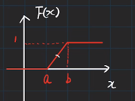
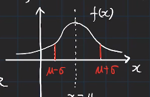
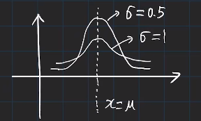
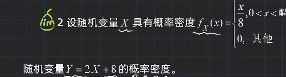
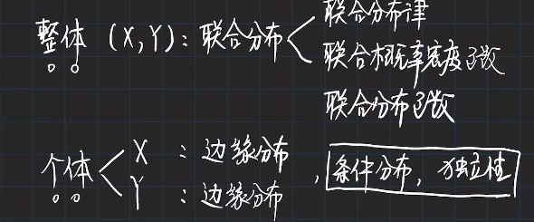

# 概率论与数理统计

> [Bilibilil - 概率论](https://www.bilibili.com/video/BV1D741147G5/)

[TOC]

## 基本概念

-   **随机试验**$E$
    -   可以在相同条件下重复
    -   能够明确所有试验结果，并且不止一个
    -   试验前不能确定结果

-   **样本空间**：随机试验所有可能结果的集合$S$

-   **样本点**：随机试验中每个可能的结果$e$​

-   **随机事件**（简称：事件）：满足某些条件的样本点集合（样本空间的子集）

    -   事件发生：事件中的某个样本点出现
    -   事件不发生：事件中的没有样本点出现
    -   必然事件：包含整个样本空间的样本点，总能发生
    -   不可能事件：空集
    -   **基本事件：由一个样本点组成的单点集**

    

### 古典概型（等可能概型）

随机事件$E$满足

-   样本空间样本点有限
-   每个基本事件的概率相同

（基本事件有限）

### 几何概型

随机事件$E$满足

-   样本空间是$R^n$中一个可度量的几何区域
-   每个样本点出现概率相同

（基本事件无限）

则每个事件$A$的概率为其几何度量除以样本空间的几何度量

### 条件概率

$$
P(B|A) = \frac{P(AB)}{P(A)}
$$

此时样本空间由$S$变成$A$

#### 乘法公式

$$
P(AB) = P(A)P(B|A)
$$

AB都发生：A先发生，B在A发生的情况下也发生……

**适用于不独立事件的计算**

### 全概率公式与贝叶斯公式

#### 全概率公式

$$
P(A) =\sum_iP(AB_i) = \sum_i P(B_i)P(A|B_i)
$$
进行划分出的$B_i$需要两两互不相容

>
>
>三个厂的原件均匀混合
>
>**Q: 随机取一只元件，是次品的概率**()
>$$
>P(A) = \frac{1}{3}\times0.02 + \frac{1}{3}\times 0.01 + \frac{1}{3}\times 0.03
>$$
>

#### 贝叶斯公式

由全概率公式：
$$
P(A) =\sum_iP(AB_i) = \sum_i P(B_i)P(A|B_i)
$$
我们通过$B_i$求出了$A$的概率

我们考虑反过来
$$
P(B_i|A) = \frac{P(AB_i)}{P(A)} = \frac{P(AB_i)}{\sum_i P(B_i)P(A|B_i)}
$$

>若已经知道取到的是次品，分别求由三家厂生产的概率
>$$
>P(B_2) = \frac{\frac{1}{3}\times0.01}{\frac{1}{3}\times0.02 + \frac{1}{3}\times 0.01 + \frac{1}{3}\times 0.03} \\
>P(B_3) = \frac{\frac{1}{3}\times0.03}{\frac{1}{3}\times0.02 + \frac{1}{3}\times 0.01 + \frac{1}{3}\times 0.03} \\
>$$
>

### 独立性

$$
P(B|A) = \frac{P(AB)}{P(A)} = P(B)
$$

则称AB相互独立

有：
$$
P(AB) = P(A)P(B)
$$

## 随机变量

>   用函数的方式研究概率

例如：记随机变量$X$为三次抛硬币正面朝上的次数

-   随机试验各种结果的实值单值函数

### 分布函数

设随机变量$X$，$x$是任意实数：
$$
F(x) = P(X\leq x), x \in R
$$
称为$X$的分布函数

- $x \in R$
- $0 \leq F(x) \leq 1$
- $P(x_1 < X \leq x_2) = F(x_2) - F(x_1)$，左开右闭

- 单调不减
- $\lim _{x\to -\infty} F(x) = 0, \lim_{x\to +\infty}F(x) = 1$
- 右连续

### 离散型随机变量

有限、可列举的

-   记离散型随机变量的取值$X_k(k=1,2,...)$
-   每个事件$X=X_k$的概率为$P(X=X_k)$
-   这称为离散型随机变量的分布律
    -   $P_k \geq 0$
    -   $\sum P_k = 1$

#### 01分布（两点分布）

-   随机变量只能取0或1

-   分布律：

    -   $$
        P(X=k) = p^k(1-p)^{1-k}
        $$

    -   即当$k=1$时概率为$p$，否则为$1-p$

#### 二项分布（伯努利分布）

>   独立重复实验

试验$E$只有两种结果$A$和$B$，且多次试验互相独立，$P(A) = p, P(B) = 1-p$，记发生$A$的次数恰好为$k$

$n$重独立重复试验满足二项分布
$$
X \sim b(n,p)
$$
此时分布律：
$$
P(X=k) = C_{n}^kp^k(1-k)^{n-k}
$$

#### 泊松分布

若随机变量$X$分布律为：
$$
P(X=k) = \frac{\lambda ^k e^{-\lambda}}{k!}
$$
其中$\lambda > 0$，则称$X$服从参数为$\lambda$的泊松分布
$$
X \sim P(\lambda)
$$

> 由二项分布：
> $$
> P(X=k) = C_{n}^kp^k(1-k)^{n-k} = \frac{n!}{k!(n-k)!}p^k(1-p)^{n-k}
> $$
> 我们令$np = \lambda$
> $$
> P =  \frac{n!}{k!(n-k)!}(\frac{\lambda}{n})^k(1-\frac{\lambda}{n})^{n-k} = \frac{n(n-1)...(n-k+1)}{k!}(\frac{\lambda}{n})^k(1-\frac{\lambda}{n})^{n-k}
> $$
> 提出$\frac{\lambda^k}{k!}$
> $$
> P =\frac{\lambda^k}{k!}*[1\times (1-\frac{1}{n})\times ...\times (1-\frac{k-1}{n})](1-\frac{\lambda}{n})^{n}(1-\frac{\lambda}{n})^{-k}
> $$
> 当$n$趋近于正无穷时
> $$
> 1\times (1-\frac{1}{n})\times ...\times (1-\frac{k-1}{n})] \to 1 \\
> (1-\frac{\lambda}{n})^{n} \to e^{-\lambda} \\
> (1-\frac{\lambda}{n})^{-k} \to 1 \\
> $$
> 因此：
> $$
> P = \frac{\lambda^ke^{-\lambda }}{k!}
> $$
> 

- $n$趋近无穷时，二项分布即为$\lambda = np$​的泊松分布
- $n >> p$时可以用泊松分布近似

#### 几何分布

> （和几何没有什么关系）

- 试验次数未知
- 独立重复试验，直到成功一次

$$
P(X=k) = (1-p)^{k-1}p
$$

$k$为试验次数。此时称服从参数为$p$的几何分布

#### 超几何分布

- N个物体中，M个次品。
- 任取n次所得到的次品数

$$
P(X=k) = \frac{C_{M}^kC_{N-M}^{n-k}}{C_N^n}
$$

### 

### 连续型随机变量

对于$X$的分布函数$F(x)$，存在非负、可积函数$f(x)$：
$$
F(x) = \int_{-\infty}^xf(t)dt
$$
则称$X$为连续型随机变量

$f(x)$为其概率密度函数

#### 均匀分布

若$X$的概率密度函数：
$$
f(x) = \frac{1}{b-a}, x \in (a,b)
$$
则$X$在$(a,b)$上服从均匀分布
$$
X\sim U(a,b)
$$
则其分布函数：
$$
F(x) = \frac{x-a}{b-a}, x \in (a,b)
$$

此时，$X$若在区间内任意一个**子区间**的概率，取决于子区间的长度

#### 正态分布（高斯分布）

若$X$的概率密度函数：
$$
f(x) = \frac{1}{\sqrt{2\pi} \sigma}e^{-\frac{(x-\mu)^2}{2\sigma^2}}
$$
则：
$$
X \sim N(\mu, \sigma^2)
$$

- 对称性：$x=\mu$
- 最大值：$f_{max}(x) = \frac{1}{\sqrt{2\pi} \sigma}$
- 渐近线：$y = 0$

- 方差越大，越扩散

当$\mu = 0, \sigma^2 = 1$时，服从**标准正态分布**
$$
X  \sim N(0, 1)
$$
此时概率密度函数
$$
\varphi(x) = \frac{1}{\sqrt{2\pi}}e^{-\frac{x^2}{2}}
$$
分布函数$\phi(x)$

>- $\phi(x) = 1 - \phi(-x)$
>- $\phi(x) = \phi(-x)$
>- $\phi(0) = \frac{1}{2}$ ，即$P(X\leq 0) = \frac{1}{2}$ 

任意正态分布都可以转化为标准正态分布：

若$X\sim N(\mu, \sigma^2)$，则随机变量$Y = \frac{X-\mu}{\sigma} \sim N(0, 1)$

则我们求解$F(x)$：
$$
F(x) = P(X\leq x) = P(\frac{X-\mu}{\sigma} \leq \frac{x-\mu}{\sigma}) = \phi(\frac{x-\mu}{\sigma})
$$

#### 指数分布

$$
f(x) = \frac{1}{\theta}e^{-\frac{x}{\theta}}, x>0
$$

其中$\theta>0$为常数，此时$X$服从参数为$\theta$的指数分布
$$
F(x) = 1 - e^{-\frac{x}{\theta}}, x>0
$$

- 无记忆性：$P(X>s)$时，$P(X>s+t|X>s) = P(X>s+t)$ 

> 条件概率公式算一下即可，可以被消掉

### 随机变量的函数

若$X$是随机变量，存在函数$Y = g(X)$，则其随机变量$X$的函数。此时$Y$也是随机变量

- 离散型求法：逐值代入即可
- 连续型求法
  - 分布函数求导
  - 公式

#### 分布函数求导

 
$$
F_Y(y) = P(Y\leq y) = P(2X+8\leq y)
$$
此时可转化为：
$$
F_Y(y) = P(X\leq \frac{y-8}{2}) = F_X(\frac{y-8}{2})
$$
我们成功把$Y$的分布函数转化为了$X$​的分布函数

同时求导即可得到概率密度函数
$$
f_Y(y) = \frac{ d F_X(\frac{y-8}{2})}{dy} = \frac{1}{2}f_X(\frac{y-8}{2})
$$

#### 公式

对于概率密度函数为$f(x)$的随机变量$X$

前提条件：

- 若$y=g(x)$关于变量$x$是**单调且可导**
  - 即：$g'(x) > 0 $或$g'(x) <0 $恒成立

则对于$Y =g(X)$，随机变量$Y$的概率密度函数：
$$
f_Y(y) = \begin{cases}
f_X[h(y)] \times |h'(y)|, \alpha < y < \beta
\\
0, otherwise
\end{cases}
$$
其中$x = h(y)$是$y=g(x)$的反函数

- $\alpha = \min\{ g(-\infty), g(+\infty) \}$
- $\beta = \max\{ g(-\infty), g(+\infty) \}$

## 二维随机变量

对于样本空间$S = \{e \}$，随机变量$X=X(e), Y=Y(e)$共同组成二维随机变量$(X,Y)$

### 联合分布

#### 联合分布函数

$$
F(x,y) = P( X\leq x,Y\leq y)
$$

此时$,$表示积事件

- 单调性
  - 固定一维，另一维单调
- 有界性：$0 \leq P \leq 1$​

对于离散型：使用联合分布律

对于连续型：使用联合概率密度

#### 联合概率密度

$$
F(x,y) = \int_{-\infty}^x\int_{-\infty}^yf(u,v)dudv
$$

则$f(x,y)$即为$F(x,y)$的联合概率密度函数

### 边缘分布

#### 边缘分布函数

- $F_X(x) = P(X\leq x)$
- $F_Y(y) = P(Y\leq y)$

已知$F(X,Y)$求边缘分布函数

- $F_X(x) = P(X\leq x) = P(X\leq x, Y<+\infty) = F(x,+\infty) = \lim_{y \to +\infty} F(x,y)$
- $F_Y(y) = P(Y\leq y) = P(X\leq +\infty, Y<y) = F(+\infty, y) = \lim_{x \to +\infty} F(x,y)$

#### 边缘分布律

联合分布律按行列求和即可

#### 边缘概率密度

有联合概率密度：
$$
F(x,y) = \int_{-\infty}^x\int_{-\infty}^yf(u,v)dudv
$$
关于$X$的**边缘分布函数**可以表示为：
$$
F_X(x) = \lim_{y \to +\infty} F(x,y) = \int_{-\infty}^{+\infty}[\int_{-\infty}^{x}f(u,v)du]dv \\
F_X(x) = \int_{-\infty}^{x}[\int_{-\infty}^{+\infty}f(u,v)dv]du \\
F_X(x) = \int_{-\infty}^{x} f_X(x) du
$$
此时则有：
$$
f_X(x) =\int_{-\infty}^{+\infty}f(x,y)dy
$$
将$x$看做常数进行积分
$$
f_Y(y) =\int_{-\infty}^{+\infty}f(x,y)dx
$$
将$y$看做常数进行积分

### 条件分布

#### 离散型

求$P(X=x_i |Y=y_j)$
$$
P(X=x_i |Y=y_j) = \frac{P(X=x_i,Y=y_j)}{P(Y=y_j)}
$$
即**联合概率除以边缘概率**

#### 连续型

求$P(X\leq x |Y=y)$

但对于连续型，等于一个值的概率为0，因此需要修正为：

$P(X\leq x |y < Y\leq y + \epsilon)$
$$
P = \frac{P(X\leq x ,y < Y\leq y + \epsilon)}{P(y < Y\leq y + \epsilon)} \\
P = \frac{\int_{-\infty}^{x}[\int_y^{y+\epsilon}f(x,y)dy]dx}{\int_y^{y+\epsilon}f_Y(y)dy}\\
P = \frac{\int_{-\infty}^{x}\epsilon f(x,y) dx}{\epsilon f_Y(y)} =  \frac{\int_{-\infty}^{x} f(x,y) dx}{f_Y(y)} \\
P = \int_{-\infty}^{x} \frac{ f(x,y) }{f_Y(y)} dx
$$
其中$y$为常数

此时我们就可以把$\frac{ f(x,y) }{f_Y(y)} $看作一个新的概率密度函数

在$Y=y$的条件下$X$的概率密度函数为：
$$
f_{X|Y}(x|y) = \frac{ f(x,y) }{f_Y(y)}
$$
在$Y=y$的条件下$X$的**条件分布函数**为：
$$
F_{X|Y}(x|y) = P(X\leq x|Y=y) = \int_{-\infty}^{x}f_{X|Y}(x|y)  dx
$$
