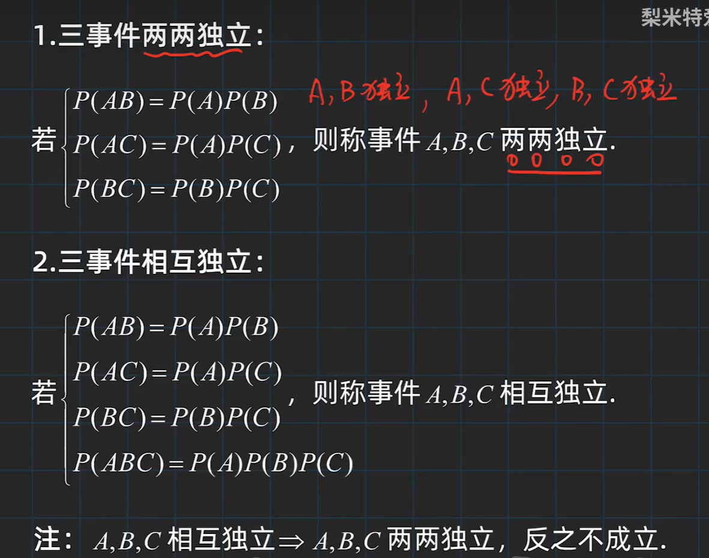

# 概率论与数理统计

> [Bilibilil - 概率论](https://www.bilibili.com/video/BV1D741147G5/)

[TOC]

## 基本概念

-   **随机试验**$E$
    -   可以在相同条件下重复
    -   能够明确所有试验结果，并且不止一个
    -   试验前不能确定结果

-   **样本空间**：随机试验所有可能结果的集合$S$

-   **样本点**：随机试验中每个可能的结果$e$​

-   **随机事件**（简称：事件）：满足某些条件的样本点集合（样本空间的子集）

    -   事件发生：事件中的某个样本点出现
    -   事件不发生：事件中的没有样本点出现
    -   必然事件：包含整个样本空间的样本点，总能发生
    -   不可能事件：空集
    -   **基本事件：由一个样本点组成的单点集**

    

### 古典概型（等可能概型）

随机事件$E$满足

-   样本空间样本点有限
-   每个基本事件的概率相同

（基本事件有限）

### 几何概型

随机事件$E$满足

-   样本空间是$R^n$中一个可度量的几何区域
-   每个样本点出现概率相同

（基本事件无限）

则每个事件$A$的概率为其几何度量除以样本空间的几何度量

### 条件概率

$$
P(B|A) = \frac{P(AB)}{P(A)}
$$

此时样本空间由$S$变成$A$

#### 乘法公式

$$
P(AB) = P(A)P(B|A)
$$

AB都发生：A先发生，B在A发生的情况下也发生……

**适用于不独立事件的计算**

### 全概率公式与贝叶斯公式

#### 全概率公式

$$
P(A) =\sum_iP(AB_i) = \sum_i P(B_i)P(A|B_i)
$$
进行划分出的$B_i$需要两两互不相容

>
>
>三个厂的原件均匀混合
>
>**Q: 随机取一只元件，是次品的概率**()
>$$
>P(A) = \frac{1}{3}\times0.02 + \frac{1}{3}\times 0.01 + \frac{1}{3}\times 0.03
>$$
>

#### 贝叶斯公式

由全概率公式：
$$
P(A) =\sum_iP(AB_i) = \sum_i P(B_i)P(A|B_i)
$$
我们通过$B_i$求出了$A$的概率

我们考虑反过来
$$
P(B_i|A) = \frac{P(AB_i)}{P(A)} = \frac{P(AB_i)}{\sum_i P(B_i)P(A|B_i)}
$$

>若已经知道取到的是次品，分别求由三家厂生产的概率
>$$
>P(B_2) = \frac{\frac{1}{3}\times0.01}{\frac{1}{3}\times0.02 + \frac{1}{3}\times 0.01 + \frac{1}{3}\times 0.03} \\
>P(B_3) = \frac{\frac{1}{3}\times0.03}{\frac{1}{3}\times0.02 + \frac{1}{3}\times 0.01 + \frac{1}{3}\times 0.03} \\
>$$
>

### 独立性

$$
P(B|A) = \frac{P(AB)}{P(A)} = P(B)
$$

则称AB相互独立

有：
$$
P(AB) = P(A)P(B)
$$

## 随机变量

>   用函数的方式研究概率

例如：记随机变量$X$为三次抛硬币正面朝上的次数

-   随机试验各种结果的实值单值函数

### 分布函数

设随机变量$X$，$x$是任意实数：
$$
F(x) = P(X\leq x), x \in R
$$
称为$X$的分布函数

- $x \in R$
- $0 \leq F(x) \leq 1$
- $P(x_1 < X \leq x_2) = F(x_2) - F(x_1)$，左开右闭

- 单调不减
- $\lim _{x\to -\infty} F(x) = 0, \lim_{x\to +\infty}F(x) = 1$
- 右连续

### 离散型随机变量

有限、可列举的

-   记离散型随机变量的取值$X_k(k=1,2,...)$
-   每个事件$X=X_k$的概率为$P(X=X_k)$
-   这称为离散型随机变量的分布律
    -   $P_k \geq 0$
    -   $\sum P_k = 1$

#### 01分布（两点分布）

-   随机变量只能取0或1

-   分布律：

    -   $$
        P(X=k) = p^k(1-p)^{1-k}
        $$

    -   即当$k=1$时概率为$p$，否则为$1-p$

#### 二项分布（伯努利分布）

>   独立重复实验

试验$E$只有两种结果$A$和$B$，且多次试验互相独立，$P(A) = p, P(B) = 1-p$，记发生$A$的次数恰好为$k$

$n$重独立重复试验满足二项分布
$$
X \sim b(n,p)
$$
此时分布律：
$$
P(X=k) = C_{n}^kp^k(1-k)^{n-k}
$$

#### 泊松分布

若随机变量$X$分布律为：
$$
P(X=k) = \frac{\lambda ^k e^{-\lambda}}{k!}
$$
其中$\lambda > 0$，则称$X$服从参数为$\lambda$的泊松分布
$$
X \sim P(\lambda)
$$

> 由二项分布：
> $$
> P(X=k) = C_{n}^kp^k(1-k)^{n-k} = \frac{n!}{k!(n-k)!}p^k(1-p)^{n-k}
> $$
> 我们令$np = \lambda$
> $$
> P =  \frac{n!}{k!(n-k)!}(\frac{\lambda}{n})^k(1-\frac{\lambda}{n})^{n-k} = \frac{n(n-1)...(n-k+1)}{k!}(\frac{\lambda}{n})^k(1-\frac{\lambda}{n})^{n-k}
> $$
> 提出$\frac{\lambda^k}{k!}$
> $$
> P =\frac{\lambda^k}{k!}*[1\times (1-\frac{1}{n})\times ...\times (1-\frac{k-1}{n})](1-\frac{\lambda}{n})^{n}(1-\frac{\lambda}{n})^{-k}
> $$
> 当$n$趋近于正无穷时
> $$
> 1\times (1-\frac{1}{n})\times ...\times (1-\frac{k-1}{n})] \to 1 \\
> (1-\frac{\lambda}{n})^{n} \to e^{-\lambda} \\
> (1-\frac{\lambda}{n})^{-k} \to 1 \\
> $$
> 因此：
> $$
> P = \frac{\lambda^ke^{-\lambda }}{k!}
> $$
> 

- $n$趋近无穷时，二项分布即为$\lambda = np$​的泊松分布
- $n >> p$时可以用泊松分布近似

#### 几何分布

> （和几何没有什么关系）

- 试验次数未知
- 独立重复试验，直到成功一次

$$
P(X=k) = (1-p)^{k-1}p
$$

$k$为试验次数。此时称服从参数为$p$的几何分布

#### 超几何分布

- N个物体中，M个次品。
- 任取n次所得到的次品数

$$
P(X=k) = \frac{C_{M}^kC_{N-M}^{n-k}}{C_N^n}
$$

### 

### 连续型随机变量

对于$X$的分布函数$F(x)$，存在非负、可积函数$f(x)$：
$$
F(x) = \int_{-\infty}^xf(t)dt
$$
则称$X$为连续型随机变量

$f(x)$为其概率密度函数

