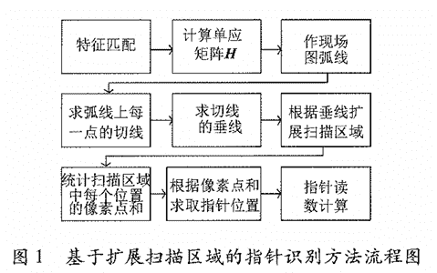
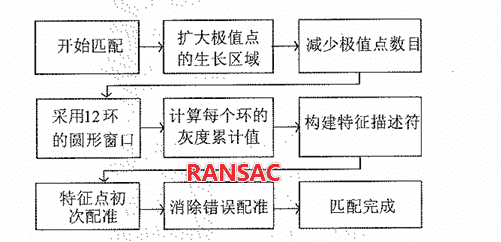
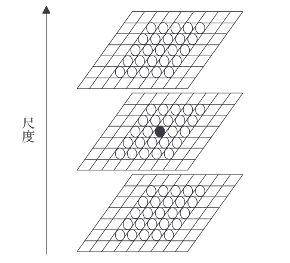
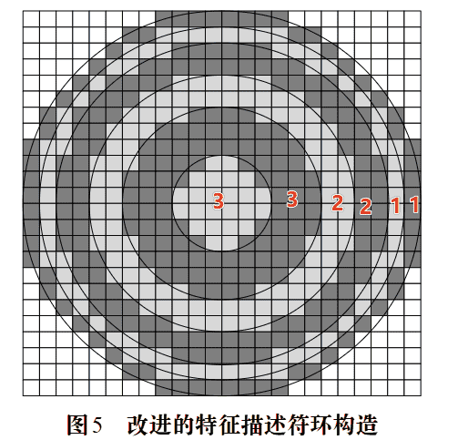
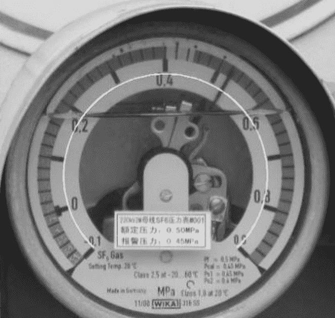
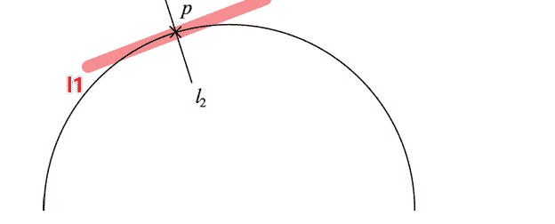

# 论文笔记 · 基于扩展扫描区域的现场表计指针识别方法

[TOC]

## 引言

-   通过现场图、模板图的特征匹配，求解单应矩阵
-   将模板图中的**弧线点**投影到现场图中
-   拓展现场图扫描区，扫描整条弧线
-   找到<u>像素累积和</u>最大（小）值的位置，作为指针位置
-   按照弧线比例和量程求出示数

## 特征匹配

总体流程：

-   不使用彩色图片，只看灰度图，消除光线影响，方便找到指针

### SIFT改进版本

特征匹配采用改进过的SIFT算法

参考论文：[卢鹏,卢奇,邹国良,等. 基于改进SIFT的时间序列图像拼接方法研究[J]. 计算机工程与应用,2020,56(1):196-202. DOI:10.3778/j.issn.1002-8331.1809-0317.](https://d.wanfangdata.com.cn/periodical/jsjgcyyy202001027)

-   原算法中每个像素点与周围26个像素进行比较，若本像素最大或最小，认为是一个待选极值点
    -   改进方案：与周围74个进行比较
    -   一定程度上减少极值点，减少错误的匹配，提高比较精度

-   原算法中采用了方形区域进行构造特征符
    -   改进算法改为圆形区域，半径选为12，采用(3,3,2,2,1,1)的环数构造
    -   直方图计算时每36度划分为同一个方向，总共10个方向

>   子环区域的灰度累加值作为一维特征向量，引入特征描述符的构建，从而
>   减少由灰度变化引起的错误匹配 
>
>   -   将整个环作为一个大的区域R，每环产生一个**正的灰度累积值**及**一个负的  灰度累积值**，分别记为$H_{R_i+}, H_{R_i-}$​
>   -   定义$Gray = \sum I_{R_i}$，其中$I$表述灰度，$R_i$表述每一个环形区域
>
>   每个环形的直方图维度为10，添加上述3个新值，维度为13
>
>   总共6个环形，因此每个像素的描述符数量为78
>
>   参考文献：[吴建,马跃. 一种改进的SIFT算法[J]. 计算机科学, 2013, 40(7): 270-272. https://doi.org/ WU Jian and MA Yue. Improved SIFT Algorithm[J]. Computer Science, 2013, 40(7): 270-272. https://doi.org/]([一种改进的SIFT算法 (jsjkx.com)](https://www.jsjkx.com/CN/abstract/abstract5896.shtml))

 

进行初次现场图、模板图特征点的匹配工作

若现场图的第$n$个特征点和模板图的第$m$个特征点能够匹配，需要满足：

记$\min dis, sub$分别为$n$对应的最近邻点和次近邻点的距离

若
$$
\frac{\min dis}{sub - \min dis} < threshold
$$
则可以匹配，否则失败

>   即最近邻需要足够接近，明显近于次近邻点
>
>   有足够的置信度让两个点匹配到一起，不能模糊
>
>   threshold为设定的阈值

使用KD-Tree求解

 

### RANSAC配准

>   参考文献：[[1]贾雯晓,张贵仓,汪亮亮,等.基于SIFT和改进的RANSAC图像配准算法[J].计算机工程与应用, 2018, 54(2):5.DOI:10.3778/j.issn.1002-8331.1707-0264.]([基于SIFT和改进的RANSAC图像配准算法 - 百度学术 (baidu.com)](https://xueshu.baidu.com/usercenter/paper/show?paperid=be0f59cc8f37d9dcc8d0e3b86435b947&site=xueshu_se))

确定一个单应矩阵需要四对配对点

因此使用RANSAC随机多次，产生多组单应矩阵

检测所有配对点，选择外点最少的单应矩阵作为最后结果

 

---

最后，我们将模板图中的刻度弧线，通过单应矩阵以点集的方式，映射到现场图中

## 拓展扫描区域的现场表识别

>   表盘文字、刻度、标记、污垢影响很大
>
>   我们需要重点识别指针位置

我们需要求解弧线上每个点$p$的切线$l_1$斜率$K_1$

因为弧线不是光滑的弧线，我们考虑通过周围的点近似求解

连接点$p$左侧第$i$个点，右侧第$i$个点，文中取10个点对

第$i$条连线的斜率如下：
$$
k_i = \frac{y_{i2}-y_{i1}}{x_{i2}-x_{i1}}
$$
取平均值作为$p$所在弧线的切线$l_1$斜率
$$
K_1 = \frac{\sum_{i=1}^k K_i}{k}
$$
我们过点$p$作$l_1$的垂线$l_2$

其与水平线的夹角定义为：
$$
\alpha = \left\{\begin{matrix}
 \arctan(-\frac{1}{K_1}), & K_1\neq 0\\
 90^{\circ} \ & K_1=0\\
 0^{\circ}  & K_1 \text { is NULL}
\end{matrix}\right.
$$
其中近似连线中有部分斜率不存在时，我们认为$K_1$不存在

标准情况下$l_2$是最完美的指针位置

但是一般不是

所以我们需要考虑$l_2$周围的位置，进行**拓展扫描**

-   以$p$点为旋转中心，左右各旋转$45^{\circ}$

只要扇形大小选取适当的情况下，指针只要指向点$p$，那么指针一定会出现在扇形内

-   对扇形区域的像素值进行求和，指针黑色（像素值最小），指针白色（像素值最大）
-   扫到刻度线并不会造成影响，因为一定不是像素和的最值

-   遍历整个扇形

假设我们总共扫描了$N$个点，刻度表量程为$M$，像素和最值序号出现在$n$

则刻度为
$$
y = \frac{n}{N}\times M
$$
