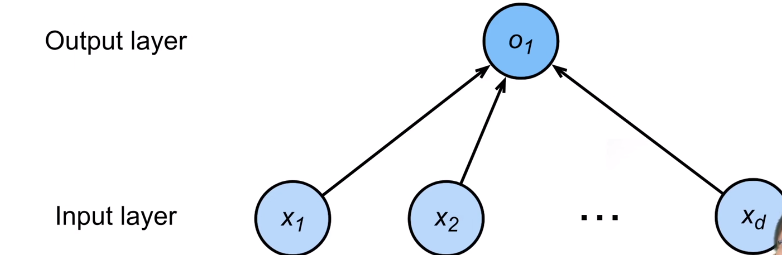

# 动手学深度学习

[TOC]

## 深度学习基础

### 优化方法

#### 梯度下降

$$
w_t = w_{t-1}-\alpha \frac{\partial L}{\partial w_{t-1}}
$$

但一般不会在整个训练集上进行梯度下降（代价太大）

- **小批量随机梯度下降**：随机采用$b$个样本，计算出的损失函数作为全局损失函数的近似值
  - $b$​是一个新的超参数
    - 太小，不适合并行计算
    - 太多，时间开销大
  - 

### 线性神经网络

线性模型可以看为一个单层神经网络

#### 线性回归

> 预测房价

假设有若干个因素影响房价
$$
y = w_1x_1 +w_2x_2+...
$$

- 输入：$\mathrm {x}    = [x_1, x_2, x_3, ...,x_n]^T$
- 线性模型：$w = [w_1, w_2, w_3,...,w_n]^T, b$
- 输出：$y= \left \langle  w,\mathrm {x}   \right \rangle  + b$

定义**损失函数**，用于衡量预估的质量：平方损失函数
$$
L(y,\hat y) = \frac{1}{2}(y-\hat y)^2
$$
定义训练数据
$$
X = [\mathrm {x}_1, \mathrm {x}_2,...,\mathrm {x}_n]^T\\
y = [y_1,y_2,...,y_n]^T
$$
学习目标：

找出最佳的$w,b$，最小化损失函数：
$$
L(X,y,w,b) = \frac{1}{n}\sum L(y_i,\left \langle  w,\mathrm {x_i}   \right \rangle  + b) = \frac{1}{2n}\left \| y-Xw-b \right \| ^2
$$

事实上，我们为了方便，可以拓展$X$，令$X = [X, 1]$，每个训练数据都增加一个常数1，且令$w = \begin{bmatrix} w \\  b\end{bmatrix} $

原问题变成：
$$
w^* = \arg \min_{w}L(X,y,w) = \arg \min_{w} \frac{1}{2n}\left \| y-Xw \right \|^2
$$
我们对$L$对$w$求导
$$
\frac{\partial L}{\partial w} =\frac{1}{n}(y-Xw)^TX = 0\\
w = (X^TX)^{-1}Xy
$$
我们就直接得到了此**凸函数**的最优解

##### 代码实现

小批量梯度下降：

> /linear-networks/linear regression/handwritten.ipynb

Pytorch框架实现：

